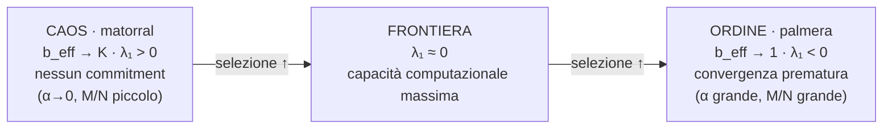

# Deep Dive 09 — La frontiera caos/ordine: formalizzazione di una congettura testabile

> *"en la frontera creo que está el bueno… tú ajustas tu reward de manera que el
> árbol tienda a tener un número de ramas… mínima bifurcación, máximo crecimiento
> de entropía."* — Sergio Hernández, Radient 2026, cap. 16.

> **Stato**: formalizzazione, 2026-05-21. Porta la **Congettura B** di
> [`MATH_CANON`](../../docs/MATH_CANON.md#congettura-b--frontera-caosorden-come-terza-legge)
> da "informale, formalizzazione pendente" a *ipotesi falsificabile* — e applica
> al claim lo stesso scetticismo con cui il repo ha falsificato il "magic 6"
> (Congettura A). Chiude la discrepanza **D3** della tabella in [`CLAUDE.md`](../../CLAUDE.md).
> **Esito anticipato**: il claim sopravvive come *diagnostica testabile*, **non**
> come "terza legge universale" — e una delle sue tre candidate statistiche viene
> falsificata qui, per propagazione corretta della falsificazione di Congettura A.
>
> ⚠️ **Aggiornamento (2026-05-21, post H-B1a).** H-B1a (§4.2) è stata eseguita —
> [`work/13_chaos_order/HB1A_RESULT.md`](../13_chaos_order/HB1A_RESULT.md). Esito:
> l'esponente di Lyapunov dello swarm $\lambda_1$ **non è scale-free** — cambia
> *segno* al variare della scala di perturbazione $\delta_0$, confermando
> empiricamente il caveat del §3.1. **$\Psi_1$ è quindi compromessa** insieme a
> $\Psi_2$ (assorbita, §3.2) e $\Psi_3$ (falsificata, §3.3): **tutte e tre le
> candidate $\Psi$ cadono**, e l'ipotesi nulla **H-B4** diventa la posizione di
> default. La riformulazione del §4.3 e i test H-B1b/c restano sospesi finché non
> esiste una $\Psi$ ben posta (un $\lambda_1(\delta_0)$ scale-resolved, o una
> statistica d'ensemble). Non una falsificazione della sostanza di B — una
> falsificazione dello *stimatore* $\Psi_1$.

---

## 0. Cosa stiamo formalizzando

Sergio, nei podcast, articola un'intuizione ricorrente: i sistemi complessi
"vivono" sulla **frontiera tra flusso laminare e flusso caotico**, e lì succede
tutto ciò che è interessante. Tradotta su FMC: la reward function *ottimale* è
quella che tiene lo swarm di walker su quella frontiera — tra la *palmera* (un
solo cammino, deciso tutto, $b_{\text{eff}}\to 1$) e il *matorral* (infinite
biforcazioni, niente deciso, $b_{\text{eff}}\to K$). Sergio la propone come
candidata **terza legge** — al pari del principio di Wissner-Gross.

Questa è la Congettura B di MATH_CANON, e la riga **D3** delle discrepanze note
(CLAUDE.md): *"mai formalizzata come hypothesis testabile in alcun paper o deep
dive"*. Questo documento la formalizza. Tre compiti, in ordine:

1. **Inquadrare** il claim nella letteratura consolidata "edge of chaos" — cosa è
   già stabilito, e cosa la letteratura *vieta* (§1).
2. **Definire** le candidate statistiche $\Psi$ che misurerebbero la frontiera, e
   **gradarle** — inclusa l'eliminazione di quelle non difendibili (§3).
3. **Riformulare** la Congettura B come un insieme di ipotesi competitive
   falsificabili, con esperimenti economici su `fmc-core` (§4).

La disciplina è quella del progetto: una congettura è tale solo se esiste un
criterio esplicito per **rigettarla**. Se alla fine la frontiera non discrimina
reward buone da cattive, la Congettura B è narrazione descrittiva, non legge — e
va detto.

---

## 1. La cornice "edge of chaos" — cosa la letteratura ha già stabilito

L'intuizione di Sergio non è isolata: è una riscoperta indipendente di un filone
con 35 anni di storia. Conviene importarne i risultati *e* i divieti.

### 1.1 Langton e il parametro λ

Langton (1990) studia gli automi cellulari parametrizzati da $\lambda$ — la
frazione di regole che portano a uno stato "vivo". Variando $\lambda$ da 0 a 1, il
comportamento attraversa **ordinato → complesso → caotico**. La computazione
universale (capacità di trasmettere, memorizzare e modificare informazione) si
trova **vicino alla transizione** ordine/caos, non agli estremi.

> **Caveat load-bearing.** Langton stesso, e la letteratura successiva, mostrano
> che **non esiste un singolo valore universale di $\lambda$** che marchi la
> frontiera: il valore critico dipende dal "cammino" scelto nello spazio delle
> regole. La frontiera è reale; la sua *coordinata* non è una costante di natura.

Questo divieto è decisivo per la Congettura B. Vieta l'inquadramento "terza legge
nel senso di costante universale". Qualunque formalizzazione difendibile deve
fare della frontiera un **confine nello spazio dei parametri del sistema stesso**,
non un numero universale (e quindi: niente "$b_{\text{eff}}=6$ per ogni task" —
§3.3).

### 1.2 Bertschinger & Natschläger — la frontiera è λ₁ ≈ 0

Bertschinger & Natschläger (2004, *Neural Computation* 16:1413–1436) rendono il
claim quantitativo per le reti ricorrenti: calcolano il **confine critico** nello
spazio dei parametri dove la dinamica passa da ordinata a caotica, e mostrano che
**solo vicino a quel confine** la rete sa fare computazione non banale su serie
temporali. Il confine è marcato dall'**esponente di Lyapunov** della dinamica:

- $\lambda_1 < 0$ — regime ordinato: le perturbazioni muoiono, la rete dimentica
  l'input (memoria nulla).
- $\lambda_1 > 0$ — regime caotico: le perturbazioni esplodono, la rete amplifica
  il rumore (nessuna struttura stabile).
- $\lambda_1 \approx 0$ — **la frontiera**: memoria lunga e separabilità coesistono.

A differenza del $\lambda$ di Langton, $\lambda_1 = 0$ **è** universale — non come
*posizione* in un dato spazio di parametri, ma come *criterio*: la linea
$\lambda_1=0$ separa ordine e caos in qualunque sistema dinamico. È la distinzione
che salva la Congettura B (§4).

### 1.3 Criticità auto-organizzata e "intelligenza al limite del caos"

Due ulteriori ancore:

- **Self-organized criticality** (Bak, Tang, Wiesenfeld 1987): alcuni sistemi
  *si sintonizzano da soli* sul punto critico, senza tuning esterno. Bertschinger,
  Natschläger & Legenstein (2004, NeurIPS) mostrano RNN che lo fanno. Domanda
  aperta per FMC: la dinamica FMC è auto-critica, o la frontiera va imposta dalla
  reward? (§5, legame con Cong. E.)
- **"Intelligence at the Edge of Chaos"** (Zhang et al. 2024, arXiv:2410.02536):
  modelli addestrati a predire sistemi *al limite del caos* sviluppano capacità di
  ragionamento superiori a quelli addestrati su sistemi ordinati o caotici. È la
  versione moderna, AI-centrica, dello stesso principio.

**Sintesi importabile.** (a) Esiste una frontiera ordine/caos reale e misurabile;
(b) la capacità computazionale picca *vicino* ad essa; (c) la sua *coordinata* non
è universale, ma il *criterio* $\lambda_1=0$ lo è. La Congettura B è plausibile —
ma solo nella forma (c)-compatibile.

---

## 2. FMC come sistema dinamico: dove vive la frontiera

Per applicare la cornice serve identificare il sistema dinamico. **Non è il
mondo**; è lo **swarm**.

L'oggetto che evolve è $\mathbf{W}_t \in (E \times A)^N$, sotto l'iterazione
(Def. 1 di MATH_CANON):
$$
\mathbf{W}_{t+1} = \mathcal{S}_t \circ \mathcal{C}_t(\mathbf{W}_t),
$$
con $\mathcal{C}$ il cloning operator e $\mathcal{S}$ lo step simulatore +
perturbazione. I due operatori tirano in direzioni opposte:

| Operatore | Effetto sulla diversità dello swarm | Spinge verso |
|---|---|---|
| $\mathcal{C}$ (cloning) | **contrattivo** — copia i walker vincenti, riduce la varianza | ordine (palmera) |
| $\mathcal{S}$ (simulatore + perturbazione) | **espansivo** — diffonde i walker | caos (matorral) |

L'esponente di Lyapunov dello swarm è il **saldo** tra i due. E i casi limite di
$b_{\text{eff}}$ (Def. 6) sono *esattamente* la palmera e il matorral di Sergio:

Le manopole che muovono FMC lungo l'asse sono note dal repo:

- **$\alpha$** — la "temperatura inversa" del Teorema 2. $\alpha\uparrow$ rende
  $\mathcal{C}$ più selettivo → più ordine.
- **$M/N$** — la profondità del transitorio Wright-Fisher (deep dive 07).
  $M/N\uparrow$ → più generazioni di cloning → più ordine ($b_{\text{eff}}\to 1$).
- **$\beta$** — il termine anti-collasso (Teorema 3). $\beta$ da 0 a $>0$ frena
  $\mathcal{C}$ → meno ordine; ma $\beta$ *oltre* $\sim 1$ torna selettore (caveat
  controintuitivo del Teorema 3) → di nuovo ordine. $\beta$ è **non monotono**
  rispetto alla frontiera.

La Congettura B, riletta: *la reward function ottimale è quella che, dato il task,
tiene lo swarm vicino a $\lambda_1 = 0$* — né palmera né matorral. La reward entra
perché $\widehat{R}^\alpha$ modula la contrattività di $\mathcal{C}$ a ogni tick:
una reward "buona" produce un paesaggio in cui la selezione è informativa senza
collassare; una "cattiva" o satura collassa lo swarm (ordine) o lo lascia
indifferente (caos).

---

## 3. Le candidate statistiche Ψ — formalizzate e gradate

MATH_CANON elenca tre candidate per la statistica $\Psi$ che misurerebbe la
frontiera. Le definiamo con precisione e le gradiamo. **Una viene eliminata.**

### 3.1 Ψ₁ — Esponente di Lyapunov dello swarm (in spazio degli stati)

**Definizione.** Si considerino due copie dello swarm, $\mathbf{W}_0$ e
$\mathbf{W}_0' = \mathbf{W}_0 + \delta$, con $\|\delta\|$ infinitesimo, evolute
**con lo stesso seed** (stessi partner $\sigma_t$, stesse perturbazioni di
$\mathcal{S}$ — metodo delle traiettorie gemelle, standard in Bertschinger &
Natschläger). L'esponente di Lyapunov massimo dello swarm è
$$
\lambda_1 \;:=\; \lim_{t\to\infty}\frac{1}{t}\,
\mathbb{E}\!\left[\log\frac{\|\mathbf{W}_t - \mathbf{W}_t'\|}{\|\mathbf{W}_0 - \mathbf{W}_0'\|}\right],
$$
con la norma presa sulle **componenti di stato** $W^{(i)}\in E$ (non sulle
etichette — vedi §3.3). **Frontiera $= \lambda_1 \approx 0$.**

**Meccanismo.** $\lambda_1$ è letteralmente il saldo $\mathcal{C}$ vs $\mathcal{S}$
del §2. È l'oggetto che Bertschinger & Natschläger usano per le RNN; trasportarlo
su FMC è diretto.

**Forza.** È l'**unica** candidata il cui valore critico è genuinamente universale
($\lambda_1=0$, §1.2) — quindi l'unica compatibile con il divieto di Langton.
Si lega al Teorema 3: $\beta=0$ è il caso $\lambda_1\ll 0$ (collasso). Misurabile
su `fmc-core` senza modificare il kernel.

**Debolezza / assunzione.** Due ostacoli di misura. *(i)* FMC è stocastico:
$\lambda_1$ è una media sul rumore — serve cura statistica (molte coppie di
repliche, molti seed; cf. la regola $n_{\text{seed}}\ge 5$ del plasma). *(ii)* Il
cloning è un operatore **discontinuo** (un clone scatta o no): una perturbazione
*infinitesima* dello swarm può non flippare alcuna decisione di cloning per molti
tick, e l'esponente di Lyapunov classico rischia allora di dare $\lambda_1=0$ in
modo banale. Va stimato col metodo della **separazione finita** — $\delta$ piccolo
ma finito, distanza tipo-Hamming sullo swarm, rinormalizzazione alla Benettin (§6)
— ed è possibile che $\lambda_1$ dipenda da $\delta$. Quella $\delta$-dipendenza va
caratterizzata, non assunta via. Non ancora misurato.

**Verdetto: candidata principale.** Sopravvive a tutti i criteri.

### 3.2 Ψ₂ — Tasso di crescita del volume del cono causale

**Definizione.** $\mathrm{Vol}(X_H(t)) :=$ numero di stati distinti raggiungibili
in $\le t$ step (cardinalità del cono causale, §I.2 di MATH_CANON). La statistica
è $\Psi_2 := \frac{d}{dt}\log \mathrm{Vol}(X_H(t))$. Ordine = cono a tubo sottile,
crescita sub-esponenziale; caos = cono che riempie lo spazio, crescita
esponenziale; **frontiera = crescita super-lineare ma sub-esponenziale.**

**Debolezza.** "Super-lineare ma sub-esponenziale" copre *ogni* polinomio di ogni
grado — una banda troppo larga per essere un criterio netto. Senza una predizione
sull'esponente preciso, $\Psi_2$ non è un test, è una descrizione.

**Riduzione a Ψ₁.** La versione *affilata* di $\Psi_2$ è il tasso di produzione di
entropia della distribuzione di stato dello swarm — e per l'**identità di Pesin**
(Pesin 1977), il tasso di entropia di Kolmogorov-Sinai eguaglia la somma degli
esponenti di Lyapunov positivi. Cioè: $\Psi_2$, portata alla sua forma rigorosa,
**collassa in $\Psi_1$**. Non è una candidata indipendente; è la forma volumetrica
della stessa quantità.

**Verdetto: assorbita in Ψ₁.** Non è sbagliata — è $\Psi_1$ integrata.

### 3.3 Ψ₃ — Branching factor effettivo $b_{\text{eff}}$ — **FALSIFICATA come statistica di frontiera**

**Definizione (Def. 6).** $b_{\text{eff}} = \exp(H(\{p_a\}))$, la perplessità
della distribuzione delle etichette sopravvissute. Candidata frontiera (e claim
letterale di Sergio): $b_{\text{eff}} \approx 6$.

**Falsificazione, due argomenti indipendenti.**

*(a) Empirico — propagazione di Congettura A.* Congettura A v0.4.0 (MATH_CANON,
deep dive 07) ha stabilito che $b_{\text{eff}}$ **non ha un punto fisso**: è un
transitorio di Wright-Fisher,
$$
b_{\text{eff}}^*(\alpha,\beta{=}0,K,N,M) \approx 1 + (K-1)\cdot\mathcal{F}(M/N)\cdot\mathcal{G}(\alpha,K),
$$
con $\mathcal{F}$ in decadimento monotono: $b_{\text{eff}}\to 1$ per $M\to\infty$.
Una quantità senza valore stazionario **non può** essere la $\Psi$ di una "legge":
scegliendo $M$ si legge qualunque $b_{\text{eff}}\in(1,K)$ si voglia. Il "6" di
Sergio è lo snapshot triplamente contingente $(K{=}9, N{\sim}32, M{=}15, \alpha{=}0.1)$
— in Congettura A come in Congettura B, è lo stesso artefatto.

*(b) Strutturale — $b_{\text{eff}}$ vive nello spazio sbagliato.* $b_{\text{eff}}$
misura la diversità delle **etichette** $\ell^{(i)}$. Ma le etichette si propagano
in *un solo* modo: la copia in fase di cloning (Def. 1 — $\ell$ è il marker
ereditato; il simulatore $\mathcal{S}$ non tocca mai le etichette). La copia è
**non creativa**: può solo ridurre o preservare il numero di etichette distinte,
mai aumentarlo. Quindi, *entro un episodio di pianificazione*, la diversità di
etichette è **monotonamente non crescente — per ogni $\alpha$, per ogni $\beta$**:
non è un fatto del regime neutro, è la struttura dell'operatore. Il mapping di
Wright-Fisher di deep dive 07 ne quantifica solo il *tasso* nel caso neutro
($H(t)=H(0)(1-1/N)^t$, dunque $\lambda_{\text{label}}=\log(1-1/N)<0$); la selezione
($\alpha>0$) accelera la contrazione, non la inverte. Lo spazio delle etichette
**non attraversa mai $\lambda=0$**: non *ha* una frontiera, per costruzione. La
frontiera ordine/caos, se esiste, vive nello spazio degli **stati** $W^{(i)}\in E$,
dove $\mathcal{S}$ può iniettare divergenza. $b_{\text{eff}}$ guarda la dimensione
sbagliata del sistema.

**Verdetto: eliminata.** $b_{\text{eff}}$ è una diagnostica utile del transitorio
WF (Congettura A), ma **non è la $\Psi$ della Congettura B**. Questo è il
contributo affilato del deep dive: la Congettura B non è "$b_{\text{eff}}=6$".

> **Conseguenza.** Delle tre candidate, una è eliminata ($\Psi_3$), una è assorbita
> ($\Psi_2 \subset \Psi_1$). Resta **$\Psi_1$, l'esponente di Lyapunov dello swarm
> in spazio degli stati**. La Congettura B difendibile è una congettura su
> $\lambda_1$.

---

## 4. Congettura B come ipotesi testabile

Applichiamo la disciplina della generazione di ipotesi: formulare spiegazioni
*competitive*, includere l'ipotesi nulla, dare a ciascuna predizioni ed
esperimenti, e un criterio di falsificazione.

### 4.1 Le quattro ipotesi competitive

| ID | Ipotesi | $\Psi$ | Stato a priori |
|---|---|---|---|
| **H-B1** | Esiste una frontiera ordine/caos per lo swarm a $\lambda_1\approx 0$; le reward buone ce lo tengono | $\lambda_1$ (Ψ₁) | candidata principale |
| **H-B2** | La frontiera esiste ma la statistica giusta è la crescita del cono | Ψ₂ | assorbita in H-B1 (§3.2) |
| **H-B3** | La frontiera è $b_{\text{eff}}\approx 6$ (claim letterale di Sergio) | $b_{\text{eff}}$ (Ψ₃) | **falsificata** (§3.3) |
| **H-B4** | *Ipotesi nulla.* Non esiste una statistica di frontiera task-indipendente; "edge of chaos" è narrazione post-hoc, la qualità di una reward è irriducibilmente task-specifica | — | da battere |

H-B2 e H-B3 sono già risolte dal §3. Il lavoro vivo è **H-B1 contro H-B4**: provare
che $\lambda_1$ è un discriminatore reale, non un racconto.

### 4.2 H-B1 scomposta in tre sotto-ipotesi falsificabili

**H-B1a — Esistenza della frontiera.** $\lambda_1(\text{swarm})$ attraversa lo
zero al variare di $\alpha$ (o di $M/N$).

- *Meccanismo*: $\alpha\uparrow$ rende $\mathcal{C}$ più contrattivo (Teorema 2);
  a $\alpha$ basso $\mathcal{S}$ domina ($\lambda_1>0$), ad $\alpha$ alto
  $\mathcal{C}$ domina ($\lambda_1<0$). Per continuità c'è un attraversamento.
- *Predizione*: $\lambda_1(\alpha)$ monotona decrescente, con uno zero
  $\alpha_c \in (0, 1)$.
- *Esperimento (economico)*: su `fmc-core`, harness traiettorie-gemelle (§6);
  sweep $\alpha\in\{0,0.05,0.1,0.2,0.5,1\}$ su rocket / navigation2D / pendulum;
  20 seed. Costo: ore.
- *Falsificazione*: se $\lambda_1$ non cambia segno — niente frontiera, niente
  Congettura B.

**H-B1b — Picco computazionale alla frontiera.** Il throughput del task (reward
cumulata, win-rate, Crafter score…) è massimo vicino a $\lambda_1\approx 0$, non
agli estremi.

- *Meccanismo*: è il risultato di Bertschinger & Natschläger trasportato — la
  ricerca FMC ha massima capacità di propagare il segnale di reward quando lo
  swarm non collassa né diffonde.
- *Predizione (claim affilato)*: throughput vs $\lambda_1$ ha un **picco interno**
  — né all'estremo ordinato né a quello caotico dello sweep. La posizione precisa
  (esattamente $\lambda_1=0$ o leggermente sul lato ordinato) è un'attesa
  *secondaria*, non parte del criterio di falsificazione.
- *Esperimento — e il suo confounder*. **$\alpha$ da solo non basta**: variare
  $\alpha$ muove $\lambda_1$ *e*, direttamente, la pressione goal-seeking — è il
  trade-off già misurato da E2. Un picco di throughput ad $\alpha$ intermedio
  sarebbe spiegato da E2 senza alcuna "frontiera". Per attribuire il picco a
  $\lambda_1$ bisogna manipolare $\lambda_1$ con **almeno due manopole
  indipendenti** ($\alpha$ *e* $M/N$, o $\beta$ a $\alpha$ fisso) e mostrare che il
  throughput segue $\lambda_1$, non la manopola. Scatter $(\lambda_1,
  \text{throughput})$ aggregato sulle manopole. Costo: medio.
- *Falsificazione*: throughput **monotono** in $\lambda_1$ (nessuno sweet spot);
  **oppure** il picco si sposta a seconda della manopola usata (è artefatto della
  manopola, non di $\lambda_1$). In entrambi i casi $\lambda_1$ non è il meccanismo
  e la metafora cade.

**H-B1c — Diagnostica della reward.** Una reward "cattiva" (basso throughput)
spinge lo swarm misurabilmente fuori da $\lambda_1\approx 0$; una "buona" ce lo
tiene. È il criterio già in MATH_CANON, ora con $\Psi$ ancorata a $\lambda_1$.

- *Predizione*: $\lambda_1(R_{\text{good}}) \approx 0$ e $\lambda_1(R_{\text{bad}})$
  significativamente diverso da 0, separabili statisticamente; e — punto chiave —
  $\lambda_1(R_{\text{good}})$ riproducibile *attraverso task diversi* (è questo
  che lo renderebbe un criterio, non un fit).
- *Esperimento*: prendere reward variants già note buone/cattive (es. le mutation
  di Craftax exp01–exp22, Congettura D, con Crafter score noto) e misurarne
  $\lambda_1$; oppure costruire reward degradate ad hoc.
- *Falsificazione*: se $\lambda_1$ non separa, o se $\lambda_1(R_{\text{good}})$ è
  task-specifico (ogni task ha il suo valore "buono"), allora la frontiera non è
  una diagnostica trasferibile — Congettura B resta descrittiva, **H-B4 vince**.

### 4.3 La riformulazione onesta — via la "terza legge"

Il divieto di Langton (§1.1) e la falsificazione di $\Psi_3$ (§3.3) impongono di
**abbandonare l'inquadramento "terza legge universale"**. La forma difendibile:

> **Congettura B (riformulata, v2).** Per un dato task esiste una banda di
> parametri $(\alpha, M/N)$ in cui l'esponente di Lyapunov dello swarm
> $\lambda_1 \approx 0$. Le reward function che tengono lo swarm in quella banda
> producono throughput più alto di quelle che lo spingono in regime ordinato
> ($\lambda_1 < 0$: palmera, convergenza prematura) o caotico ($\lambda_1 > 0$:
> matorral, nessun commitment). La **frontiera $\lambda_1 = 0$ è universale come
> *criterio*; la sua *posizione* $(\alpha^*, (M/N)^*)$ è task-specifica.**

Questa forma è (a) compatibile con la non-universalità di Langton; (b) ancorata a
una quantità con valore critico genuinamente universale; (c) falsificabile via
H-B1a/b/c; (d) non in conflitto con la falsificazione di Congettura A — anzi, la
*usa*. Non è una "legge della fisica"; è una **diagnostica di reward** con un
fondamento dinamico. È un downgrade di ambizione e un upgrade di rigore — lo
stesso movimento che il "magic 6" ha subìto in Congettura A.

---

## 5. Connessioni interne

La frontiera, una volta ancorata a $\lambda_1$, lega insieme quattro pezzi del
canone.

### 5.1 Congettura A — `b_eff` caratterizza *dove sei*, non *se è buono*

Le due congetture invocavano lo stesso "6" e si confondevano. La separazione netta:
**Congettura A** descrive *dove* si trova $b_{\text{eff}}$ (la superficie 4D di
Wright-Fisher) — è cinematica. **Congettura B** chiede *se starci è un bene* — è
normativa, e con $\Psi_3$ morta deve misurarlo con $\lambda_1$. A e B non sono in
competizione: A dà la mappa, B chiede dove sulla mappa conviene stare. Sono
disgiunte una volta che B smette di parlare di $b_{\text{eff}}$.

### 5.2 Teorema 3 — il termine β è la manopola verso la frontiera dal lato ordinato

Il Teorema 3 (lemma anti-collasso) dice: $\beta=0 \Rightarrow$ collasso esponenziale
dello swarm. Nel linguaggio di questo deep dive: $\beta=0$ è $\lambda_1 \ll 0$ —
massimo ordine. Accendere $\beta$ alza $\lambda_1$ verso la frontiera. Ma il
**caveat controintuitivo** del Teorema 3 ($\beta$ oltre $\sim 1$ *riduce* di nuovo
$b_{\text{eff}}$) significa che $\beta$ è **non monotono** rispetto a $\lambda_1$:
esiste un $\beta^*$ che porta lo swarm esattamente a $\lambda_1\approx 0$. Il tema
di ricerca aperto di MATH_CANON — "caratterizzare $\beta^*(\alpha, \text{task})$" —
è dunque *letteralmente* il problema di trovare la frontiera dal lato $\beta$.
H-B1 dà a quel tema una definizione operativa.

### 5.3 Congettura E — la self-preservation di E1 è frontiera-seeking *locale*

Il risultato più nuovo del repo, [`E1_ROBUSTNESS_RESULT.md`](../12_conjecture_e/E1_ROBUSTNESS_RESULT.md),
ha trovato il **converso locale del Teorema 3**: un sottoinsieme di walker che
entra in una cella assorbente subisce un collasso *locale* di diversità → distanza
reciproca $\to 0$ → $\mathrm{VR}$ crolla → la regione assorbente si auto-spegne.

Nel linguaggio della frontiera: una cella assorbente è una **toppa locale di
ordine puro** ($\lambda_1 \ll 0$ in quel sotto-spazio). La self-preservation di E1
— FMC che evita gli stati assorbenti senza reward di sopravvivenza — è, letta da
qui, **comportamento di fuga dalle toppe di sovra-ordine**. Cioè: gli esperimenti
E1/E1-robustness sono evidenza empirica *a favore* di una forma debole della
Congettura B. Non la dimostrano (E1 testa l'evitamento di un estremo, non il
picco computazionale a $\lambda_1=0$), ma la rendono molto più plausibile: FMC
*ha già* una pulsione documentata che lo allontana dal lato ordinato.

### 5.4 Wissner-Gross — la frontiera è il saldo di due forze, e (congetturalmente) la stessa di E2

La forza entropica causale, $F = T_c\,\nabla_X S_c$ (Wissner-Gross & Freer 2013),
massimizza la diversità di cammini futuri — spinge lo swarm **via dal lato
ordinato** (assorbente = entropia di cammino nulla). Nel virtual reward, è il
termine $\widehat{D}^\beta$. Il termine $\widehat{R}^\alpha$ spinge in direzione
opposta: il goal è *commitment*, è ordine. La frontiera è il loro saldo.

Ma questa è *esattamente* la dualità che la Congettura E2 ha misurato:
$\alpha$ = desiderio/goal (ordine), $\beta$ = preservazione/diversità (anti-ordine).
E2 ha trovato una banda di Pareto $(\alpha^*,\beta^*)$ con $\alpha\le 0.5,\ \beta\ge 1$.

> **Affermazione unificante (congetturale).** La banda di Pareto
> $(\alpha^*,\beta^*)$ della Congettura E2 e la frontiera $\lambda_1\approx 0$
> della Congettura B sono — *si congettura* — la stessa regione di parametri.
> MATH_CANON asseriva già il legame (riga "un agente vivo vive in una banda… la
> stessa frontiera della Congettura B"); l'argomento qui è che non è una
> coincidenza terminologica ma una *predizione*: entrambe sarebbero il punto di
> saldo tra la forza entropica causale ($\beta$, anti-ordine) e la pressione di
> reward ($\alpha$, ordine), con $\lambda_1=0$ come sua caratterizzazione
> dinamica. **Predizione falsificabile**: la banda di Pareto misurata in E2
> dovrebbe sovrapporsi alla banda $\lambda_1\approx 0$ misurata da H-B1a. Se le
> due bande **non** si sovrappongono, *o* la Congettura B *o* l'interpretazione
> $\alpha$/$\beta$ di E2 è sbagliata. È un test di coerenza interna del canone,
> eseguibile su `fmc-core` — e una via di falsificazione che non costa un
> esperimento nuovo.

---

## 6. Cosa non è verificato, e l'harness per chiuderlo

**Niente di tutto questo è ancora misurato.** $\lambda_1$ non è mai stato calcolato
per FMC. Lo stato della Congettura B resta `non verificata` — ma ora con un
disegno, non con "formalizzazione pendente".

**Harness proposto** (`work/02_deep_dives/` non è la sede giusta — andrà in
`fmc-core/bench/` o in un `work/13_chaos_order/`):

1. **Misuratore di $\lambda_1$ (traiettorie gemelle).** Due swarm con lo stesso
   seed, $\mathbf{W}_0' = \mathbf{W}_0 + \delta$ con $\|\delta\|=\varepsilon$
   piccolo; rinormalizzare $\delta$ a ogni tick (metodo standard di Benettin per
   evitare overflow); $\lambda_1 = $ media dei log-rapporti. Riusa le funzioni
   pubbliche di `plan()`, kernel invariato. Costo: poche ore.
2. **H-B1a** — sweep $\alpha$ su 3 task, plot $\lambda_1(\alpha)$, cercare lo zero.
   Costo: ore. È il go/no-go: se $\lambda_1$ non cambia segno, ci si ferma qui.
3. **H-B1b** — scatter throughput vs $\lambda_1$, test della U-rovesciata.
   Costo: medio.
4. **H-B1c** — $\lambda_1$ su reward buone/cattive note (mutation di Craftax).
   Costo: medio.
5. **Test di coerenza E2↔B** (§5.4) — confronto banda Pareto vs banda
   $\lambda_1\approx 0$. Costo: basso (riusa lo sweep di E2 e l'harness 1).

Priorità nel programma: **bassa** rispetto a P13 (la stella polare passa da E1-LLM,
non da B). Ma l'harness 1 + H-B1a sono economici e darebbero subito il primo
segnale go/no-go — coerente con la nota di MATH_CANON ("priorità bassa fino a
quando Bet 1 e Bet 3 non danno segnali forti", ora superata dai dati di Cong. A/E).

**Confini di scope onesti.**

- Questo deep dive **non misura nulla**: è formalizzazione, non risultato.
- $\lambda_1$ per un sistema stocastico è una media sul rumore — serve disciplina
  statistica (molte repliche, IC), o i numeri saranno seed-luck (cf. la lezione
  M24 del plasma: $n_{\text{seed}}<5$ non basta).
- H-B1b/c richiedono task con una metrica di throughput pulita; il gridworld di
  E1 ha goal-rate ma è povero — meglio rocket / navigation2D / Craftax.
- La domanda della criticità auto-organizzata (§1.3: FMC si sintonizza da solo
  sulla frontiera?) **non** è affrontata qui. È un deep dive a sé.

---

## 7. Riferimenti

### Edge of chaos / criticità

- **Langton, C. G.** (1990). *Computation at the edge of chaos: phase transitions
  and emergent computation*. Physica D 42. — parametro $\lambda$; valore critico
  non universale.
- **Packard, N. H.** (1988). *Adaptation toward the edge of chaos*. Dynamic
  Patterns in Complex Systems.
- **Bertschinger, N. & Natschläger, T.** (2004). *Real-Time Computation at the
  Edge of Chaos in Recurrent Neural Networks*. Neural Computation 16(7):1413–1436.
  — la frontiera come $\lambda_1=0$; computazione solo vicino al confine critico.
- **Bertschinger, N., Natschläger, T., Legenstein, R.** (2004). *At the Edge of
  Chaos: Real-time Computations and Self-Organized Criticality in Recurrent Neural
  Networks*. NeurIPS 2004.
- **Bak, P., Tang, C., Wiesenfeld, K.** (1987). *Self-organized criticality: an
  explanation of 1/f noise*. Phys. Rev. Lett. 59(4).
- **Zhang, A. et al.** (2024). *Intelligence at the Edge of Chaos*.
  arXiv:2410.02536. — versione AI-centrica del principio.
- **Pesin, Ya. B.** (1977). *Characteristic Lyapunov exponents and smooth ergodic
  theory*. Russian Math. Surveys 32(4). — identità entropia KS ↔ Lyapunov, base
  per Ψ₂ ⊂ Ψ₁.
- **Benettin, G. et al.** (1980). *Lyapunov characteristic exponents for smooth
  dynamical systems*. Meccanica 15. — metodo di rinormalizzazione per misurare
  $\lambda_1$.

### Fisica e fonti del progetto

- **Wissner-Gross, A. D. & Freer, C. E.** (2013). *Causal Entropic Forces*. Phys.
  Rev. Lett. 110(16).
- **Hernández, S.** (2026). *Radient Podcast 2026*, cap. 16 — frontera caos/orden.
  [`docs/bibliography/sources/podcasts/2026_radient_sergio_interview.md`](../../docs/bibliography/sources/podcasts/2026_radient_sergio_interview.md).

### Repo

- [`docs/MATH_CANON.md`](../../docs/MATH_CANON.md) — Congettura B (§Parte IV),
  Congettura A (transitorio WF), Teorema 2/3, Congettura E, Def. 6.
- [`07_wright_fisher_mapping.md`](07_wright_fisher_mapping.md) — $b_{\text{eff}}$
  come transitorio di Moran/Wright-Fisher; base della falsificazione di Ψ₃.
- [`work/12_conjecture_e/E1_ROBUSTNESS_RESULT.md`](../12_conjecture_e/E1_ROBUSTNESS_RESULT.md)
  — converso locale del Teorema 3; toppe di ordine locale.
- [`08_video_seminar_extracted_insights.md`](08_video_seminar_extracted_insights.md)
  — cone-entropy / cross-entropy collapse, framing di Sergio.

---

*Fine deep dive 09. Status: formalizzazione (non risultato). ~480 righe. Esito:
Congettura B sopravvive come ipotesi falsificabile su $\lambda_1$ (H-B1a/b/c),
non come "terza legge"; Ψ₃ ($b_{\text{eff}}$) falsificata come statistica di
frontiera; prossimo passo = harness $\lambda_1$ su `fmc-core` + H-B1a.*
