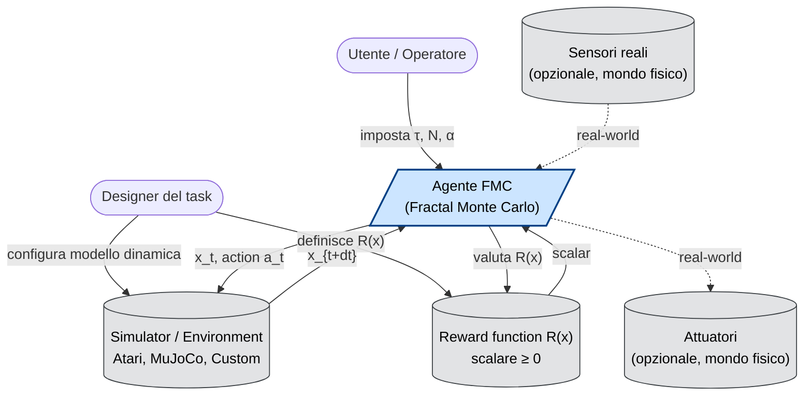

# 01 — FMC System Context Diagram (C4 Level 1)

**Scopo**: mostrare chi (umano e sistema) interagisce con un agente FMC e con quali sistemi esterni parla.

## Chiave di lettura

- **Utente / Operatore**: chi esegue l'agente al runtime. Sceglie iperparametri (`τ`, `N`, balance `α/β`).
- **Designer del task**: chi progetta il problema. Definisce la *reward* e il *simulator*.
- **Simulator**: il cuore del forward-thinking. Per Atari è l'emulatore stesso; per il razzo, una fisica custom; per la robotica, MuJoCo/PyBullet.
- **Reward function**: deve rispettare R(alive) > 0, R(dead) = 0. Spesso composta moltiplicativamente.
- **Sensori/Attuatori**: presenti solo se l'agente è deployato nel mondo reale. Non necessari per benchmark RL.

## Differenza chiave vs RL classico

In RL tradizionale, l'agente **impara** una policy `π_θ(a|s)` da un dataset. Qui invece:

- Non c'è apprendimento
- L'agente **pianifica online** ad ogni step usando il simulator come "occhio sul futuro"
- Niente network, niente gradiente, niente training loop
