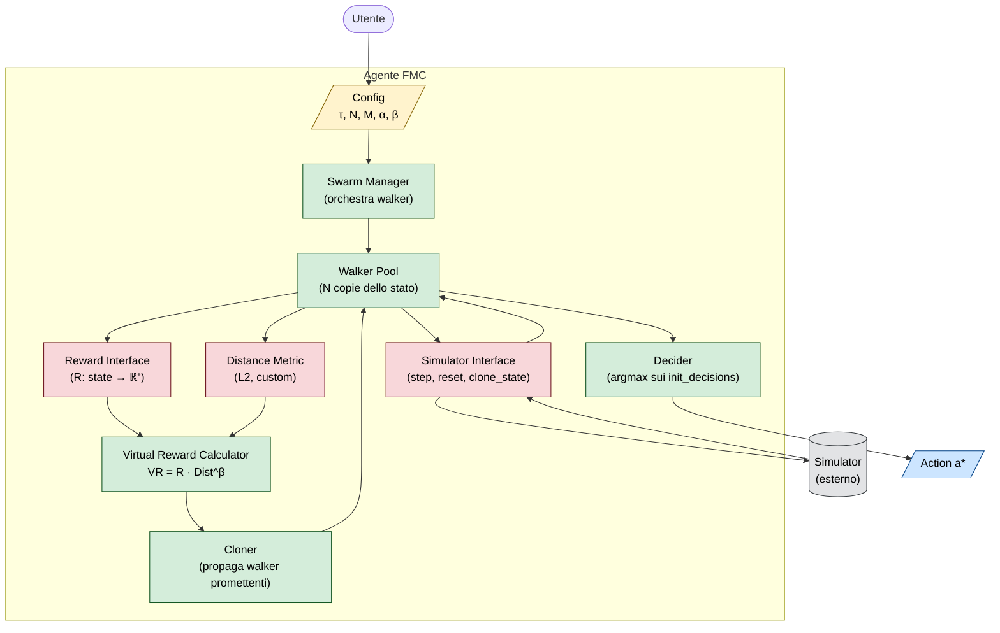

# 02 — FMC Container Diagram (C4 Level 2)

**Scopo**: zoom dentro l'agente FMC, mostrare i "container" software (moduli/processi).

## Container per ruolo

| Container | Cosa fa | File rappresentativo (FractalAI_old) |
|---|---|---|
| Swarm Manager | Orchestra il loop scanning → cloning → decision | [`fractalai/swarm.py:174-617`](../../repos/FractalAI_old/fractalai/swarm.py#L174) |
| Walker Pool | Tiene gli N walker in memoria | `Swarm.observations`, `Swarm.walkers_id` |
| Virtual Reward Calc | Calcola `VR = R · Dist^β` | `Swarm.virtual_reward()` linee 469-480 |
| Cloner | Probabilità + applicazione del clone | `Swarm.clone_condition()`, `Swarm.perform_clone()` |
| Decider | Sceglie l'azione finale | `FractalMC.weight_actions()` linee 94-107 |
| Simulator Interface | Astrazione su gym/MuJoCo/custom | `fractalai/environment.py` |
| Reward Interface | Permette `custom_reward` callable | `Swarm.__init__(custom_reward=...)` |
| Distance Metric | Default L2 sulla osservazione | `Swarm.evaluate_distance()` linee 451-462 |

## Boundaries (Interface)

I tre **interface in rosso** sono il punto di estensione dell'algoritmo: cambiando metrica di distanza, reward function, o simulator, lo stesso FMC si applica a domini totalmente diversi (Atari, robotica, finanza, simulazione fisica).
