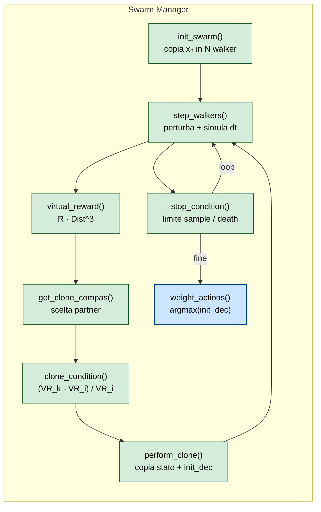
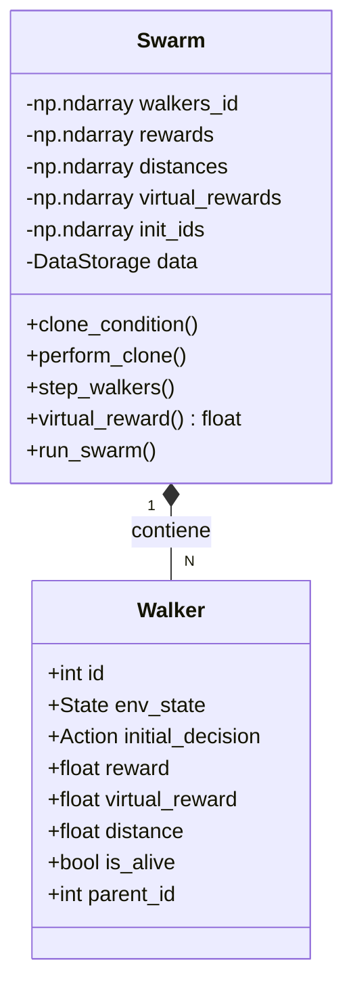
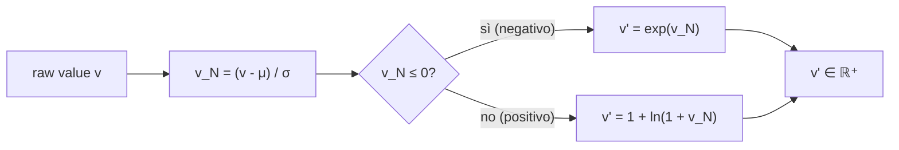

# 03 — FMC Components Diagram (C4 Level 3)

**Scopo**: zoom dentro lo Swarm Manager — i componenti che fanno il lavoro algoritmico.



## Pseudocodice del loop

```python
def run_swarm():
    init_swarm()                          # x₀ → N walker
    while not stop_condition():           # default: budget di sample
        clone_condition()                 # 1) calcola VR e probabilità clone
        step_walkers()                    # 2) perturba ed evolvi simulator
        clone()                           # 3) applica i clone effettivi
    return weight_actions()               # decisione = bincount(init_decisions).argmax()
```

## Stato del singolo walker



## Trasformazione `relativize` (essenza matematica del scoring)

Senza relativize la moltiplicazione `R · Dist` esplode quando uno dei due è grande. Con relativize entrambi sono **z-score normalizzati e poi compressi**:



Proprietà:
- `v' > 0` sempre
- Comprime outlier positivi (log)
- Espande outlier negativi (exp)
- Preserva ordinamento

Implementato in [`relativize_vector` (FractalAI_old)](../../repos/FractalAI_old/fractalai/swarm.py#L16) e in [`relativize` (fragile)](../../repos/fragile/src/fragile/fractalai.py#L27).
