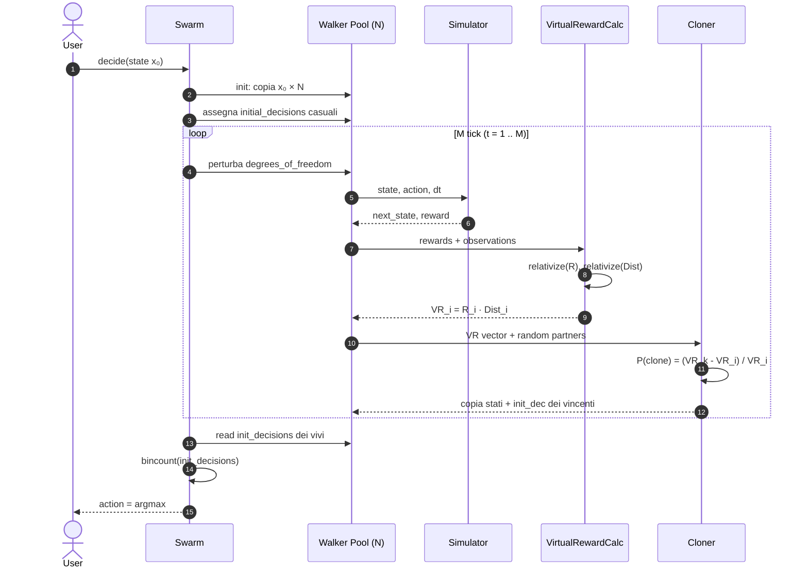

# 04 — FMC Sequence Diagram (data flow di una singola decisione)

**Scopo**: mostrare temporalmente ciò che accade durante una decisione FMC: `state → action`.



## Note temporali

- Il loop interno **M tick** è il "cuore di pianificazione" — dura `M = τ/dt` iterazioni.
- A `t=1` ogni walker usa `initial_decision` (decisione di prova).
- A `t>1` ogni walker perturba liberamente (esplorazione del cono).
- Il cloning **non è sincronizzato per default**, ma in pseudocodice del paper lo è (per chiarezza).

## Sample budget

In ogni tick, ogni walker fa una `Simulator.step()`. Quindi:

```
total_samples ≈ N × M
```

Per Atari, paper usa `N=30, M=15 → 450 sample/decisione`. Confronto con MCTS UCT: 150 000 sample/decisione (~333× di più).
