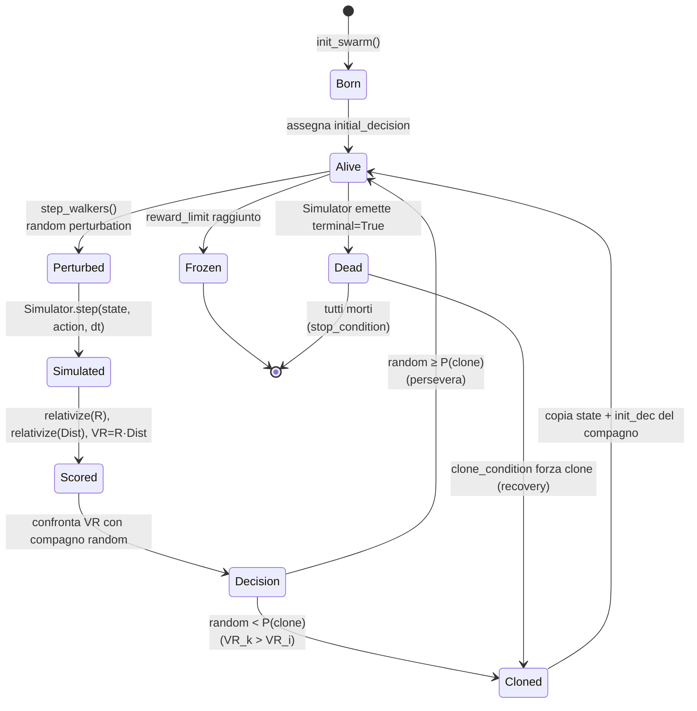

# 05 — Walker State Machine

**Scopo**: ciclo di vita di un singolo walker dall'inizializzazione alla morte/fine.

## Stati spiegati

| Stato | Significato |
|---|---|
| **Born** | Appena copiato dallo stato iniziale `x₀` |
| **Alive** | Walker in esecuzione, può perturbarsi o clonarsi |
| **Perturbed** | Ha ricevuto una nuova random action per il tick corrente |
| **Simulated** | Il simulator ha calcolato `next_state` |
| **Scored** | Sono stati calcolati `R` e `VR` |
| **Decision** | Si decide se clonarsi o no |
| **Cloned** | Ha sostituito il proprio stato con quello del compagno |
| **Dead** | Il simulator ha emesso terminal (es. game over) — può essere "rianimato" via clone |
| **Frozen** | Ha raggiunto la condizione di stop (es. score = max) — non si muove più |

## Implementazione (FractalAI_old)

| Stato/transizione | Codice |
|---|---|
| Born | [`Swarm.init_swarm()`](../../repos/FractalAI_old/fractalai/swarm.py#L349) |
| Perturbed→Simulated | [`Swarm.step_walkers()`](../../repos/FractalAI_old/fractalai/swarm.py#L401) |
| Scored | [`Swarm.virtual_reward()`](../../repos/FractalAI_old/fractalai/swarm.py#L469) |
| Decision | [`Swarm.clone_condition()`](../../repos/FractalAI_old/fractalai/swarm.py#L511) |
| Cloned | [`Swarm.perform_clone()`](../../repos/FractalAI_old/fractalai/swarm.py#L533) |
| Dead/Frozen | `Swarm._end_cond`, `Swarm._not_frozen` (mask vettoriale) |

## Insight chiave

> *Un walker morto può "rianimarsi" clonandosi su un compagno vivo.*

Questa è la differenza fondamentale rispetto a MCTS: in MCTS un percorso morto resta morto e si potano i rami. In FMC l'energia computazionale viene **continuamente riciclata** dai morti ai vivi.

Conseguenza: FMC è più resistente a "vicoli ciechi" del cono causale rispetto a MCTS, perché lo sciame si auto-bilancia continuamente.
