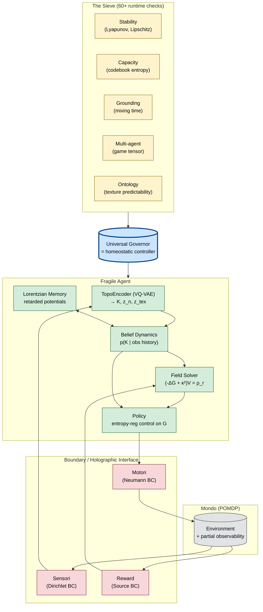
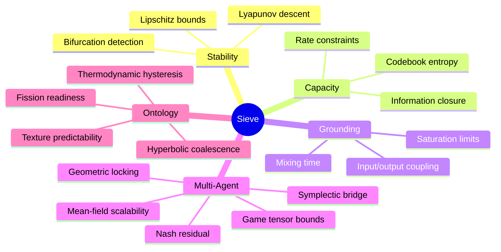

# 06 — Fragile Mechanics: Architettura cognitiva

**Scopo**: vista d'insieme del framework cognitivo `fragile-rl` (vedi [`docs/source/1_agent/intro_agent.md`](../../repos/fragile-rl/docs/source/1_agent/intro_agent.md)).



## Concetti-chiave

### State decomposition

```
State Z_t = (K_t, z_{n,t}, z_{tex,t})
```

| Componente | Significato | Dimensione tipica |
|---|---|---|
| `K` | Macro-stato discreto (control-relevant symbols) | 8 chart × 32 codici = 256 simboli |
| `z_n` | Nuisance continua (pose, basis) | 16-128 |
| `z_tex` | Texture (residuo di ricostruzione) | rest |

### Holographic Interface (sezione 23-24 del libro)

L'interfaccia con il mondo è formalmente una **PDE al contorno**:
- **Sensori** = condizioni di Dirichlet (valori imposti)
- **Motori** = condizioni di Neumann (flussi imposti)
- **Reward** = source/sink al confine

Il critic risolve `(-Δ_G + κ²) V = ρ_r` (screened Poisson) per la componente conservativa del reward field.

### The Sieve

60+ check runtime su 5 categorie (vedi [`docs/source/1_agent/02_sieve/`](../../repos/fragile-rl/docs/source/1_agent/)):



### Standard Model of Cognition

Gauge group: `G_Fragile = SU(N_f)_C × SU(r)_L × U(1)_Y` (con r = 2 minimale).

Da tre invarianze:
1. **Utility phase invariance** → U(1)_Y → field B_μ (Opportunity)
2. **Sensor-motor chirality** → SU(r)_L → field W_μ (Error)
3. **Feature basis freedom** → SU(N_f)_C → field G_μ (Binding)

## Continuità con FMC

Tutta l'architettura sopra è **molto più ambiziosa** del FMC del paper 2018, ma il **kernel di pianificazione** resta lo stesso:

> *Il policy layer in fragile-rl può essere implementato come uno sciame FMC che opera nello spazio latente `(K, z_n, z_tex)`, usando la metrica WFR per le distanze e il critic field per la reward.*

Cioè: **FMC scalato su un manifold geometrico** invece che sullo state space crudo.
