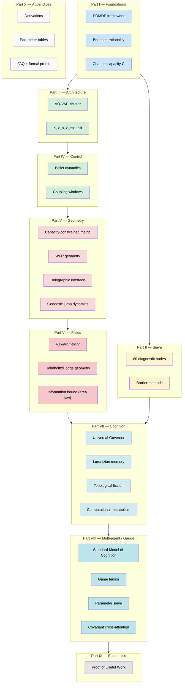

# 07 — Fragile-RL: Stratificazione del libro

**Scopo**: vista a livelli del documento "Fragile Mechanics" (10 parti, ~50 capitoli).

## Mappa parte → contributo

| Parte | Contributo nuovo | Cosa ripackagea |
|---|---|---|
| I | Definizione operativa di "bounded rationality controller" | POMDP, Friston AIF |
| II | The Sieve come sistema di safety-by-construction | Lagrangian methods, barrier funcs |
| III | Latent decomposition `(K, z_n, z_tex)` esplicita | VQ-VAE, β-VAE, InfoNCE |
| IV | Coupling windows + belief on hybrid manifold | Particle filters, EKF/UKF |
| V | **Capacity-constrained metric law** + WFR + holographic | Optimal transport (WFR), info geometry, gauge theory |
| VI | Reward come PDE source (Helmholtz/screened Poisson) | Hodge decomposition, electromagnetic analogy |
| VII | Lorentzian memory + topological fission + thermodynamic hysteresis | Self-attention, ontology learning, Landauer bound |
| VIII | **Standard Model of Cognition** = SU(N_f) × SU(2) × U(1) | Yang-Mills, Standard Model of physics |
| IX | Proof of Useful Work (PoUW) per coordinazione multi-agent | Bitcoin PoW, mechanism design |
| X | Reference + proof formali | n/a |

## Cuore concettuale

Il framework dichiara di essere **una "cosmologia" dell'agente cognitivo**: parte dai principi minimi (capacità informativa finita) e deduce la struttura dell'agente come **conseguenza geometrica/gauge-teorica**.

> *Standard RL appears as a degenerate limit of the Fragile Agent when geometry is flattened (G → I), capacity is unbounded (|K| → ∞), and the Sieve is disabled (Ξ_crit → ∞).* — `intro_agent.md`

Ovvero: tutto RL classico è un caso limite "piatto" di Fragile Mechanics.
