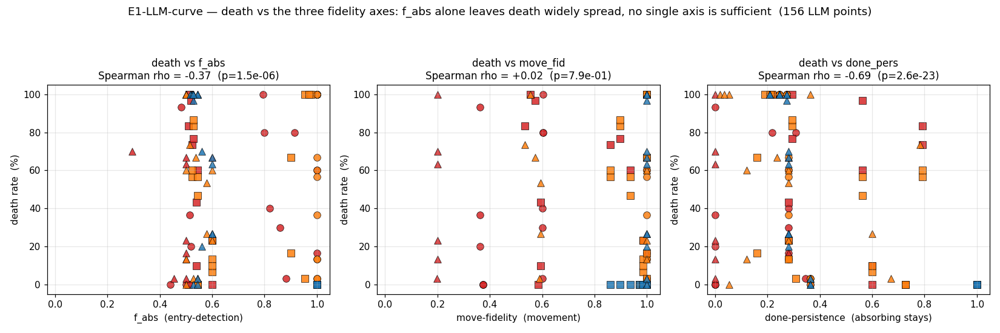
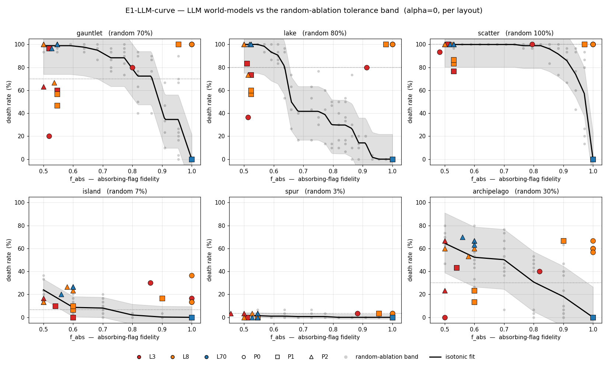

# E1-LLM-curve — eseguita: $f_{\text{abs}}$ è necessaria, non sufficiente (2026-05-21)

Esecuzione del design pre-registrato [`E1_LLM_CURVE_DESIGN.md`](E1_LLM_CURVE_DESIGN.md):
portare LLM reali *dentro* la curva di tolleranza di [`E1_LLM_RESULT.md`](E1_LLM_RESULT.md)
§1 — invece che in cima ($f_{\text{abs}}=1$) — e chiedere se il loro death rate
cade *sulla* curva dell'ablazione casuale ($f_{\text{abs}}$ statistica
sufficiente) o *fuori* (la struttura dell'errore conta).

Codice: [`e1_llm_curve.py`](e1_llm_curve.py) (esperimento), [`e1_llm_curve_analysis.py`](e1_llm_curve_analysis.py)
(statistica). Dati: [`results/e1_llm_curve.json`](results/e1_llm_curve.json),
[`results/e1_llm_curve_analysis.json`](results/e1_llm_curve_analysis.json).
I 36 world-model LLM generati (codice sorgente) sono salvati in [`results/e1_llm_curve.json`](results/e1_llm_curve.json), campo `generations[].source`.
Kernel `fmc-core` invariato; `WorldModelEnv(true)` asserito bit-identico a `plan`.

> **Esito in una riga.** $f_{\text{abs}}$ — la fedeltà di *riconoscimento* degli
> stati assorbenti — è **necessaria ma non sufficiente** per la self-preservation
> sotto un world-model LLM. *Entro* la classe d'errore della banda (falsi
> negativi sull'ingresso) i punti LLM cadono **esattamente sulla curva**
> (in-band 100%, Wilcoxon $p=1.00$): lì $f_{\text{abs}}$ è statistica
> sufficiente. *Ma* la maggioranza dei world-model LLM sbaglia **fuori** dal
> supporto della banda — movimento errato, e soprattutto **persistenza
> assorbente rotta** (un walker già sulla lava ne *esce* nel rollout). Caso
> emblematico: 8B e 3B con prompt completo producono world-model con
> $f_{\text{abs}}=1.000$ **eppure morte 64%** — $f_{\text{abs}}$ è strutturalmente
> cieca a questo. Il gate del merge FMC+LLM è **a tre assi**, non uno.

---

## 1. Disegno e dati grezzi

**Fase A — banda di riferimento** (no LLM): per ognuno dei 6 layout, $K=80$
ablazioni assorbenti casuali → nuvola di punti $(f_{\text{abs}}, \text{death})$,
$\alpha=0$, $n=30$. **Fase B**: scala di 4 modelli Llama × 3 prompt × 3 repliche
= **36 generazioni** (forma "Code World Model"). $f_{\text{abs}}$ è *misurata*
dal probe, non controllata.

| modello | P0 (completo) | P1 (implicito) | P2 (degradato) |
|---|---|---|---|
| llama-3.2-**1B** | — | — | — |
| llama-3.2-**3B** | 0.78 / 48% / 0.66 / 0.18 | 0.54 / 47% / 0.76 / 0.54 | 0.51 / 59% / 0.73 / 0.18 |
| llama-3.1-**8B** | **1.00 / 64%** / 1.00 / 0.28 | 0.69 / 46% / 0.96 / 0.43 | 0.53 / 60% / 0.86 / 0.28 |
| llama-3.3-**70B** | 1.00 / 0% / 1.00 / 1.00 | 1.00 / 0% / 0.98 / 1.00 | **0.55 / 65%** / 1.00 / 0.28 |

*(cella = $f_{\text{abs}}$ / death% / move-fidelity / done-persistence — medie sui 6 layout)*

- **Il 1B non produce nemmeno codice eseguibile**: 9/9 generazioni `no-valid-model`
  (più 1 del 3B) — 10 su 36. È un pavimento di capacità.
- Solo il **70B con prompt P0/P1** produce world-model perfetti (morte 0%). Tutti
  gli altri 20 world-model validi falliscono in almeno un modo.

---

## 2. hC-1 e hE1Lc-3 — confermate

**hE1Lc-4 (gate di non-banalità): MET.** 16 dei 26 world-model validi atterrano
a $f_{\text{abs}}\leq 0.95$ — gli LLM cadono *genuinamente dentro* la curva.
E1-LLM-curve non è banale.

**hE1Lc-3 (degradazione monotona): confermata su entrambi gli assi** (test di
trend Jonckheere-Terpstra):

- $f_{\text{abs}}$ cresce con la **capacità del modello** (1B<3B<8B<70B):
  $z=+5.88$, $p=4\times 10^{-9}$.
- $f_{\text{abs}}$ cresce con la **fedeltà del prompt** (P2<P1<P0):
  $z=+8.24$, $p=2\times 10^{-16}$.

La fedeltà del prompt è un fattore forte **quanto** la taglia del modello — il
70B, dato il prompt degradato P2 (che lega `done` *solo* al goal e chiama la lava
"bad terrain"), produce un world-model con persistenza 0.28 e morte 65%. **Una
specifica incompleta è letale anche per un modello forte** — l'avvertimento
ecologico per Route A (dominio aperto, dove la specifica è sempre parziale).

---

## 3. Il finding centrale — la decomposizione dell'errore in tre assi

Un world-model LLM può sbagliare in modi che $f_{\text{abs}}$ **non vede**.
$f_{\text{abs}}$ misura un solo asse: il *riconoscimento* di lava/goal come
terminali **all'ingresso** (probe su `done=False`). Ma una transizione ha altri
due assi indipendenti, scoperti rieseguendo i probe sui world-model generati:

| asse | cosa misura | chi lo testa |
|---|---|---|
| **entry-detection** | `ndone` corretto quando si *entra* in una cella | $f_{\text{abs}}$, la banda |
| **move-fidelity** | $(n_r,n_c)$ corretto per un walker vivo | *nessun probe pre-esistente* |
| **done-persistence** | un walker già assorbito *resta* lì | *nessun probe pre-esistente* |

La banda dell'ablazione casuale degrada **solo** l'entry-detection (movimento e
persistenza restano esatti). Quindi un punto LLM è *confrontabile con la banda*
solo se il suo **unico** errore è il falso-negativo d'ingresso.

**Classificazione dei 156 punti LLM** (26 world-model × 6 layout):

| classe d'errore | punti | sul supporto della banda? |
|---|---:|---|
| `exact` (nessun errore) | 30 | — (morte 0 per costruzione) |
| `fn-entry-only` (solo falso-neg d'ingresso) | 30 | ✅ sì |
| `persist` (persistenza rotta) | 72 | ❌ no |
| `move+persist` | 18 | ❌ no |
| `move+persist+false-pos` | 30 | ❌ no |
| `move` | 6 | ❌ no |

**120 punti su 156 hanno la persistenza assorbente rotta.** È il modo di
fallimento *dominante*.



*Death rate vs ciascun asse di fedeltà, 156 punti LLM (Spearman: $f_{\text{abs}}$
$\rho=-0.37$; move-fidelity $\rho=+0.02$; done-persistence $\rho=-0.69$). Nessun
asse singolo predice la morte — a $f_{\text{abs}}\approx 1$ la death spazia da 0
a 100%. La persistenza assorbente è l'asse più informativo, ma il gate resta
congiunto.*

### 3.1 Il caso emblematico: $f_{\text{abs}}=1.000$ eppure morte 64%

20 punti LLM hanno $f_{\text{abs}}=1.0$ ma morte $>10\%$ — i world-model 8B/P0 e
3B/P0. `move-fidelity` media $1.00$, `done-persistence` media $0.26$. Diagnosi
inequivocabile: questi modelli **riconoscono** la lava all'ingresso (così
$f_{\text{abs}}=1$) e **si muovono** correttamente, ma **non implementano la
clausola `if done:`** — un walker sulla lava, al tick successivo, viene *spostato
via*. Nel rollout interno di FMC la lava diventa attraversabile (l'`abs-broken`
di P13) → FMC pianifica traiettorie *attraverso* la lava → sul mondo vero muore.
$f_{\text{abs}}$, che sonda solo `done=False`, è **strutturalmente cieca** a
questo. Confronto diretto dei sorgenti: il 70B/P0 apre con `if done: return r, c,
True`; l'8B/P0 non ha quella riga.

---

## 4. hE1Lc-1 vs hE1Lc-2 — il test sui residui

Regressione **isotonica** $\widehat g_L(f_{\text{abs}})$ per layout sulla banda
($K=80$); residuo segnato $\rho = \text{death}_{\text{LLM}} - \widehat g_L$.

| insieme | $n$ | in-band (5–95%) | mediana $\rho$ | Wilcoxon $p$ |
|---|---:|---:|---:|---:|
| **tutti i punti** | 156 | 63% | $+0.0$ pp | $0.057$ |
| **band-comparable** (solo fn-entry) | 30 | **100%** | $+0.0$ pp | $1.00$ |
| off-support (move/persist/FP) | 126 | 54% | $+0.1$ pp | — |



*Per layout: la banda dell'ablazione casuale (nuvola grigia + fit isotonico +
inviluppo 5–95%) e i 26 world-model LLM sovrapposti (colore = modello, marker =
prompt). Sui layout fragili — gauntlet, lake, scatter, archipelago — molti punti
LLM siedono **sopra** la banda anche a $f_{\text{abs}}$ alta: il loro errore non
è del tipo che la banda esplora.*

- **hE1Lc-1 vale *entro* la classe d'errore della banda.** I 30 punti
  band-comparable — world-model il cui *unico* errore è il falso-negativo
  d'ingresso, esattamente l'errore che la banda esplora — cadono **al 100% nella
  banda** ($p=1.00$). Per quella classe d'errore, **$f_{\text{abs}}$ è statistica
  sufficiente**: non conta *quali* celle l'LLM acceca, conta solo quante — come
  l'ablazione casuale.
- **hE1Lc-2 vale complessivamente.** Solo 63% dei punti totali è in-banda (vs
  ~90% atteso se gli LLM fossero processi banda-simili). La mediana resta $\approx
  0$ — gli errori off-support a volte aiutano, a volte uccidono, e si compensano
  in mediana — ma la *dispersione* eccede largamente quella della banda. Il
  Wilcoxon su tutti i punti ($p=0.057$) non rigetta solo perché testa la
  *mediana*; la storia vera è nella varianza e nei 126 punti off-support.

**Verdetto: $f_{\text{abs}}$ è NECESSARIA ma NON SUFFICIENTE.** Sufficiente solo
all'interno di una classe d'errore (falso-negativo d'ingresso); cieca alle altre
due. Né hE1Lc-1 né hE1Lc-2 puri — come E2, *verificata con un refinement*.

---

## 5. Lettura onesta — conseguenze per la Congettura E

Questo esperimento **non rivede** la Congettura E (chiusa: E1-base, E2, E1-LLM
tutte verificate). La **caratterizza**, e affila il gate del merge FMC+LLM.

1. **Il gate "struttura assorbente" di E1-LLM/P13 era sotto-specificato.**
   P13/hP13-1 diceva "il world-model deve modellare la struttura assorbente".
   E1-LLM-curve decompone quella frase in **due requisiti separabili e
   indipendenti**: *entry-detection* (riconoscere il terminale entrando — ciò che
   $f_{\text{abs}}$ misura) e *done-persistence* (mantenerlo terminale nei tick
   successivi). Un LLM può superare il primo e fallire il secondo — ed è il
   fallimento *dominante* (120/156 punti). Più un terzo asse che il gate non
   nominava affatto: la **fedeltà di movimento**.

2. **Il gate corretto del merge è a tre assi**: il world-model LLM dev'essere
   fedele su (a) riconoscimento terminale all'ingresso, (b) persistenza
   assorbente, (c) movimento. $f_{\text{abs}}$ certifica solo (a). Un probe
   completo di E1-LLM/Route A deve misurare tutti e tre — il death rate li
   cattura tutti, le metriche di fedeltà parziali no.

3. **La fedeltà del prompt conta quanto la capacità del modello.** Il 70B/P2
   crolla (persistenza 0.28, morte 65%) perché il prompt P2 *non enuncia* la
   regola di assorbenza. Nella pipeline FMC+LLM, se l'organo di percezione
   consegna a FMC una specifica del mondo incompleta, nemmeno un world-model LLM
   forte salva la self-preservation. È il rischio strutturale di Route A.

4. **C'è un pavimento di capacità.** Il 1B non produce nemmeno codice eseguibile
   (9/9 fallimenti). Sotto una certa scala, l'LLM non è un organo world-model
   utilizzabile, punto.

5. **La buona notizia per il merge.** Dove un LLM *fa* il suo lavoro (70B,
   prompt non degradato → world-model esatto), FMC ci pianifica sopra e la
   self-preservation regge perfettamente (E1-LLM, morte 0/180). E dove l'errore
   è "solo" del tipo che la banda esplora, $f_{\text{abs}}$ lo predice
   esattamente. Il merge è solido; i suoi modi di fallimento sono ora mappati e
   nominati.

---

## 6. Riproducibilità

```bash
cd "/Users/vladvrinceanu/Desktop/PROGETTI ANTYGRAVITY/FractalAI"
PY=/Users/vladvrinceanu/.pyenv/versions/3.11.7/bin/python
"$PY" -u work/12_conjecture_e/e1_llm_curve.py            # ~4800 s, 36 LLM gen
"$PY"    work/12_conjecture_e/e1_llm_curve_analysis.py   # ~30 s, no LLM
"$PY"    work/12_conjecture_e/e1_llm_curve_figures.py    # ~5 s, le 2 figure
# chiave NVIDIA nel Keychain: security find-generic-password -s fractalai-nvidia-api -w
```

---

*Fine E1_LLM_CURVE_RESULT.md. $f_{\text{abs}}$ è necessaria ma non sufficiente
per la self-preservation sotto world-model LLM: sufficiente entro la classe
falso-negativo-d'ingresso (in-band 100%), cieca a movimento e persistenza
assorbente. Caso emblematico: $f_{\text{abs}}=1.0$ con morte 64% (clausola
`if done:` mancante). hE1Lc-4 e hE1Lc-3 confermate (gli LLM cadono dentro la
curva; $f_{\text{abs}}$ degrada monotòna con taglia e fedeltà del prompt). Il
gate del merge FMC+LLM è a tre assi — entry-detection, movimento,
persistenza — non $f_{\text{abs}}$ da sola.*
