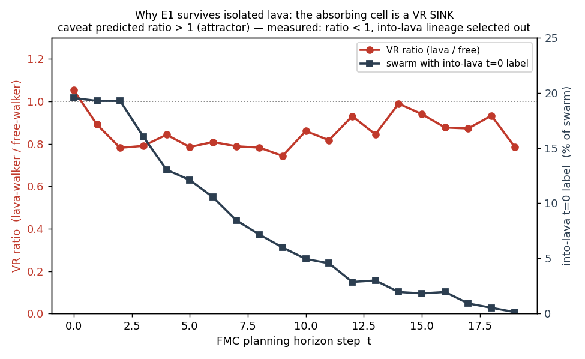

# E1-robustness — geometria avversariale (2026-05-20)

Terzo esperimento del programma research-partner. **Non** un nuovo test di
Congettura E: chiude il **caveat di geometria** lasciato aperto da E1-base e
ripreso in E2 — l'unico caveat azionabile prima del muro di compute P13.

Disegno **pre-registrato** prima dei dati: [`E1_ROBUSTNESS_DESIGN.md`](E1_ROBUSTNESS_DESIGN.md).

## Il caveat sotto esame

E1-base ha verificato che FMC a basso α evita gli stati assorbenti senza reward
di sopravvivenza — ma su **3 layout con lava compatta**. Il caveat (in
[`RESULT.md`](RESULT.md) e [`E2_RESULT.md`](E2_RESULT.md)):

> A α=0 il virtual reward è `relativize(distanza)^β` — premia gli *outlier
> spaziali*. Un walker su lava **isolata e distante** è un outlier di massima
> diversità → VR alta → il suo stato (morto, congelato) e la sua label t=0 si
> propagano per cloning → lo sciame viene *attirato* sulla lava.

Se regge, la "self-preservation emergente" di E1 si **inverte** su geometria
avversariale. Catena causale del caveat in due anelli: (1) lava-walker = outlier
ad alta VR; (2) quindi lo sciame ci viene tirato dentro.

## Setup

Identico a E1-base (kernel `fmc-core` invariato, N=64, M=20, β=1) tranne: **3
layout avversariali 15×15** con lava in celle **isolate** a scale diverse, e
**n=60 episodi/cella** (la n di E2 — n=20 di E1-base è troppo debole per
distinguere un death rate piccolo-ma-nonzero da 0). α ∈ {0, 0.1, 1.0}.

- **island** — un singolo blocco 2×2 di lava isolato, fuori dal corridoio.
- **spur** — cluster di lava in un angolo lontano; il percorso start→goal sta
  sul bordo opposto (la lava è *irrilevante al percorso*).
- **archipelago** — più celle di lava singole, ognuna circondata da spazio
  libero (`scatter` portato all'estremo isolato).

## Risultati

| layout | policy | death% | goal% | vs random | vs greedy |
|---|---|--:|--:|---|---|
| island | random | 5.0% | 0% | — | — |
| island | greedy | 5.0% | 95% | — | — |
| island | **fmc α=0.0** | **0%** | 0% | z=−1.75, p=.079 | z=−1.75, p=.079 |
| island | **fmc α=0.1** | **0%** | 0% | — | — |
| island | **fmc α=1.0** | **0%** | **100%** | — | — |
| spur | random | 5.0% | 0% | — | — |
| spur | greedy | 0% | 100% | — | — |
| spur | **fmc α=0.0** | **0%** | 0% | z=−1.75, p=.079 | — |
| spur | **fmc α=0.1** | **0%** | 0% | — | — |
| spur | **fmc α=1.0** | **0%** | **100%** | — | — |
| archipelago | random | **31.7%** | 0% | — | — |
| archipelago | greedy | **41.7%** | 58% | — | — |
| archipelago | **fmc α=0.0** | **0%** | 0% | z=−4.75, **p<.001** | z=−5.62, **p<.001** |
| archipelago | **fmc α=0.1** | **0%** | 0% | **p<.001** | **p<.001** |
| archipelago | **fmc α=1.0** | **0%** | **100%** | **p<.001** | **p<.001** |

Death rate `fmc α=0`, IC95 di Wilson: **[0%, 6.0%]** su tutti e 3 i layout.
Dati grezzi: [`results/e1_robustness.json`](results/e1_robustness.json).

**Verdetto pre-registrato: 3/3 PASS → caveat RESPINTO.** FMC a ogni α testato →
**0% di morte su tutte e 3 le geometrie avversariali**.

## Lettura — onestà sulla forza dell'evidenza

I tre layout non pesano uguale:

- **`archipelago` è il risultato load-bearing.** Random muore al **31.7%**,
  greedy al **41.7%**: c'è una *vera* pressione di morte da lava — e FMC a ogni
  α la azzera (0%, z=−4.75 vs random, p<0.001). Decisivo.
- **`island`/`spur` sono PASS a contrasto debole.** Lì il random muore solo al
  5%: lava così isolata è semplicemente difficile da colpire per caso. Il loro
  valore non è "FMC batte random" (debole, p=.079) ma "FMC non aggiunge **alcuna**
  attrazione" — il death rate resta inchiodato a 0% proprio dove la geometria era
  costruita per massimizzare l'outlier-ness della lava. Il caveat predice
  attrazione *attiva*; non se ne vede traccia.

**Bonus — α=1.0 funziona qui.** Su tutti e 3 i layout α=1 raggiunge il goal nel
**100%** con **0% morte**. Conferma la lettura di E1-base: la morte di α=1 sul
*lake* (100%) era specifica della geometria "goal **dietro** la lava", non una
sconsideratezza di α alto. Dove il goal non è dietro la lava, α=1 instrada
pulito anche fra celle di lava isolate.

## Perché il caveat sbagliava — il meccanismo

[`e1_robustness_diag.py`](e1_robustness_diag.py) apre la scatola: replica il loop
`plan()` di `fmc-core` (senza toccare il kernel — riesegue solo le funzioni
pubbliche per osservare) da un probe piazzato **adiacente** a una cella di lava
isolata (il caso peggiore), 12 ripetizioni, α=0.



**Anello 1 — FALSO.** Un lava-walker **non** è un outlier ad alta VR. Il
rapporto VR(lava)/VR(free) parte a 1.05 a t=0 e **scende a 0.78–0.88** lungo
l'orizzonte: i walker su lava hanno VR *più bassa* dei free. Motivo: il cloning
**copia i walker sulla stessa cella assorbente** → la loro distanza reciproca
collassa a ~0 → il termine β/distanza crolla. **Una cella assorbente è un
*pozzo* di VR, non una sorgente.** Il caveat assumeva un outlier *solitario*; ma
le dinamiche di cloning di FMC garantiscono che chiunque raggiunga una cella
assorbente riceva *compagnia*, e un grappolo di walker su un punto solo ha
diversità interna nulla.

**Anello 2 — FALSO.** Di conseguenza la frazione di sciame con label t=0
"verso-la-lava" **decade** lungo l'orizzonte: 19.5% → 13% → 7.2% → 2.9% → 0.1%.
La lineage che punta alla lava viene **selezionata via**. `decide()` ha votato
"verso la lava" in **0/12** probe, pur partendo adiacente alla lava e senza
attrazione di goal (α=0).

Questo è quasi il **converso del Teorema 3** (anti-collasso): Th. 3 dice che β=0
fa collassare *globalmente* lo sciame; qui un sottoinsieme di walker che entra in
una cella assorbente subisce un collasso *locale* della diversità → perde VR →
la regione assorbente si **auto-spegne**. La self-preservation di E1 non è
fragile alla geometria: è radicata in come il termine β tratta i punti a
diversità nulla.

## Cosa chiude / cosa no

- ✅ Il caveat di geometria di E1 (lava isolata-distante) è **respinto**, con
  meccanismo identificato. E1-base regge su geometria avversariale.
- ✅ Spiega *perché*: gli stati assorbenti sono pozzi di VR sotto il termine β.
- ❌ Non testa E1-LLM (muro P13 — invariato).
- ⚠️ `pocket`/lava-che-circonda-lo-sciame resta un *altro* modo di fallire non
  testato qui (la pulsione di spread contro pareti adiacenti). Fuori scope.

## Riproducibilità

```bash
python work/12_conjecture_e/e1_robustness.py       # ~111 s — sweep 3 layout
python work/12_conjecture_e/e1_robustness_diag.py  # ~25 s  — meccanismo + figura
```

## Prossimi passi

1. **E1-LLM** — sostituire il simulatore con un world-model LLM; prima
   risolvere la sotto-domanda di fattibilità P13 (interrogazione sparsa O(N)).
2. **Deep-dive 09** — inquadramento architetturale FMC-core / LLM-organo.
