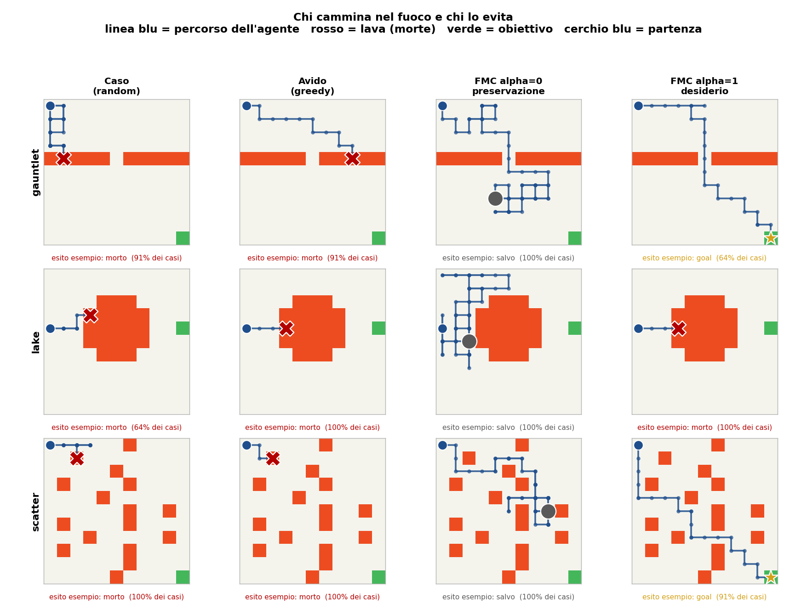
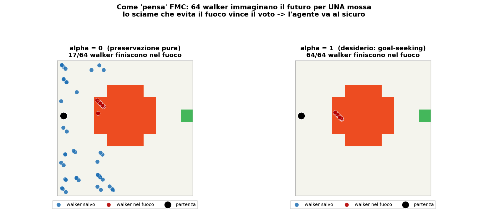
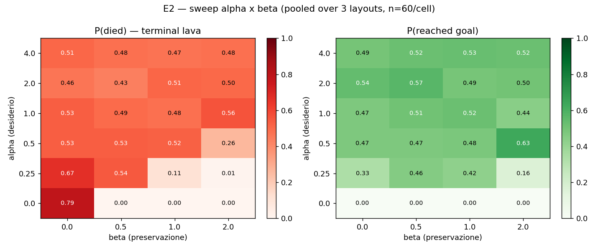
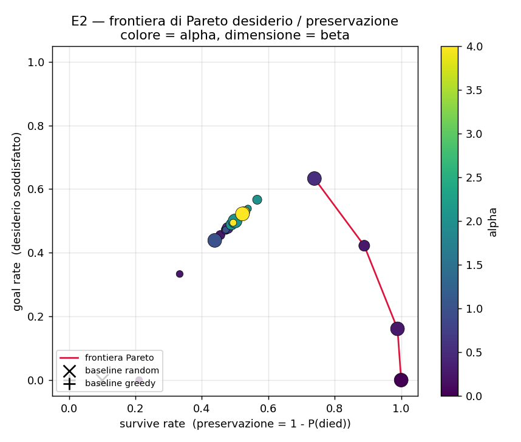

# E2 — Congettura E, sweep α×β (2026-05-20)

Secondo esperimento del programma research-partner. Testa la proposizione **E2**
di [Congettura E](../../docs/MATH_CANON.md#congettura-e--self-preservation-emergente-da-entropia-causale):
α e β si separano funzionalmente in *desiderio di azione* e *preservazione di sé*?
Esiste una banda Pareto-ottimale?

Disegno **pre-registrato** prima dei dati: [E2_DESIGN.md](E2_DESIGN.md).
Dati: **4320 episodi FMC** (6 α × 4 β × 3 layout × 60 episodi). Kernel `fmc-core`
invariato, N=64, M=20. Statistica con la skill `statistical-analysis`.

## Risultato in una riga

**E2 confermata — con un refinement importante e una falsificazione onesta:**
α è un trade-off reale (desiderio ⇄ morte); **β invece NON è un trade-off — è
sicurezza quasi gratuita.**

## I numeri

Ipotesi pre-registrate, test di Cochran-Armitage (robusto alla separazione),
p corretti con Holm-Bonferroni:

| Ipotesi (pre-registrata) | Test | Esito |
|---|---|---|
| H1 — P(morte) **cresce** con α | CA z = +12.5, p_holm < 10⁻³⁴ | ✓ **confermata** |
| H2 — P(goal) **cresce** con α | CA z = +20.3, p_holm < 10⁻⁹⁰ | ✓ **confermata** |
| H3 — P(morte) **decresce** con β | CA z = −13.4, p_holm < 10⁻³⁹ | ✓ **confermata** (monotona) |
| H4 — P(goal) **decresce** con β | CA z = −0.63, p = 0.53 | ✗ **FALSIFICATA** |
| H5 — separazione funzionale α/β | decomposizione η² | ✓ confermata ma **asimmetrica** |

**GLM logistico** (odds ratio per unità, IC 95%):

| Outcome | OR α | OR β |
|---|---|---|
| morte | 1.30 [1.23, 1.37] — α aumenta la morte | **0.48 [0.43, 0.53]** — β quasi dimezza la morte |
| goal | 1.61 [1.52, 1.71] — α aumenta il goal | **0.94 [0.85, 1.04]** — IC include 1: β **non** tocca il goal |

**Decomposizione η²** (quota di varianza spiegata): per il `goal`, α spiega
**91%**, β solo 0.8% — α *possiede* il goal. Per la `sopravvivenza`: α 26%,
β 23%, **interazione α×β 50%** — la sopravvivenza è un fenomeno congiunto.

## Le figure

### 1 — Chi cammina nel fuoco e chi lo evita



3 mappe × 4 strategie, un episodio rappresentativo ciascuno. **Caso** (random) e
**Avido** (greedy) finiscono con una ✗ rossa: morti nella lava. **FMC α=0**
(preservazione) vaga e sopravvive sempre (●). **FMC α=1** (desiderio) raggiunge
l'obiettivo (★) su `gauntlet` e `scatter` — ma sul `lake`, dove il goal è
*dietro* il lago di lava, il desiderio lo porta dritto nel fuoco.

### 2 — Come "pensa" FMC: lo sciame



Per decidere **una sola mossa**, FMC lancia 64 walker a immaginare 20 passi di
futuro. A **α=0** lo sciame si sparpaglia nello spazio libero: solo 17/64 walker
finiscono nel fuoco, e quelli — bloccati e ammassati — perdono il "voto"; l'agente
va al sicuro. A **α=1** l'attrazione del goal trascina **tutti e 64** i walker
dentro la lava: l'agente ci cammina dentro. È il meccanismo della morte da
desiderio, reso visibile.

### 3 — Mappa di calore α×β



A sinistra P(morte), a destra P(goal). Da leggere così: **scendendo le colonne**
(β cresce) il rosso si schiarisce — β salva. **Salendo le righe** (α cresce) il
verde del goal si accende — α dà scopo. La cella in basso a sinistra (α=0, β=0)
è rosso scuro 0.79: con β=0 lo sciame collassa — conferma empirica del
**Teorema 3** (lemma anti-collasso) di MATH_CANON.

### 4 — Frontiera di Pareto



Ogni punto è una coppia (α,β): asse x = sopravvivenza, asse y = goal. La linea
rossa è la frontiera dei compromessi non-dominati. **Tutti** i punti della
frontiera hanno α basso (≤0.5) e β alto (≥1); l'α alto è sempre dominato. Le
baseline random/greedy stanno nell'angolo morto in basso a sinistra.

## Lettura non-tecnica

- **α = la voglia di arrivare all'obiettivo.** Alzarla funziona: l'agente
  raggiunge il goal. Ma costa morti — più voglia, più rischio. È un vero
  compromesso.
- **β = l'istinto di sopravvivenza** (tenere aperte le vie di fuga). La scoperta
  di E2: alzare β **dimezza le morti e non costa NULLA in obiettivi raggiunti.**
  Non è il "knob opposto" ad α — è un margine di sicurezza quasi gratuito.
- Quindi la ricetta per un agente "vivo e diretto": **sii ambizioso quanto ti
  serve (α), ma tieni sempre alto l'istinto di sopravvivenza (β) — è gratis.**
  Il punto bilanciato migliore misurato: **α=0.5, β=2.0** (sopravvive 74%,
  raggiunge il goal 63%).

## Verdetto

E2 **confermata** nella sostanza (α e β si separano: H1, H2, H3, H5 ✓), con un
**refinement** che corregge la congettura: la sua versione simmetrica ("β fa
sopravvivere ma fa progredire meno") è **sbagliata sulla seconda metà** — H4
falsificata. La separazione è **asimmetrica**: α possiede in esclusiva il goal
(η²=0.91); β è un knob di pura sicurezza; la sopravvivenza è un effetto congiunto
α×β (η²_interazione=0.50). Il trade-off vero vive **solo** sull'asse α.

## Caveat (onestà statistica)

- **Geometria-dipendenza**: solo H3 (β salva) è consistente su tutti e 3 i
  layout. Gli effetti di α sono geometry-dependent — sul `lake` H2 si **inverte**
  (z=−4.3: più α → *meno* goal, perché α porta nella lava). β-protezione è
  l'unico universale.
- **α alto satura, non collassa**: su gridworld α∈{2,4} plateau (~50% goal, ~50%
  morte), non il crollo catastrofico visto su Craftax (exp22). Ambiente diverso.
- **n=60/cella**: i trend (ipotesi primarie) sono potenziati >0.99; le differenze
  fini cella-cella no (IC ±0.12). Vedi E2_DESIGN.md §potenza.

## Riproducibilità

```bash
python work/12_conjecture_e/e2_sweep.py      # ~7 min, genera e2_raw.csv
python work/12_conjecture_e/e2_analysis.py   # statistica + heatmap + pareto
python work/12_conjecture_e/e2_visuals.py    # traiettorie + sciame
```

## Prossimi passi

1. ✅ **Robustezza geometrica** — layout con lava isolata-distante →
   [`E1_ROBUSTNESS_RESULT.md`](E1_ROBUSTNESS_RESULT.md) (caveat di E1 respinto).
2. **E1-LLM** — sostituire il simulatore con un world-model LLM; prima risolvere
   la sotto-domanda di fattibilità P13 (interrogazione sparsa, costo O(N)).
