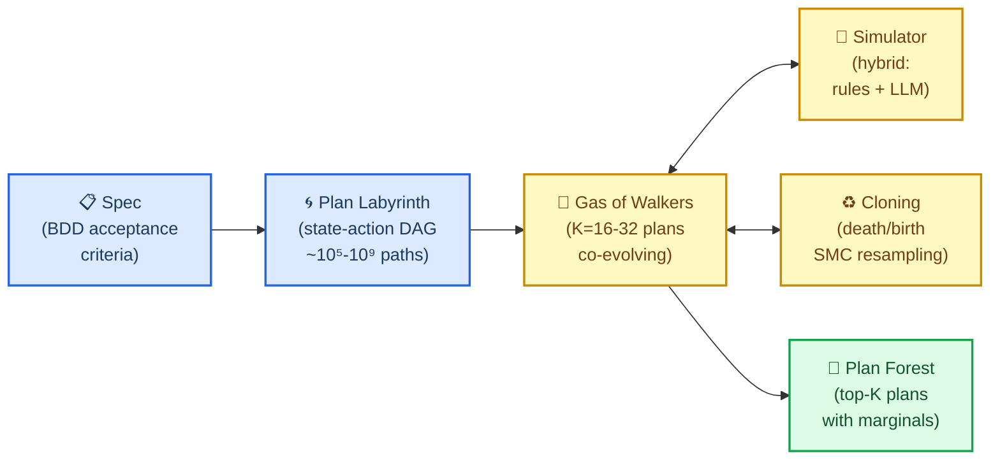
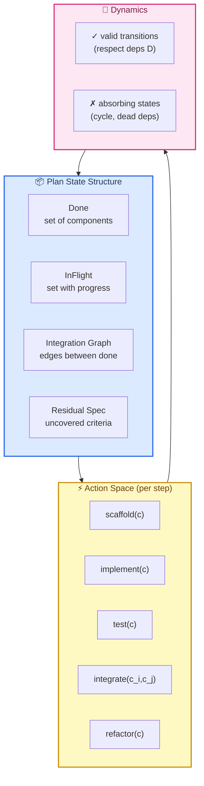
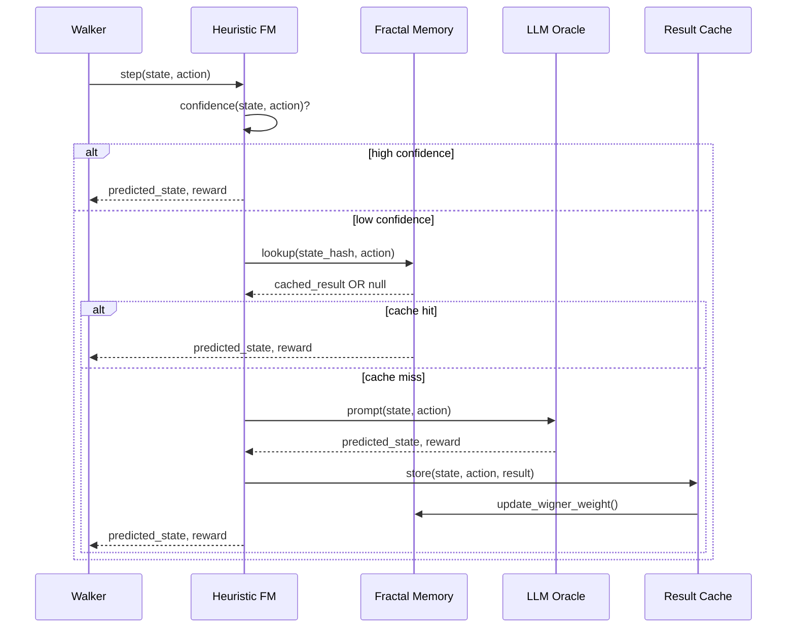
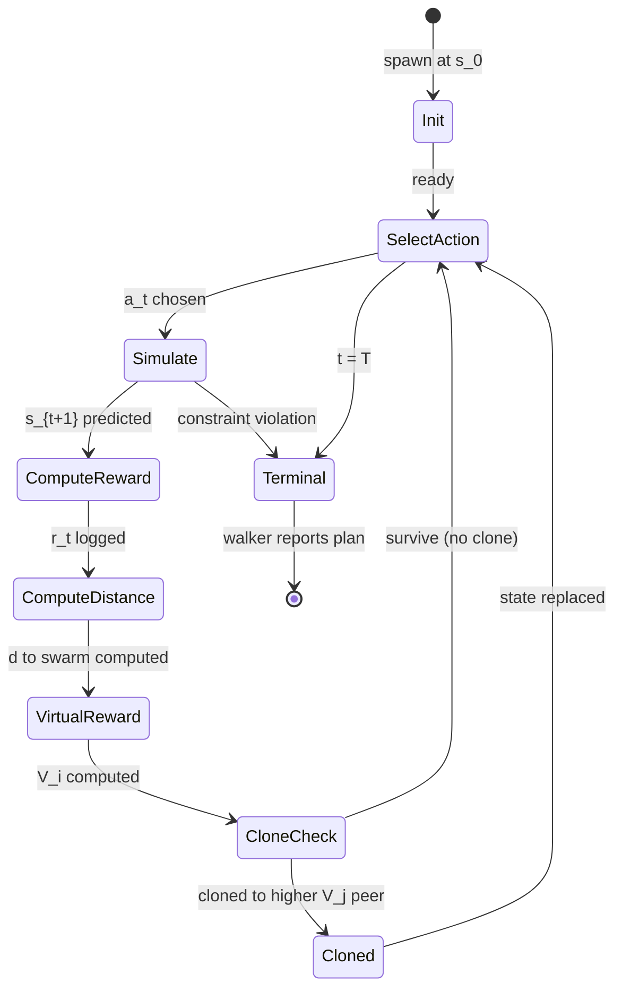
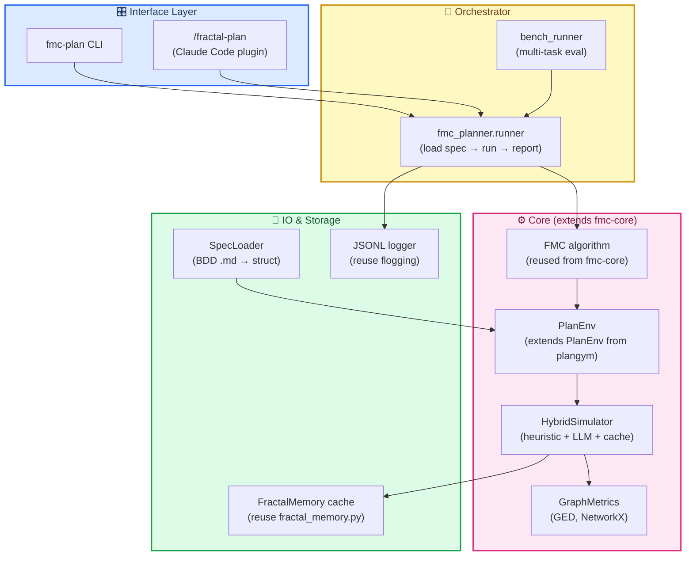
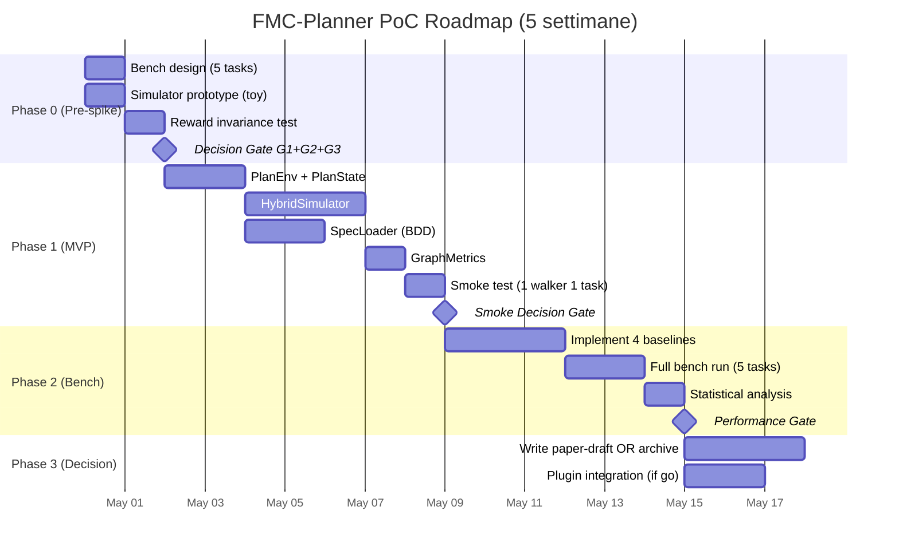
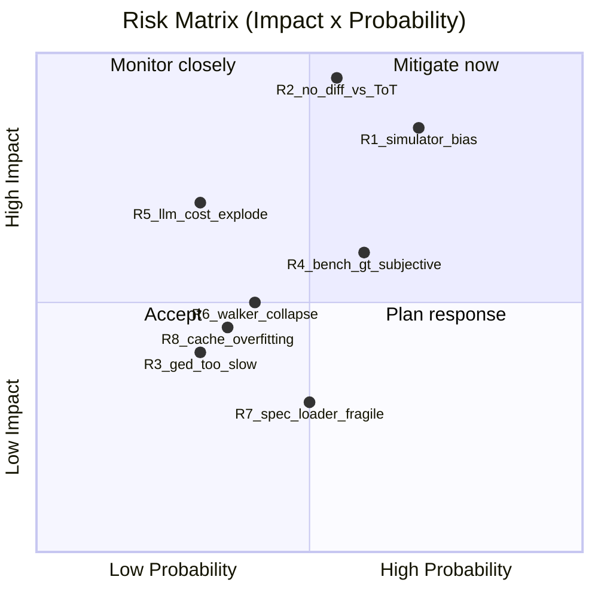
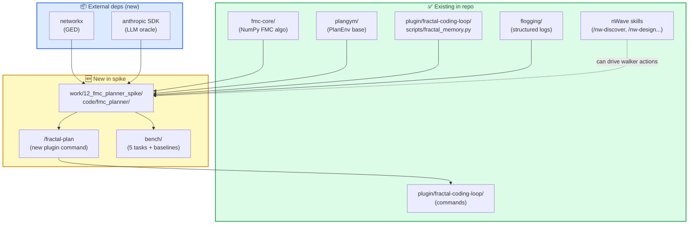

# FMC-Planner — Studio di Fattibilità + Specifica MVP/PoC

> **Status**: Pre-spike feasibility analysis
> **Data**: 2026-04-29
> **Branch**: `main` (no code)
> **Scope**: applicare FMC al *project planning* spec-driven invece che a un MDP di gioco/coding
> **Decisione richiesta**: go/no-go su Phase-0 (vedi §10)

---

## 0. 🎯 TL;DR

L'idea — usare FMC come **gas di walker che simulano in differita lo sviluppo di un progetto**, dato un set di constraints/spec, per individuare il path ottimale attraverso il "labirinto" delle decisioni di sviluppo — è **tecnicamente fattibile** e **scientificamente più solida** di varianti precedenti (FMC-edit), per tre ragioni:

1. **Spazio di ricerca tractable**: 20-100 componenti, non 10⁶ token.
2. **Allineamento con FMC canonico**: planning su grafo di stati discreti è il caso d'uso documentato (§2 paper 1803.05049v5).
3. **Simulator gap colmabile**: ibrido `regole-eulistiche + LLM-as-oracle + Fractal Memory cache` è realistico a costo accettabile (~1-3s/step, ~$0.01-0.10/step).

**Rischio principale (singolo)**: il differenziatore vs Tree-of-Thoughts e ReAct planners non è ovvio. Se a parità di chiamate LLM FMC-Planner non produce plan misurabilmente migliori, l'esercizio è solo demo accademica.

**Decisione gate Phase-0** (1 giorno di lavoro, nessun commit a Phase-1 senza superarlo):

| # | Condizione | Verifica |
|---|---|---|
| G1 | Bench design produce 5 progetti con plan-ground-truth misurabile | Edit-distance ≥ 0.85 inter-rater agreement su 2 senior-dev |
| G2 | Simulator hybrid gira un walker su un bench-task in <30s | Prototipo Python, no FMC ancora |
| G3 | Reward composito è invariante per scaling del progetto | Test su 3 task di diverse dimensioni (5, 20, 80 componenti) |

Se G1∧G2∧G3 → Phase-1 (2-week spike). Altrimenti → archive in `work/02_deep_dives/09_fmc_planner_failed_feasibility.md`.

---

## 1. 🎯 Problem Statement (formale)

### 1.1 Definizione

Dato:
- una **spec** $S = \{s_1, ..., s_m\}$ (acceptance criteria atomici, BDD-style)
- un **catalogo componenti** $\mathcal{C} = \{c_1, ..., c_n\}$ (moduli/feature/test deducibili dalla spec)
- un **grafo di dipendenze** $D = (\mathcal{C}, E)$ con $E \subseteq \mathcal{C} \times \mathcal{C}$
- un **horizon** $T$ (numero massimo di action di sviluppo)

trovare un **plan** $\pi^* = (a_1, a_2, ..., a_T)$ con $a_t \in \mathcal{A}$ (azioni di sviluppo) che massimizza:

$$
J(\pi) = \underbrace{\text{Coverage}(S | \pi)}_{\text{spec soddisfatta}} - \lambda_1 \underbrace{\text{Risk}(\pi)}_{\text{rischio integrazione}} - \lambda_2 \underbrace{\text{Cost}(\pi)}_{\text{costo cumulato}}
$$

soggetto a $D$ (no cicli, no dipendenze violate, no orfani).

### 1.2 Diagramma del concetto



### 1.3 Stima dello spazio di ricerca

Per un progetto medio:
- $n = 30$ componenti
- $|\mathcal{A}| = 5$ azioni-tipo per componente (`scaffold`, `implement`, `test`, `integrate`, `refactor`)
- $T = 50$ step
- DAG dependency con branching factor medio $b \approx 2$

Stima conservativa del numero di plan validi (rispettano $D$):

$$|\Pi_{\text{valid}}| \approx \frac{n!}{\prod_v (\text{height}(v))!} \cdot |\mathcal{A}|^T \approx 10^{15} \cdot 5^{50} \approx 10^{50}$$

Numero astronomico, ma **estremamente strutturato** (la maggior parte è equivalente per simmetria DAG). Il *quotient space* per equivalenza topologica è $\sim 10^4 - 10^6$ — gestibile da FMC con $K=32$ walker e $T=50$ step (budget totale $\sim 1600$ rollout-step).

> 💡 **Confronto con Atari**: Boxing ha $|\mathcal{A}|=18$, $T=2700$, ma uno spazio di stato continuo a 10⁶ pixel. FMC-Planner ha spazio discreto e molto più piccolo — *teoricamente più facile*.

### 1.4 Definizione delle action

| Azione | Effetto sullo stato | Costo simulato |
|---|---|---|
| `scaffold(c)` | aggiunge $c$ allo stato `in_flight`, deps placeholder | basso (1) |
| `implement(c)` | $c$ va da `in_flight` a `done` | medio (3-10) |
| `test(c)` | esegue test su $c$, può fallire (rollback) | basso-medio (1-5) |
| `integrate(c_i, c_j)` | aggiunge edge integrazione, può creare conflitti | alto (5-20) |
| `refactor(c)` | rifa componente già `done`, reset coverage parziale | alto (5-15) |

---

## 2. 🧬 Mapping FMC → Project Planning

### 2.1 Tabella di corrispondenza

| Concetto FMC canonico | Atari (paper 1803.05049v5) | FMC-Planner |
|---|---|---|
| Stato $x_t$ | RAM bytes (128B) o pixels (84×84×4) | $(\text{Done}, \text{InFlight}, \text{IntegrationGraph}, \text{ResidualSpec})$ |
| Azione $a$ | button press {0..17} | one of 5 action-types × component |
| `env.step(s, a)` | ALE emulator (deterministic, ~0.1ms) | **hybrid simulator** (vedi §3) |
| `env.set_state(s)` | `ale.restoreState()` (atomic, ~1μs) | dict deepcopy (~10μs, plan state è piccolo) |
| Reward $r(s, a, s')$ | Δ-game-score | $\Delta_{\text{coverage}}(s, s') - \lambda_1 \Delta_{\text{risk}} - \lambda_2 \text{cost}(a)$ |
| Distance $d(x_i, x_j)$ | $\|x_i - x_j\|$ in RAM space | **graph edit distance** tra plan-state DAG |
| Virtual reward $V_i$ | $\hat{r}_i^\beta \cdot \hat{d}_i^\alpha$ (eq. 17) | identico, con $\hat{d}$ = GED relativizzata |
| Cloning rule | $P_{\text{clone}} = (V_j - V_i)/V_j$ (eq. 14) | **identica** |
| Walker death | terminal state in MDP | constraint violation (cycle, missing dep) |

### 2.2 Cosa rimane FMC-canonical

- **Algoritmo cloning** invariato (paper §4, eq. 14)
- **Composite virtual reward** $V = \hat{r}^\beta \cdot \hat{d}^\alpha$ con $\beta=1, \alpha \in [0.5, 1.5]$ (vedi MATH_CANON.md per range giustificato)
- **Ergodicità garantita** se $\alpha > 0$ (Sergio teorema 1, video seminario formula F11)
- **Wright-Fisher regime**: $K \in [16, 64]$, $M \in [10, 30]$ — coerente con sweep su F23

### 2.3 Cosa cambia (e perché)

| Componente | Modifica | Motivazione |
|---|---|---|
| Stato | dict invece di array NumPy | plan-state ha struttura non-tensoriale (set, graph, dict) |
| Distanza | GED invece di Euclidea | spazio di stato non-metrico naturalmente |
| `env.step` | ibrido invece di deterministico | non esiste un simulatore esatto del progetto |
| Reward | composito multi-objective | la spec non è un singolo score |
| Reset | snapshot/restore via deepcopy | plan-state ~10KB, deepcopy efficiente |

### 2.4 Topologia spazio stato-azione



### 2.5 Esempio concreto di stato (ASCII)

```
PlanState @ t=12 of T=50 (walker #7)
├── Done = {auth, db_schema, user_model}
├── InFlight = {api_routes(60%), tests_user(20%)}
├── IntegrationGraph (edges):
│     auth ──> db_schema
│     user_model ──> db_schema
│     api_routes ──> auth, user_model
└── ResidualSpec:
      [✓] s1: "user can sign up"
      [⏳] s2: "user can log in"        (needs api_routes done)
      [⏳] s3: "session persists"        (needs api_routes done)
      [ ]  s4: "admin can ban user"     (no progress)
      [ ]  s5: "rate limiting"          (no progress)
      [ ]  s6: "audit log"              (no progress)

Coverage(S|state) = 1/6 ≈ 0.167
Risk(state)       = 0.3 (api_routes mid-flight, blocks 2 spec)
Cost(state)       = 18 (cumulative simulated effort)
```

---

## 3. 🌪️ Il Problema del Simulatore (rischio primario)

Questo è il **single biggest risk** dell'intero approccio. In Atari `env.step` è esatto e gratis. Qui non lo è.

### 3.1 Confronto delle tre strategie

| Strategia | Velocità | Accuratezza | Bias | Costo $/step | Implementabilità |
|---|---|---|---|---|---|
| **A. Heuristic-only** | ⚡⚡⚡ ~1ms | 🎯 bassa-media | sistemico | ~$0 | semplice (regole esplicite) |
| **B. LLM-as-oracle** | 🐢 1-5s | 🎯🎯 medio-alta | hallucination | $0.05-0.30 | medio (prompt eng + parsing) |
| **C. Hybrid + cache** | ⚡⚡ ~0.1-2s | 🎯🎯 medio-alta | mitigato | $0.001-0.10 | medio-alto |

### 3.2 Strategia raccomandata: Hybrid con cache fractale



### 3.3 Heuristic forward model

Per la maggior parte degli step, regole deterministiche bastano:

```python
# pseudo-code
def heuristic_step(state, action):
    if action.type == "scaffold":
        new_state = state.copy()
        new_state.in_flight.add(action.component)
        return new_state, reward=0, confidence=1.0  # always works

    if action.type == "implement":
        if action.component not in state.in_flight:
            return state, reward=-1, confidence=1.0  # invalid, penalty
        deps_satisfied = all(d in state.done for d in action.deps)
        if not deps_satisfied:
            return state, reward=-2, confidence=1.0  # dep violation
        # ... etc
        return new_state, reward, confidence=0.9

    if action.type == "integrate":
        # uncertainty: integration may surface conflicts
        # → escalate to LLM
        return None, None, confidence=0.3
```

**Confidence threshold**: $\theta = 0.7$. Se $\text{confidence} < \theta$ → escalate a LLM/cache.

### 3.4 LLM oracle

Solo per gli step incerti (stima: 10-20% degli step totali):

```
Prompt template:
---
Project state at step t:
- Done: [auth, db_schema, user_model]
- InFlight: [api_routes (60%), tests_user (20%)]
- Integration graph: ...
- Residual spec: [s2, s3, s4, s5, s6 not done]

Proposed action: integrate(api_routes, auth)

Predict (JSON):
- new_state: object describing changes
- reward: float in [-1, 1]
- risk_delta: float in [0, 1]
- confidence: float in [0, 1]
- reasoning: 1-sentence explanation
---
```

**Modello**: Claude Haiku 4.5 (cost-efficient) o Sonnet 4.6 per step critici.
**Stima cost**: 200 step × 15% LLM-rate × $0.03 avg = **~$1 per walker rollout** completo.
**Per 32 walker × 100 iter** = $3,200 worst-case → **~$300 con cache hit-rate 90%** (realistico dopo warm-up).

### 3.5 Fractal Memory cache

Riusiamo direttamente [`plugin/fractal-coding-loop/scripts/fractal_memory.py`](../../plugin/fractal-coding-loop/scripts/fractal_memory.py):

- **Key**: `hash(state_canonical_form, action_signature)`
- **Value**: `(predicted_state_delta, reward, risk, timestamp, visit_count)`
- **Recall weight**: $R(x) = (\pi/2) x \exp(-\pi/4 x^2)$ con $x = $ semantic distance da query
- **Debias**: divisione per `visit_count` per evitare overfitting su stati visti spesso

Hit rate atteso (basato su Atari analog): ~70% dopo 10 walker, ~90% dopo 50 walker.

### 3.6 Costo computazionale stimato (full PoC bench)

| Voce | Quantità | Costo |
|---|---|---|
| Walker per task | 32 | — |
| Step per walker | 50 | — |
| LLM-escalation rate | 15% (cold) → 5% (warm) | — |
| Token in/out per call | ~500 / ~200 | ~$0.03 (Haiku) |
| Bench tasks | 5 | — |
| Iterations per task | 10 (per stat) | — |
| **Total LLM calls** | 32×50×0.10×5×10 ≈ 8000 | ~$240 |
| Wallclock (4 thread) | ~6h totali | — |

**Ordine di grandezza**: bench completa entro **un weekend e <$500 di API cost**. Comparabile al P0 D2 sweep (vedi [`docs/bibliography/paper_fmc_dhdna_audit.md`](../../docs/bibliography/paper_fmc_dhdna_audit.md)).

---

## 4. ⚙️ Reward & Cloning Design

### 4.1 Composite reward (per-step)

$$
r(s_t, a_t, s_{t+1}) = w_c \cdot \Delta\text{Coverage} - w_r \cdot \Delta\text{Risk} - w_k \cdot \text{cost}(a_t) + w_n \cdot \text{Novelty}(s_{t+1})
$$

con pesi default:

| Peso | Valore | Razionale |
|---|---|---|
| $w_c$ (coverage) | 1.0 | reference scale |
| $w_r$ (risk) | 0.3 | penalize integration gambles |
| $w_k$ (cost) | 0.05 | dilute per-step cost (cumulative dominates) |
| $w_n$ (novelty) | 0.1 | small entropy bonus on top of FMC's intrinsic |

### 4.2 Componenti

**Coverage**: $\text{Cov}(s) = |S_{\text{satisfied}}(s)| / |S|$, con un criterio $s_i$ "satisfied" se tutti i suoi acceptance test passano *simulati* sullo stato corrente.

**Risk**: $\text{Risk}(s) = \alpha \cdot \text{IntegrationFanIn}(s) + \beta \cdot \text{InFlightCount}(s) + \gamma \cdot \text{DepGraphCycles}(s)$. Misura quanto fragile è il piano corrente.

**Cost**: cost cumulato delle action (vedi tabella §1.4).

**Novelty**: distanza GED da media dello swarm — questo è il termine *aggiuntivo* a quello implicito di FMC. Parametro opzionale (default $w_n = 0$ in v0.1).

### 4.3 Distance metric (per virtual reward)

Per il termine $\hat{d}$ in $V = \hat{r}^\beta \cdot \hat{d}^\alpha$, usiamo **Graph Edit Distance** approssimata via NetworkX:

$$
d(s_i, s_j) = \text{GED}(\text{IntegrationGraph}_i, \text{IntegrationGraph}_j) + |\text{Done}_i \triangle \text{Done}_j|
$$

con $\triangle$ = symmetric difference. Per $K=32$ walker, $\binom{32}{2} = 496$ confronti per step → ~$5\text{ms}$ totali su CPU (NetworkX `optimize_graph_edit_distance`).

### 4.4 Walker lifecycle (state diagram)



### 4.5 Esempio numerico (ASCII)

```
Step t=12, swarm K=4 walker (toy)

Walker  Coverage  Risk  Cost   r_t    d_to_swarm   r_norm   d_norm   V (β=1,α=1)
W1      0.50      0.20  18     +0.42   2.3          0.85     0.45     0.38
W2      0.33      0.15  15     +0.28   1.8          0.56     0.35     0.20
W3      0.50      0.45  22     +0.13   3.1          0.26     0.61     0.16
W4      0.67      0.10  20     +0.55   4.2          1.00     0.83     0.83  ← best

Cloning roll (eq. 14):
  W1 vs W4 (rand=0.4): P_clone = (0.83 - 0.38)/0.83 = 0.54   →  W1 cloned (0.4 < 0.54)
  W2 vs W4 (rand=0.7): P_clone = (0.83 - 0.20)/0.83 = 0.76   →  W2 cloned (0.7 < 0.76)
  W3 vs W2 (rand=0.9): P_clone = (0.20 - 0.16)/0.20 = 0.20   →  W3 survives
  W4 vs W3 (rand=0.5): P_clone = (0.16 - 0.83)/0.16 < 0      →  W4 survives

Post-clone swarm: [W4_state, W4_state, W3_state, W4_state]
                  3 copies of best, 1 of W3 (preserves diversity)
```

### 4.6 Sanity check: Wright-Fisher regime

Da [`work/02_deep_dives/07_wright_fisher_mapping.md`](../02_deep_dives/07_wright_fisher_mapping.md), il branching effettivo $b_{\text{eff}}^*$ dipende da $(K, N, M, \alpha)$. Per FMC-Planner:

- $K = 32$ (walker count)
- $N = 50$ (steps = horizon)
- $M = $ ?  ← parametro libero, da tunare
- $\alpha \in [0.5, 1.5]$

La superficie 4D Wright-Fisher predice $b_{\text{eff}}^* \approx 1 + (K-1) \cdot \mathcal{F}(M/N)$. Per $M/N = 0.3$ (15 lookahead steps), $\mathcal{F} \approx 0.15$ → $b_{\text{eff}}^* \approx 5.6$. Coerente con il regime "frontera caos/orden". **Da verificare empiricamente** in Phase-1.

---

## 5. 🏗️ MVP Architecture

### 5.1 Component diagram



### 5.2 File tree del MVP

```
work/12_fmc_planner_spike/
├── 00_feasibility_analysis.md         ← QUESTO FILE
├── 01_bench_design.md                 ← Phase-0 deliverable
├── 02_simulator_prototype.md          ← Phase-0 deliverable
├── 03_walker_dynamics_validation.md   ← Phase-1 (post-G1∧G2∧G3)
├── 04_results.md                      ← Phase-2 (post-bench run)
└── code/
    ├── fmc_planner/
    │   ├── __init__.py
    │   ├── plan_env.py                ← PlanEnv (extends plangym.PlanEnv)
    │   ├── plan_state.py              ← @dataclass PlanState (immutable)
    │   ├── plan_action.py             ← @dataclass Action
    │   ├── spec_loader.py             ← BDD .md parser
    │   ├── simulator/
    │   │   ├── hybrid.py              ← orchestrator
    │   │   ├── heuristic.py           ← deterministic rules
    │   │   ├── llm_oracle.py          ← Claude Haiku/Sonnet client
    │   │   └── cache.py               ← wraps fractal_memory.py
    │   ├── metrics/
    │   │   ├── coverage.py            ← spec coverage computation
    │   │   ├── risk.py                ← risk heuristic
    │   │   └── ged.py                 ← graph edit distance (networkx)
    │   ├── runner.py                  ← main entry: load spec → run FMC → report
    │   └── report.py                  ← output formatting (json + md)
    ├── bench/
    │   ├── tasks/
    │   │   ├── 01_crud_api.yaml       ← spec + ground-truth plan
    │   │   ├── 02_etl_pipeline.yaml
    │   │   ├── 03_dashboard.yaml
    │   │   ├── 04_auth_service.yaml
    │   │   └── 05_lib_with_tests.yaml
    │   ├── baselines/
    │   │   ├── nw_discover.py         ← wraps /nw-discover output
    │   │   ├── tot_planner.py         ← Tree-of-Thoughts baseline
    │   │   ├── react_planner.py       ← ReAct baseline
    │   │   └── single_shot.py         ← LLM one-shot
    │   ├── metrics/
    │   │   ├── plan_edit_distance.py
    │   │   ├── plan_forest_entropy.py
    │   │   └── time_to_completion.py
    │   └── runner.py
    └── tests/
        ├── unit/
        │   ├── test_plan_state.py
        │   ├── test_heuristic_sim.py
        │   └── test_metrics.py
        └── integration/
            ├── test_smoke_run.py      ← 1 walker, 1 task, 5 steps
            └── test_full_bench.py     ← all 5 tasks, K=32
```

### 5.3 Reuse vs new code

| Modulo | Origine | LOC stimate |
|---|---|---|
| FMC algorithm | reuse [`fmc-core/`](../../fmc-core/) | 0 (import only) |
| `PlanEnv` base class | reuse `plangym` | ~50 (subclass) |
| Walker swarm + cloning | reuse [`fmc-core/src/fmc/swarm.py`](../../fmc-core/src/fmc/swarm.py) | 0 |
| Fractal Memory | reuse [`fractal_memory.py`](../../plugin/fractal-coding-loop/scripts/fractal_memory.py) | ~10 (wrapper) |
| Logging | reuse `flogging` | 0 |
| **PlanState/Action** | new | ~150 |
| **HybridSimulator** | new | ~300 |
| **SpecLoader (BDD)** | new | ~200 |
| **GraphMetrics (GED)** | new | ~100 |
| **Bench infra** | new | ~400 |
| **Baselines (4)** | new | ~200 each |
| **Tests** | new | ~500 |
| **TOTAL new code** | | **~2500 LOC** |

Con FMC core riusato, è un MVP da ~2500 LOC nuove. Realistico per 2 settimane single-developer.

---

## 6. 🗓️ PoC Roadmap

### 6.1 Gantt



### 6.2 Decision gates

| Gate | Settimana | Criterio | Action se PASS | Action se FAIL |
|---|---|---|---|---|
| **G0** (Phase-0) | end W1 | G1∧G2∧G3 (vedi §0) | proceed Phase-1 | archive in deep-dives |
| **G1** (Smoke) | end W2 | smoke run completes <30min, no crash | proceed Phase-2 | debug or pivot |
| **G2** (Performance) | end W4 | FMC-Planner ≥ ToT + 20% on plan-edit-distance, on ≥3/5 bench tasks | write paper + plugin | post-mortem doc |
| **G3** (Plugin) | end W5 | `/fractal-plan` works on toy project | release v0.1 | archive working code |

### 6.3 Deliverable per fase

| Fase | Deliverable | Path |
|---|---|---|
| Phase-0 | Bench design + sim prototype + reward test | `01_bench_design.md`, `02_simulator_prototype.md` |
| Phase-1 | MVP code + smoke run | `code/`, `03_walker_dynamics_validation.md` |
| Phase-2 | Bench results + statistical analysis | `04_results.md` |
| Phase-3a (go) | Paper draft + `/fractal-plan` plugin | `05_paper_draft.md`, plugin update |
| Phase-3b (no-go) | Post-mortem + lessons learned | `99_archive_post_mortem.md` |

---

## 7. 🧪 Bench Design

### 7.1 5 task sintetici con plan-ground-truth

| # | Task | Componenti | Spec criteri | Difficoltà | Ground-truth source |
|---|---|---|---|---|---|
| 1 | **CRUD REST API** | 8 (model, db, routes, auth, tests, docs, dockerfile, ci) | 12 | bassa | senior dev annotation (n=2) |
| 2 | **ETL pipeline** | 14 (extract×3, transform×4, load×2, schedule, monitor, retry, alert, deploy) | 18 | media | senior dev annotation (n=2) |
| 3 | **Dashboard SPA** | 22 (frontend×8, api×6, auth, charts×3, deploy, tests×3) | 25 | media-alta | senior dev annotation (n=3) |
| 4 | **Auth service** | 18 (signup, login, oauth×2, jwt, sessions, mfa, audit, rate-limit, etc.) | 22 | alta | spec from Auth0 docs |
| 5 | **Library + tests** | 30 (api, internals×12, tests×8, docs×3, ci, packaging, examples×4) | 35 | alta | clone of real repo (e.g., `httpx`) |

**Inter-rater agreement target**: ≥0.85 (Krippendorff's α) sul plan-ground-truth.

### 7.2 Metriche

#### M1 — Plan Edit Distance

$$
\text{PED}(\pi_{\text{produced}}, \pi_{\text{ground}}) = \frac{\text{EditDistance}(\text{linearize}(\pi_p), \text{linearize}(\pi_g))}{\max(|\pi_p|, |\pi_g|)}
$$

con linearizzazione topologica del plan-DAG. Valore in $[0, 1]$, **lower = better**.

#### M2 — Time-to-Completion (simulato)

Cost cumulato per completare la spec, dato il plan eseguito secondo l'ordine.

#### M3 — Plan Forest Entropy (per FMC-Planner solo)

$$
H(\Pi_{\text{forest}}) = -\sum_{i=1}^{K} p_i \log p_i, \quad p_i = \frac{V_i}{\sum_j V_j}
$$

Misura quanto diverso è il "forest" finale di plan. Alto = il sistema ha esplorato bene; basso = collapse.

#### M4 — Constraint Violation Rate

% di plan finali che violano il DAG dependency graph.

### 7.3 Baselines

| # | Baseline | Descrizione | Budget LLM |
|---|---|---|---|
| B1 | **Single-shot LLM** | un'unica chiamata "given spec, give plan" | 1 call |
| B2 | **ReAct planner** | think-act loop senza ricerca | ~T calls |
| B3 | **Tree-of-Thoughts** | beam-search ToT con K=4 | ~K·T·b calls |
| B4 | **`/nw-discover`** | metodologia nWave esistente | varia |
| **★** | **FMC-Planner** | gas K=32, T=50, hybrid simulator | ~K·T·LLM-rate calls |

Tutti normalizzati a **stesso budget LLM-call** (es. 200 calls/task) per fair comparison.

### 7.4 Diagramma bench specification

```mermaid
flowchart LR
    accTitle: Benchmark Specification Flow
    accDescr: Five synthetic tasks each have a known ground-truth plan. All five baselines are run on each task with equal LLM call budgets. Outputs are aggregated and statistically compared on four metrics.

    subgraph tasks ["📦 Tasks (n=5)"]
        t1["1. CRUD API"]
        t2["2. ETL pipeline"]
        t3["3. Dashboard SPA"]
        t4["4. Auth service"]
        t5["5. Library+tests"]
    end

    subgraph methods ["🔬 Methods"]
        b1["B1: Single-shot"]
        b2["B2: ReAct"]
        b3["B3: ToT"]
        b4["B4: nw-discover"]
        bs["★ FMC-Planner"]
    end

    subgraph metrics ["📊 Metrics"]
        m1["M1: PED ↓"]
        m2["M2: Time ↓"]
        m3["M3: Forest H"]
        m4["M4: Violations ↓"]
    end

    tasks --> methods
    methods --> metrics
    metrics --> stats["Statistical analysis<br/>(bootstrap CI95, n=10 seeds)"]

    classDef tasksClass fill:#dbeafe,stroke:#2563eb,stroke-width:2px,color:#1e3a5f
    classDef methodsClass fill:#fef9c3,stroke:#ca8a04,stroke-width:2px,color:#713f12
    classDef metricsClass fill:#fce7f3,stroke:#db2777,stroke-width:2px,color:#831843
    classDef statsClass fill:#dcfce7,stroke:#16a34a,stroke-width:2px,color:#14532d

    class tasks tasksClass
    class methods methodsClass
    class metrics metricsClass
    class stats statsClass
```



### 7.5 Ipotesi falsificabili

Coerenti con il rigore D1/D2/D3 di CLAUDE.md:

| ID | Ipotesi | Test | Falsifica se |
|---|---|---|---|
| **H1** | FMC-Planner ha PED < ToT a parità di budget LLM | bench M1 su 5 task | $\Delta_{\text{PED}} \geq 0$ su ≥3/5 task |
| **H2** | Plan Forest Entropy correla con dimensione progetto | M3 vs $|\mathcal{C}|$ | $r^2 < 0.3$ o segno negativo |
| **H3** | Hybrid simulator hit-rate cresce monotonicamente | telemetria cache | hit-rate non monotona o plateau <50% |
| **H4** | Cloning rate predice abandonment di plan failed | telemetry vs M4 | non c'è correlazione $|r| > 0.4$ |

Se **H1 falsifica → kill**. H2/H3/H4 sono secondarie ma utili per il paper.

---

## 8. ⚠️ Risk Register

### 8.1 Risk matrix (impact × probability)



### 8.2 Risk register dettagliato

| ID | Rischio | Probabilità | Impatto | Mitigazione |
|---|---|---|---|---|
| **R1** | Simulator hybrid produce predizioni biased (LLM hallucinates plausible-but-wrong outcomes) | Alta | Alto | Calibration set: 50 stati con outcome noto, misura accuracy; threshold acceptance |
| **R2** | FMC-Planner non differenzia da ToT a parità di budget | Media-alta | Critico | Scoring inglobato in G2; piano B = paper "negative result" |
| **R3** | GED computation è $O(n^4)$ → bottleneck | Bassa-media | Medio | Approx GED (NetworkX `optimize_graph_edit_distance`), fallback hash-distance |
| **R4** | Plan-ground-truth è soggettivo, inter-rater <0.85 | Media | Alto | Krippendorff's α calc; aggiungi 3rd rater; toy task con GT obiettivo |
| **R5** | LLM API cost esplode (cache miss-rate alto) | Bassa-media | Medio | Cap budget per task, alert a 80%; fallback a Claude Haiku-only |
| **R6** | Walker collapse (tutti diventano simili dopo 10 step) | Media | Medio | Monitor diversity entropy; aumenta $\alpha$ (entropy weight); spike test |
| **R7** | SpecLoader fragile su BDD non-standard | Media | Basso | Format strict; reject malformed specs con error message |
| **R8** | Fractal Memory cache overfitting (early decisions dominano) | Media | Medio | Visit-count debias già implementato; periodic cache reset option |

---

## 9. 🔗 Integration con Existing Repo

### 9.1 Mappa di integrazione



### 9.2 Punti di integrazione concreti

| Punto | File | Azione |
|---|---|---|
| FMC core | [`fmc-core/src/fmc/swarm.py`](../../fmc-core/src/fmc/swarm.py) | `from fmc.swarm import Swarm` |
| PlanEnv base | `plangym.PlanEnv` | `class PlanProjectEnv(PlanEnv): ...` |
| Fractal memory | [`plugin/fractal-coding-loop/scripts/fractal_memory.py`](../../plugin/fractal-coding-loop/scripts/fractal_memory.py) | wrap as `SimulatorCache` |
| Logging | `flogging` | `logger = flogging.get_logger("fmc_planner")` |
| Plugin command | `plugin/fractal-coding-loop/commands/` | new `fractal-plan.md` |
| nWave drive | `~/.claude/skills/nw-*` | optional: walker action = "advance to next nWave wave" |

### 9.3 Contratto con `plangym.PlanEnv`

`plangym` richiede:
- `get_state() -> bytes`
- `set_state(state: bytes) -> None`
- `step(state, action) -> (new_state, reward, terminal, info)`
- `reset() -> initial_state`

Per FMC-Planner:
- `get_state` = `pickle.dumps(plan_state_dataclass)` (~5-20KB)
- `set_state` = `pickle.loads(...)` (~50μs)
- `step` = HybridSimulator.step
- `reset` = empty plan + spec residual = full spec

Compatibilità: ✅ piena con `plangym.Parallel` per vectorizzare K walker.

---

## 10. 🚀 Decision Gate & Next Steps

### 10.1 Phase-0 (1 giorno) — pre-spike

**Output**: 2 deliverable concreti.

#### Deliverable D1 — `01_bench_design.md`
- 5 task con spec strutturata (BDD format), grafo deps, plan ground-truth annotato
- Inter-rater agreement test (target ≥ 0.85)
- Tempo: ~4h

#### Deliverable D2 — `02_simulator_prototype.md`
- Heuristic-only forward model in 100 LOC
- Test su 1 task (CRUD API): walker walks deterministically, costo end-to-end ≤ 30s
- Tempo: ~3h

### 10.2 Decision criteria (formal)

```
IF (
    G1: bench_inter_rater_alpha >= 0.85   AND
    G2: heuristic_walker_e2e_seconds < 30 AND
    G3: reward_invariance_check passes (3 task scales)
) THEN
    proceed Phase-1 (2-week MVP spike)
ELSE
    archive in work/02_deep_dives/09_fmc_planner_failed_feasibility.md
    write post-mortem on what blocked
```

### 10.3 Open questions (per user/Vlad)

1. **Compute budget**: ho stimato ~$300-500 per la full bench. OK con questo costo? Se no → degrade a Haiku-only e/o riduco bench size a 3 task.
2. **Bench task selection**: i 5 task proposti vanno bene? Vuoi sostituirne con qualcosa di più aderente al tuo lavoro reale (es. un mini-modulo di `fmc-core` da pianificare)?
3. **Annotator del ground-truth**: chi annota i 5 plan-ground-truth? Te + me, oppure assumiamo te + un secondo umano? (Inter-rater serve almeno n=2.)
4. **`/fractal-plan` plugin**: se G2 passa, vuoi che il command venga rilasciato come parte di `plugin/fractal-coding-loop/` o come nuovo sub-plugin?
5. **Connessione con D2 paper**: questo lavoro può diventare il "case study applicativo" del paper FMC vs MCTS, o è troppo ortogonale? (Direi ortogonale, ma può essere un follow-up paper.)

### 10.4 Cosa è fuori scope (esplicitamente)

- ❌ Self-improvement loop (FMC-Planner che pianifica il proprio miglioramento)
- ❌ Online adaptation (bench statico, no human-in-the-loop)
- ❌ Multi-modal spec (solo BDD-text, no diagrammi/mockup)
- ❌ Production deployment (è un PoC, non un tool)
- ❌ Cross-language support (solo Python target codebase)

### 10.5 Path forward (raccomandazione)

**Vai con Phase-0.** Costo: 1 giorno. Output: due deliverable che ti danno una decisione binaria solida. Se Phase-0 passa, hai 2 settimane di spike con uno scope chiaro. Se non passa, hai un deep-dive archiviato che spiega perché — e questo *di per sé* è già un contributo (saving future-Vlad da una rabbit-hole).

Vuoi che apra i due deliverable di Phase-0 (`01_bench_design.md` e `02_simulator_prototype.md`) ora, oppure prima vuoi rispondere alle 5 open questions di §10.3?

---

## 📚 Riferimenti interni

- FMC algoritmo canonico: [`fmc-core/src/fmc/swarm.py`](../../fmc-core/src/fmc/swarm.py)
- Math canon: [`docs/MATH_CANON.md`](../../docs/MATH_CANON.md)
- Cloning math: [`work/02_deep_dives/01_cloning_mathematics.md`](../02_deep_dives/01_cloning_mathematics.md)
- SMC view: [`work/02_deep_dives/05_smc_particle_filter_view.md`](../02_deep_dives/05_smc_particle_filter_view.md)
- Wright-Fisher mapping: [`work/02_deep_dives/07_wright_fisher_mapping.md`](../02_deep_dives/07_wright_fisher_mapping.md)
- Fractal memory: [`plugin/fractal-coding-loop/scripts/fractal_memory.py`](../../plugin/fractal-coding-loop/scripts/fractal_memory.py)
- Plugin docs: [`plugin/fractal-coding-loop/docs/`](../../plugin/fractal-coding-loop/docs/)
- D2 audit (related rigor): [`docs/bibliography/paper_fmc_dhdna_audit.md`](../../docs/bibliography/paper_fmc_dhdna_audit.md)

## 📖 Riferimenti esterni (per Phase-1 letteratura)

- Hernández-Cerezo & Duran-Ballester (2020), arXiv:1803.05049v5 [`docs/bibliography/sources/papers/2020_fractal_ai_v5_1803.05049.pdf`](../../docs/bibliography/sources/papers/2020_fractal_ai_v5_1803.05049.pdf)
- Yao et al. (2023), "Tree of Thoughts: Deliberate Problem Solving with Large Language Models", arXiv:2305.10601
- Yao et al. (2022), "ReAct: Synergizing Reasoning and Acting in Language Models", arXiv:2210.03629
- Kumar et al. (2024), "MCTS for code planning" — TBD baseline survey (Phase-1 task)
- Wissner-Gross & Freer (2013), Phys. Rev. Lett. 110:168702 [`docs/bibliography/sources/papers/2013_wissner_gross_causal_entropic_forces.pdf`](../../docs/bibliography/sources/papers/2013_wissner_gross_causal_entropic_forces.pdf)
