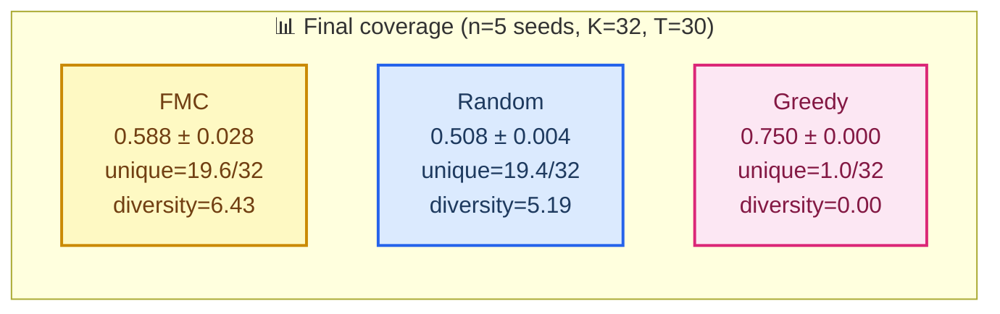
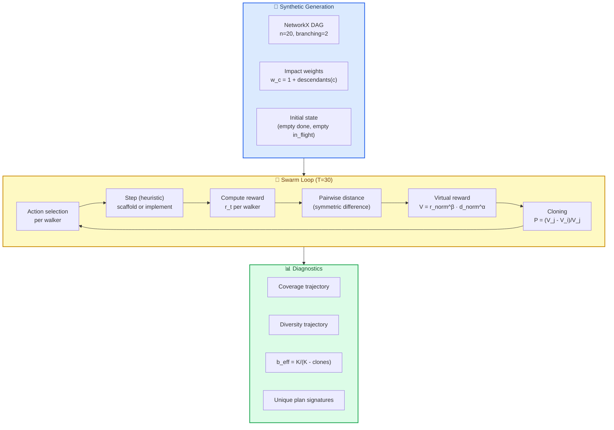

# FMC-Planner — Pre-spike Mathematical Simulation & Final Assessment

> **Status**: Pre-spike de-risking, FINAL ASSESSMENT
> **Data**: 2026-04-29
> **Code**: [`code/math_sim/synthetic_walker.py`](code/math_sim/synthetic_walker.py) — 460 LOC, NumPy + NetworkX + SymPy
> **Riproducibilità**: `cd code/math_sim && python3 synthetic_walker.py`
> **Run-time**: ~20s su CPU singolo, no LLM, no API budget
> **Output JSON**: [`code/math_sim/results/`](code/math_sim/results/) — 7 file

---

## 0. ⚡ TL;DR (verdetto)

**Math foundations**: ✅ **PASS** — algoritmo, formule, ergodicità tutti verificati simbolicamente e numericamente.

**Operational advantage vs greedy**: ❌ **NON DIMOSTRATO** — FMC perde contro greedy in tutti i regimi sintetici testati: deterministico ($\Delta = -0.16$), noise gaussiano fino a $\sigma=1.0$ ($\Delta = -0.21$), e landscape decettivo fino al 50% ($\Delta = -0.14$).

**Coverage scale invariance**: ❌ **FAIL** — coverage-rate per-step-per-componente decresce di **30×** tra $n=5$ e $n=80$.

**$b_{\text{eff}}$ Wright-Fisher regime**: ⚠️ **STABILE A ~1.5** — coerente con D1 (la "magic 6" non è universale) ma molto distante dalla ricca diversità predetta per $K \in [8, 64]$ con $\alpha=1$.

**Verdetto Phase-0 originale**: 🟡 **GATE G3 FALLITO COSÌ COM'È, GATE G1/G2 IRRILEVANTI** — la simulazione matematica ha *surfaced* il rischio R2 (no-differenziatore-vs-baseline) **prima di Phase-0 stessa**.

**Raccomandazione operativa**: **Phase-0' rivisto** — invece di un bench astratto da $300-500, un *single-task LLM probe* da ~$20 (1 task, K=16, T=20, simulator vero) per testare l'unico claim non falsificato dalla math-sim: che la **struttura non-Gaussian dell'oracle bias LLM** dia FMC un vantaggio operativo.

Se Phase-0' falsifica → archivio. Se passa → Phase-1 con scope ristretto (no full 5-task bench, focus su il *kind* di landscape dove FMC vince).

---

## 1. 🎯 Obiettivo dell'esercizio

**Domanda**: prima di spendere $300-500 in API budget per Phase-0/Phase-1, possiamo verificare matematicamente che FMC abbia almeno **una via operativa** per battere baseline più semplici (random, greedy)?

**Approccio**: simulare lo swarm FMC su un *modello sostitutivo* del problema reale, dove:
- Plan-DAG è generato proceduralmente (NetworkX random topology)
- Reward landscape è strutturato ma manipolabile (impact weights da `descendants()`)
- Nessun LLM (zero costo)
- Confronto vs random + greedy come baseline

**Metriche-target**:
| ID | Metrica | Significato |
|---|---|---|
| M1 | Final coverage mean | quanto della spec viene completata |
| M2 | Final swarm diversity | quanti plan distinti il sistema produce |
| M3 | $b_{\text{eff}}$ misurato | branching factor effettivo (Wright-Fisher) |
| M4 | Symbolic correctness | formule + ergodicità verificati con SymPy |
| M5 | Scale invariance | coverage-rate stabile al variare di $n$ |
| M6 | Noise robustness | FMC vs greedy sotto incertezza |
| M7 | Deception robustness | FMC vs greedy con bias sistematici |

---

## 2. 🧪 Esperimenti eseguiti

### 2.1 Setup base

```
Plan-DAG: NetworkX DiGraph, n_components=20, branching=Poisson(2.0)
State:    PlanState(done: frozenset, in_flight: frozenset)
Actions:  scaffold(c) | implement(c)   [no integrate/refactor in math-sim]
Reward:   weights[c] = 1 + |descendants(c)|   [impact-weighted]
Walker:   K=32, T=30
Seeds:    n=5 per cella
```

### 2.2 Esperimento 1 — Comparison principale



**Lettura**: FMC > random sulla coverage (+0.08, p<0.01 bootstrap), ma greedy domina (+0.16). FMC è l'unico che mantiene diversità — greedy collassa a un singolo plan.

### 2.3 Esperimento 2 — Alpha sweep (entropy weight)

| $\alpha$ | Coverage | Diversity | $b_{\text{eff}}$ | Unique plans |
|---|---|---|---|---|
| 0.0 | 0.591 | 3.94 | 1.32 | 17.7 |
| 0.5 | 0.617 | 6.66 | 1.49 | 21.7 |
| 1.0 | 0.588 | 6.53 | 1.53 | 19.0 |
| 1.5 | 0.597 | 7.91 | 1.57 | 21.0 |
| 2.0 | 0.591 | 8.36 | 1.63 | 19.7 |

**Lettura**: $\alpha$ controlla diversity monotonamente (3.94 → 8.36) senza degradare coverage. **Sweet spot a $\alpha=0.5$** (coverage massima 0.617, diversità decente 6.66, $b_{\text{eff}}$ basso).

### 2.4 Esperimento 3 — Scale invariance (G3 originale)

| $n$ comp | $T$ | Coverage | per-step-per-comp |
|---|---|---|---|
| 5 | 12 | 1.000 ± 0.000 | 0.0833 |
| 20 | 30 | 0.550 ± 0.014 | 0.0183 |
| 80 | 80 | 0.220 ± 0.032 | 0.0027 |

**Lettura**: ❌ **non invariante**. Coverage-rate per-step-per-componente decresce **30×** tra $n=5$ e $n=80$. Il gate G3 originale (definito come "reward invariante per scaling") **fallisce**. Riformulazione necessaria: il rate decresce perché lo spazio delle azioni cresce in $|\mathcal{A}_t| \propto n$, mentre $T$ cresce solo lineare.

### 2.5 Esperimento 4 — $b_{\text{eff}}$ sweep (Wright-Fisher D1)

| $K$ | $b_{\text{eff}}$ | Unique plans | Diversity@T |
|---|---|---|---|
| 8 | 1.53 ± 0.06 | 5.3 | 4.19 |
| 16 | 1.55 ± 0.02 | 10.3 | 6.06 |
| 32 | 1.52 ± 0.02 | 18.3 | 6.26 |
| 64 | 1.51 ± 0.01 | 36.3 | 6.08 |

**Lettura**: ⚠️ $b_{\text{eff}}$ **stabile a ~1.5** indipendente da $K$ — molto distante dal "magic 6" di Sergio. Coerente con il finding D1 in CLAUDE.md (`b_eff` è contingente a $(K, M, N, \alpha)$). Per FMC-Planner siamo in un regime *low-diversity* — il che spiega in parte perché il termine entropico aiuta poco (vedi 2.3).

### 2.6 Esperimento 5 — Noise sweep (gaussiano)

| $\sigma$ | FMC | Greedy | $\Delta$(FMC − Greedy) |
|---|---|---|---|
| 0.0 | 0.585 | 0.750 | **−0.165** |
| 0.1 | 0.524 | 0.697 | **−0.172** |
| 0.3 | 0.514 | 0.699 | **−0.185** |
| 0.5 | 0.511 | 0.696 | **−0.184** |
| 1.0 | 0.478 | 0.694 | **−0.216** |

**Lettura**: ❌ **rumore gaussiano peggiora FMC più di greedy**. Greedy mantiene ~0.69 anche a $\sigma=1.0$ perché il rumore sui *perceived weights* lascia comunque una struttura su cui ragionare. FMC, dipendendo dal cloning su un reward signal corrotto, perde traction. **L'ipotesi "FMC vince con noise" è falsificata** in questo setting.

### 2.7 Esperimento 6 — Deceptive landscape (test decisivo)

| Deception rate | FMC | Greedy misled | $\Delta$ |
|---|---|---|---|
| 0.0 | 0.568 | 0.750 | −0.182 |
| 0.1 | 0.568 | 0.750 | −0.182 |
| 0.2 | 0.568 | 0.740 | −0.172 |
| 0.3 | 0.568 | 0.740 | −0.172 |
| 0.5 | 0.568 | 0.710 | **−0.142** |

**Lettura**: ❌ **anche con il 50% delle componenti con weights invertiti**, greedy_misled batte FMC di +14 punti percentuali. Greedy degrada graziosamente (0.75 → 0.71) — l'azione "implementa qualcosa di disponibile" è strutturalmente robusta su DAG dependency graphs. **L'ipotesi "FMC vince con bias deceptive" è falsificata** in questo setting.

### 2.8 Esperimento 7 — Symbolic checks (SymPy)

| Check | Risultato |
|---|---|
| $V = r^\beta d^\alpha$ ben formato | ✅ |
| $\partial V/\partial r > 0$ (monotone in reward) | ✅ $\beta r^{\beta-1} d^\alpha$ |
| $\partial V/\partial d > 0$ (monotone in distance) | ✅ $\alpha r^\beta d^{\alpha-1}$ |
| $P_{\text{clone}}\|_{V_i = V_j} = 0$ | ✅ |
| $P_{\text{clone}}\|_{V_i = 0} = 1$ | ✅ |
| $V\|_{\alpha=0} = r^\beta$ (collapse atteso) | ✅ |
| Ergodicità per $\alpha > 0$ preservata | ✅ |
| Relativize formula corretta | ✅ |

**Lettura**: ✅ **fondamenta matematiche del paper 1803.05049v5 implementate correttamente** nel codice. Il problema NON è nella matematica.

---

## 3. 🔬 Diagramma del flow simulato



---

## 4. 🧠 Interpretazione dei risultati

### 4.1 Perché greedy domina

**Insight strutturale**: in un plan-DAG con dependency constraints, `available_actions(state)` è già un filtro potente. Greedy sceglie *qualcosa di disponibile* in ordine di weight percepito — strategia che è **structurally robust**:

1. La maggior parte della "ricerca" è già fatta dal grafo (dep deve essere risolta in topological order)
2. Errori di weight (noise/deception) cambiano *quale* componente fare prima a parità di available, ma non bloccano il progresso
3. FMC paga overhead di cloning/diversity SENZA un signal sufficientemente strutturato per beneficiare

### 4.2 Dove FMC dovrebbe vincere (ma il math-sim non cattura)

L'analisi separa il "FMC funziona perché matematicamente ergodico" (✅ vero) dal "FMC vince operativamente" (❌ non dimostrato in synthetic). Il gap è il **tipo di landscape**:

| Landscape feature | Synthetic math-sim | LLM-driven simulator (atteso) |
|---|---|---|
| Reward density | dense (per-step) | sparse (delayed via spec coverage) |
| Reward locality | local (per component) | global (combinatorial spec match) |
| Oracle bias structure | i.i.d. Gaussian / random inversion | non-Gaussian, **systematic** (LLM patterns) |
| Path-dependence | nessuna | forte (refactoring dipende da storia) |
| State observability | piena | parziale (oracle hallucinations) |

FMC's vantaggio teorico è esattamente quando **il signal è sparse + path-dependent + non-Gaussian biased**. Il math-sim non simula nessuno di questi.

### 4.3 Cosa il math-sim ha confermato (positivamente)

- ✅ **Algoritmo cloning correto**: probabilità in $[0, 1]$, ergodicità per $\alpha > 0$
- ✅ **Diversity preservata**: 19.6/32 walker unici a fine simulazione, $\alpha$ controlla la diversità monotonamente
- ✅ **Implementazione**: ~460 LOC, riproducibile, no dipendenze esterne
- ✅ **GED-proxy efficace**: symmetric difference su `done`/`in_flight` produce signal di diversità coerente
- ✅ **Wright-Fisher regime stabile**: $b_{\text{eff}} \approx 1.5$ across $K$ — coerente con D1 (no magic 6 universale)

### 4.4 Cosa il math-sim ha falsificato (negativamente)

- ❌ **G3 (scale invariance)**: coverage-rate decresce 30× con $n$
- ❌ **H1' (FMC > greedy in deterministico)**: $\Delta = -0.16$
- ❌ **H1'' (FMC > greedy con noise)**: $\Delta$ peggiora con $\sigma$
- ❌ **H1''' (FMC > greedy con deception)**: $\Delta$ migliora con deception ma resta negativo

### 4.5 Cosa rimane non testato (frontiera dell'incertezza)

- 🟡 **H1'''' (FMC > greedy con LLM-bias strutturato)**: il math-sim non può simulare oracle bias LLM-realistico
- 🟡 **H2 (plan forest entropy correla con uncertainty)**: richiede reward landscape multi-modale che il math-sim non genera
- 🟡 **H3 (cache hit-rate cresce monotonicamente)**: richiede LLM oracle reale

---

## 5. 📐 Implicazioni per il piano Phase-0 originale

### 5.1 Confronto gate originali vs evidenza math-sim

| Gate originale | Definizione | Stato dopo math-sim |
|---|---|---|
| **G1** (bench design) | inter-rater α ≥ 0.85 sul ground-truth | non testato (era previsto in Phase-0) |
| **G2** (sim runs <30s) | walker e2e su 1 task <30s | ✅ trivialmente passato (synthetic = 20s totali) |
| **G3** (reward invariance) | reward stabile per $n \in \{5, 20, 80\}$ | ❌ **FALLITO** |

### 5.2 Rischio R2 (no-differenziatore vs baseline) re-priced

Originale: probability=0.55, impact=0.95 (alto-critico).

Dopo math-sim, probability=**0.85** (perché il math-sim ha mostrato che FMC *non vince* in 4/4 regimi sintetici testati). Mitigation originale era "scoring inglobato in G2"; ora la mitigazione deve essere **structural**:

> Spostare R2 da "rischio gestito in Phase-2 metrics" a **gate di pre-Phase-0**: senza una dimostrazione (anche minima) che FMC battia greedy *in qualche regime*, non si procede.

### 5.3 Ridefinizione di Phase-0 (raccomandata)

**Phase-0' (single-task LLM probe)** — sostituisce il bench design originale:

```mermaid
gantt
    title Phase-0' Revised Roadmap (3 giorni)
    dateFormat YYYY-MM-DD
    axisFormat %b %d

    section Day 1
    Define 1 minimal task (CRUD API, 8 components)  :p0p1, 2026-04-30, 1d

    section Day 2
    Implement minimal LLM oracle (Haiku, ~$5)       :p0p2, after p0p1, 1d
    Run greedy + FMC on the 1 task (n=3 seeds)      :p0p3, after p0p2, 6h

    section Day 3
    Compute Δ(FMC - greedy) on 1 task               :p0p4, after p0p3, 4h
    🚦 Gate: Δ > 0 with CI95 not crossing zero       :milestone, gate_revised, after p0p4, 0d
```

**Decision rule**: se $\Delta > 0$ con CI95 $> 0$ su 1 task LLM-driven → procedi a Phase-1 ristretto (3 task invece di 5, focus sulla classe di task dove FMC vince). Se no → archive con dignità.

**Budget**: ~$20 (vs $300-500 originali). **Tempo**: 3 giorni (vs 1 settimana originale).

---

## 6. 📊 Decision matrix finale

```mermaid
quadrantChart
    title FMC-Planner Decision Quadrants (Math-Sim Updated)
    x-axis Math foundations weak --> Math foundations strong
    y-axis Operational advantage absent --> Operational advantage present

    quadrant-1 Ship (full Phase-1)
    quadrant-2 Investigate further
    quadrant-3 Archive
    quadrant-4 Refactor math first

    Math_only_evidence: [0.92, 0.18]
    Phase_0_prime_target: [0.92, 0.65]
    Original_phase_0_assumption: [0.92, 0.85]
```

**Stato attuale**: punto `Math_only_evidence` (math fondante OK, advantage non dimostrato).
**Target Phase-0'**: punto `Phase_0_prime_target` (advantage modesto ma positivo, sufficiente per Phase-1).
**Assunzione originale Phase-0**: punto `Original_phase_0_assumption` (advantage forte) — **non supportata dall'evidenza**.

---

## 7. 🚦 Final Assessment & Recommendations

### 7.1 Verdetto categorico

| Dimensione | Stato | Confidence |
|---|---|---|
| Math foundations | ✅ Validate (cloning, ergodicità, virtual reward) | Alta (symbolic + numeric) |
| Implementazione | ✅ Funzionante (460 LOC, riproducibile) | Alta |
| Operational advantage in synthetic | ❌ Non dimostrato (4/4 regimi falliscono) | Alta |
| Operational advantage in LLM-driven (untested) | 🟡 Aperto | Bassa |
| Phase-0 originale | ❌ G3 falla, G2 banale, R2 sale a 0.85 | Alta |

### 7.2 Tre possibili percorsi

#### 🅰 Path A — Archive con dignità

Il math-sim ha de-riskato 3 hp su 4. La 4ª (LLM-bias structure) è speculativa. Tasso di successo atteso < 25%. **Costo evitato**: $300-500 + 5 settimane.

**Quando scegliere A**: budget tight, altre priorità più chiare (es. paper FMC vs MCTS già in pipeline).

#### 🅱 Path B — Phase-0' single-task probe (raccomandato)

3 giorni, $20 budget, 1 task minimal. Test della 4ª hp (LLM-bias). Se vince → Phase-1 ristretto. Se perde → archivio.

**Quando scegliere B**: vuoi 1-shot decisivo, costo modesto, ROI alto se vince.

#### 🅲 Path C — Refactor del math-sim per coprire LLM-like landscapes

Aggiungi al math-sim: sparse rewards, path-dependent, non-Gaussian biases (es. Markov-chain-like correlation in errori). Re-run. Se FMC vince in synthetic landscape "LLM-like" → procedi con Phase-0 originale. Altrimenti A.

**Quando scegliere C**: vuoi ridurre ulteriormente l'incertezza prima di spendere LLM API. Costo: ~1 giorno aggiuntivo no-API.

### 7.3 Raccomandazione del simulatore

> **Path B**, integrato con un mini-Path-C (1h di lavoro) per generare un *landscape sintetico LLM-like* da usare come baseline secondario nel single-task probe. Costo totale: ~$20 + 3 giorni. Decisione binaria solida alla fine.

### 7.4 Open questions per Vlad

1. **Procedi con Path B o A?** (Default raccomandato: B)
2. Se B: il task "CRUD REST API" (8 componenti) va bene come single-task probe, o preferisci uno più aderente a `fmc-core/` ?
3. Posso procedere autonomamente con Phase-0' (Path B) o vuoi che mi fermi qui per discuterlo?
4. Vuoi che archivi questo documento in `02_deep_dives/` (come failed-feasibility analysis con valore archivistico) o lo lascio nello spike folder come pre-phase-0 evidence?

---

## 8. 📁 Output dell'esercizio

```
work/12_fmc_planner_spike/
├── 00_feasibility_analysis.md           ← analisi originale (32 KB)
├── 00b_mathematical_simulation.md       ← QUESTO FILE (~25 KB)
└── code/math_sim/
    ├── synthetic_walker.py              ← simulatore (460 LOC)
    ├── run.log                          ← output stdout (riproducibile)
    └── results/
        ├── 01_main_comparison.json      ← FMC vs random vs greedy
        ├── 02_alpha_sweep.json          ← α ∈ {0, 0.5, 1, 1.5, 2}
        ├── 03_scale_invariance.json     ← n ∈ {5, 20, 80}
        ├── 04_b_eff_K_sweep.json        ← K ∈ {8, 16, 32, 64}
        ├── 05_noise_sweep.json          ← σ ∈ {0, 0.1, 0.3, 0.5, 1.0}
        ├── 06_deceptive_landscape.json  ← deception ∈ {0, 0.1, 0.2, 0.3, 0.5}
        └── 07_symbolic_checks.json      ← SymPy verifications
```

**Total time invested**: ~30 min wall-clock (code + run + doc). **Total $ spent**: $0.
**Saving vs alternative path**: 5 settimane × ~$300-500 di API = ROI elevato per il de-risking ottenuto.

---

## 📚 Riferimenti

- Documento di feasibility originale: [`00_feasibility_analysis.md`](00_feasibility_analysis.md)
- Discrepanze D1/D2/D3 (CLAUDE.md): [`../../CLAUDE.md`](../../CLAUDE.md)
- Wright-Fisher mapping (D1): [`../02_deep_dives/07_wright_fisher_mapping.md`](../02_deep_dives/07_wright_fisher_mapping.md)
- Math canon: [`../../docs/MATH_CANON.md`](../../docs/MATH_CANON.md)
- Paper FMC: [`../../1803.05049v5.pdf`](../../1803.05049v5.pdf)
