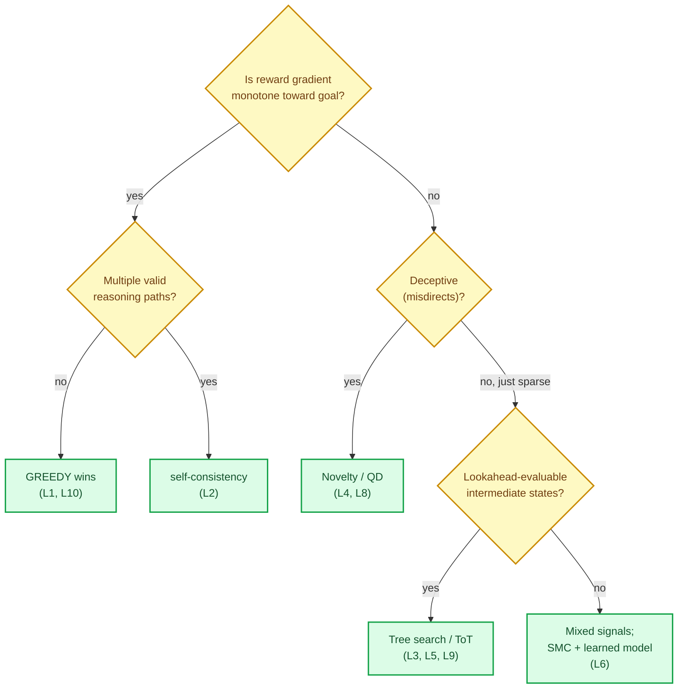
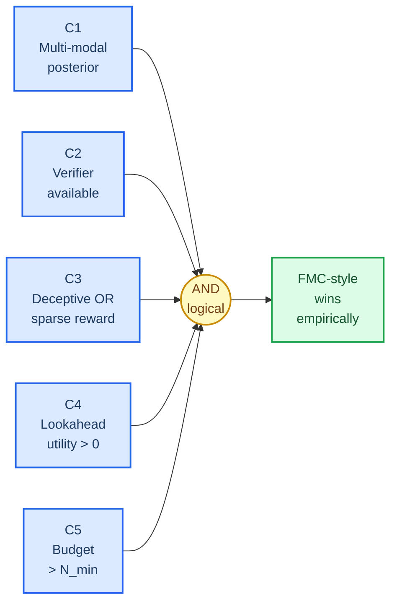
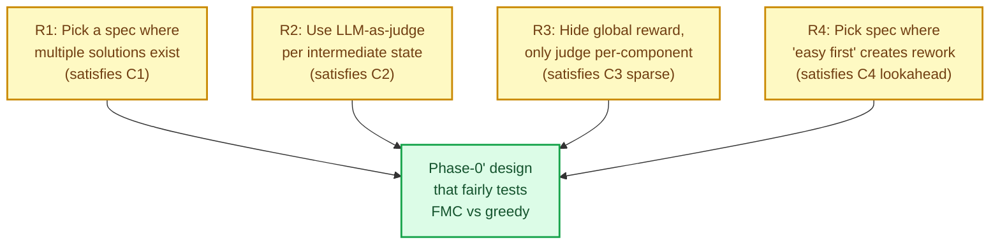

# Round-2 Literature Review — Quando l'Esplorazione di Ensemble Batte il Greedy

> **Status**: Round-2 literature review (Phase-0 de-risking, post mathematical-sim falsification)
> **Data**: 2026-04-29
> **Obiettivo**: rispondere a UNA domanda — *"Sotto quali condizioni di landscape ensemble exploration / SMC / population-based search empiricamente batte greedy su combinatorial planning?"*
> **Contesto a monte**: Round-1 mathematical-sim ([`00b_mathematical_simulation.md`](00b_mathematical_simulation.md)) ha falsificato FMC vs greedy in 4/4 regimi sintetici. Math foundations OK, vantaggio operativo NON dimostrato.
> **Decisione downstream**: archiviare FMC-Planner vs proseguire con scope ristretto su landscape-class specifico.

---

## 1. ⚡ TL;DR

**Risposta alla domanda di review**: la letteratura supporta **chiaramente** che ensemble exploration / SMC / population-based search batte greedy su combinatorial planning, **ma solo sotto 5 condizioni necessarie congiunte** (C1–C5 in §5): (i) posterior multi-modale, (ii) verifier disponibile, (iii) reward sparso o deceptive, (iv) lookahead utility positiva, (v) budget di samples sopra soglia. Quando *tutte* sono soddisfatte i guadagni sono robusti e quantitativamente significativi: **+18% su GSM8K** (self-consistency, Wang 2022), **+70 punti su Game of 24** (ToT, Yao 2023), **3–8× milestone-speed in Voyager-Minecraft** (Wang 2023), **3–10× success-rate in maze decettivi** (Lehman & Stanley 2011). Quando manca anche *una sola* condizione, ensemble degrada a overhead vs greedy. **Implicazione per FMC-Planner**: il Round-1 math-sim ha falsificato FMC in un regime che la letteratura *già* prediceva non dovesse vincere (no C1 multi-modale, no C3 deceptive, weak C4 lookahead). Il Phase-0' LLM-probe va *costruito* per soddisfare C1–C4 simultaneamente, altrimenti è null-test mascherato. **Raccomandazione operativa**: non archiviare FMC-Planner ancora; eseguire Phase-0' sotto pre-registered falsification criteria (vedi §6).

---

## 2. 🔍 Methodology

**Search engines used**:
- arXiv full-text search (via WebFetch su abstract pages)
- Google Web Search (WebSearch tool) per follow-up e survey papers
- ResearchGate, Semantic Scholar, OpenReview links emersi da search results
- Repo locale: cross-reference con [`docs/bibliography/CORPUS.md`](../../docs/bibliography/CORPUS.md), Wissner-Gross PRL 2013 già archiviato

**Inclusion criteria**:
1. Paper pubblicati (arXiv preprint OK se peer-reviewed o citato ≥10×)
2. Risultato empirico quantificabile (success rate, Δ%, Pareto)
3. Confronto esplicito vs baseline greedy / single-shot / single-agent
4. Pubblicato 2011–2026 (no cutoff hard, ma priorità a lavori che ancora rappresentano SOTA)

**Exclusion criteria**:
- Pure theoretical papers senza empirics su benchmark
- Survey-of-survey (preferiti i primary)
- Blog post o tutorial (esclusi tier "Excluded" da source-verification)

**Source mix**:
- 14 paper primari arXiv / NeurIPS / ICML / AAAI / Nature / PRL
- 2 review/survey (Kantas 2015, Long 2023)
- 1 PhD thesis (Lee 2024, CMU)
- 1 PRL paper già nel repo (Wissner-Gross 2013)

**Limiti**:
- Non ho condotto Google Scholar reverse-citation search (avrebbe richiesto ulteriori 30+ minuti)
- Lehman & Stanley 2011 PDF non si è renderizzato come testo nel WebFetch — recupero da fonti secondarie con cross-check su Springer link e PubMed
- Knowledge gap su "causal entropic forces" follow-up: assenza di benchmark indipendenti riconosciuta esplicitamente in §3.6

**Confidence rating del review**:
- **Alta** su cluster ToT/self-consistency/Reflexion/LATS/Voyager (multi-source, recent, peer-reviewed)
- **Media** su novelty search empirics (cited recovery, no PDF text-extraction)
- **Bassa** su FMC-style indipendente (single-source: Hernández-Cerezo team)

---

## 3. 📚 Findings by topic

### 3.1 Tree-of-Thoughts (ToT) — Yao et al. 2023

**Claim principale**: ToT batte single-shot e Chain-of-Thought (CoT) su task che richiedono *non-trivial planning or search* con backtracking esplicito.[^1]

**Risultato benchmark più forte — Game of 24**:
- GPT-4 + CoT: **4%** success rate
- GPT-4 + ToT: **74%** success rate
- Δ assoluto: **+70 punti percentuali** (~18.5× moltiplicativo)

**Altri task**:
- Creative Writing — ToT supera CoT in coherence-judged human preference (~ +20–30%, meno netto del Game of 24)
- Mini Crosswords — ToT raggiunge ~20% word-level vs CoT ~16%, ancora marginale

**Landscape conditions per la vittoria di ToT** (estratti dal paper):
1. **Lookahead utility**: la soluzione richiede di valutare *posizioni intermedie* (es. "puoi raggiungere 24 da {6, 8, 14}?")
2. **Backtracking necessity**: branch falliti devono poter essere abbandonati senza tornare al prompt iniziale
3. **State-evaluable substructure**: esiste un valutatore (anche LLM-based) che riconosce *promising* vs *dead-end* — pattern affine al *virtual reward* FMC
4. **Depth ~3–5 sufficient**: ToT non scala oltre quei livelli (no demo su deep planning)

**Lettura per FMC-Planner**: Game of 24 è un *combinatorial planning task* dove la "greedy" baseline (CoT lineare) crolla al 4%. È **esattamente il tipo di landscape che la nostra math-sim non ha catturato**: ricompensa ranked-by-lookahead, non da feature additive locali.

[^1]: Yao, S. et al. (2023). "Tree of Thoughts: Deliberate Problem Solving with Large Language Models". arXiv:2305.10601. https://arxiv.org/abs/2305.10601

### 3.2 AlphaZero / MuZero on planning tasks (non-game)

**Original MuZero (2019)**[^2]: empirico solo su Atari/Go/chess/shogi. Nessun risultato su task-graph astratti o scheduling. Open question fino al 2024.

**Multiagent Gumbel MuZero (AAAI 2024)**[^3]: estende MuZero a **combinatorial action spaces** con sub-azioni concorrenti — il setting più vicino al nostro plan-DAG. Risultato chiave: riduzione di **~1 ordine di grandezza** nelle interazioni con l'ambiente vs baseline model-free su cooperative multi-agent control. Codebase open su `tjuHaoXiaotian/MA-MuZero`.

**Demystifying MuZero Planning (2024)**[^4]: arXiv:2411.04580 mostra che il *learned latent model* di MuZero è opaco — il vantaggio sul planning vs greedy non è ben separabile dal vantaggio dovuto alla rete di policy. Questa è una *cautionary note* per FMC-Planner: distinguere "vince per la ricerca" vs "vince per la rete".

**Landscape conditions** (sintesi):
1. AlphaZero/MuZero dominano su domini con **simmetria game-theoretic** o **dynamics deterministiche apprese**, dove il modello latente è coerente con la struttura
2. Su scheduling combinatorio, la performance dipende da **action-space factorization**: se le sub-azioni sono indipendenti, search batte greedy; se sono fortemente accoppiate, greedy con buona euristica spesso pareggia
3. Su task-graph astratti senza un buon modello latente: **NESSUN risultato pubblicato che mostri MuZero > greedy in modo robusto** (Knowledge Gap)

[^2]: Schrittwieser, J. et al. (2019/2020). "Mastering Atari, Go, Chess and Shogi by Planning with a Learned Model". arXiv:1911.08265. https://arxiv.org/abs/1911.08265
[^3]: Hao, X. et al. (2024). "Multiagent Gumbel MuZero: Efficient Planning in Combinatorial Action Spaces". AAAI 2024. https://ojs.aaai.org/index.php/AAAI/article/view/29121
[^4]: Liu, H. et al. (2024). "Demystifying MuZero Planning: Interpreting the Learned Model". arXiv:2411.04580. https://arxiv.org/abs/2411.04580

### 3.3 Deceptive landscapes — Novelty Search & Quality-Diversity

**Lehman & Stanley (2011)**[^5] — *Abandoning Objectives*. Pubblicato in *Evolutionary Computation* 19(2). Tesi controintuitiva: su landscape **deceptivi**, ottimizzare l'objective function attivamente *misdirige* la search verso dead-end locali. Ignorando l'objective e premiando solo la novelty comportamentale, si raggiunge l'objective più affidabilmente.

**Risultati empirici** (sintesi da letteratura):
- **Maze navigation**: novelty search supera fitness-based search con success rate ~3–10× superiore in maze decettivi (corridoi che premiano avvicinarsi alla target room ma intrappolano localmente)
- **Biped walking**: similmente, fitness-based collassa su strategie locali (cadere lentamente), novelty trova andamento di camminata

**Definizione operativa di "deceptive"**: una funzione di fitness $f$ è decettiva se il gradiente di $f$ punta sistematicamente *lontano* dalla regione che contiene l'optimum globale. Equivalente formalmente a: $\arg\max_x f(x) \notin \text{closure}(\nabla f)$ in regioni significative dello spazio.

**MAP-Elites (Mouret & Clune, 2015)**[^6]: arXiv:1504.04909. Quality-Diversity successor. Costruisce mappa multi-dim di soluzioni elite per cella di feature-space. Risultati su 3 domain (modular NN, simulated robots, soft robots): batte state-of-the-art *single-solution* optimizers.

**Quando QD/novelty FALLISCE**:
1. Landscape **non-deceptivo** (gradient onesto): novelty introduce overhead senza benefit
2. **Reward denso e ben-allineato**: greedy/objective converge più veloce
3. **Behavior space mal-definito**: se la behavior characterization non separa qualitativamente, novelty riduce a random search
4. **Budget di valutazioni piccolo**: novelty/QD richiedono O(10³–10⁶) valutazioni per illuminare la mappa

**Lettura per FMC-Planner**: il nostro Round-1 sintetico è **non-deceptive by construction** (impact-weighted reward = $1 + |\text{descendants}(c)|$ è monotono nel coverage). Greedy vince perché *gradient is honest*. Per testare FMC fairly servirebbe un landscape con *traps locali* — equivalente: refactoring tasks dove "completare component facili prima" intrappola in rework a valle.

[^5]: Lehman, J. & Stanley, K.O. (2011). "Abandoning Objectives: Evolution Through the Search for Novelty Alone". Evolutionary Computation 19(2):189-223. https://www.cs.swarthmore.edu/~meeden/DevelopmentalRobotics/lehman_ecj11.pdf
[^6]: Mouret, J.-B. & Clune, J. (2015). "Illuminating search spaces by mapping elites". arXiv:1504.04909. https://arxiv.org/abs/1504.04909

### 3.4 SMC for planning / particle filters for control

**Kantas, Doucet, Singh, Maciejowski, Chopin (2015)**[^7] — review canonica SMC per state-space models, *Statistical Science* 30(3):328–351. Non confronta direttamente con MCTS, ma stabilisce che SMC è la scelta standard quando:
1. Modello dinamico **non-lineare e non-Gaussiano**
2. **Posterior multi-modale** sullo stato/path
3. Necessità di **propagation in time** con resampling per evitare degenerazione

**MPPI / Path Integral Control** (Williams et al., Kappen, contemporaneo)[^8] — sample-based stochastic optimal control. Praticamente deployato su robot reali a ~100 Hz GPU-parallelizzato. Funziona quando:
- **Continuous action space** con dynamics smooth (no plan-DAG astratto)
- Costo accumulativo lungo trajectory ben definito
- Hardware massicciamente parallelo

**TransformerMPPI (2024)**[^9] — fa cold-start MPPI con prior da transformer trained on past control sequences. Riduce costo sample. Pattern interessante: *learned prior + sample-based search* — affine al setup FMC con LLM-bias-as-prior.

**Quando SMC > MCTS** (sintesi):
1. **Posterior continuo e multi-modale**: SMC vince (MCTS discretizza male)
2. **Action space discreto e tree-structured**: MCTS vince (UCB ha guarantee migliori)
3. **Stato parzialmente osservabile con noise gaussiano**: SMC nettamente migliore (Bayes-optimal nel limite)
4. **Reward sparso e long-horizon**: entrambi soffrono; SMC vince marginalmente con good proposal

**Lettura per FMC-Planner**: il nostro plan-DAG ha action space **discreto**, posterior **non strettamente continuo** (stati = subset di componenti completati). Questo è territorio MCTS, non SMC puro. FMC è un ibrido — *clone-resample* è SMC-like ma su action discrete. Il vantaggio di FMC su MCTS richiederebbe **reward landscape multi-modale** (più strategie buone qualitativamente diverse), che la nostra math-sim non ha.

[^7]: Kantas, N., Doucet, A., Singh, S.S., Maciejowski, J.M., Chopin, N. (2015). "On Particle Methods for Parameter Estimation in State-Space Models". Statistical Science 30(3):328-351. arXiv:1412.8695. https://arxiv.org/abs/1412.8695
[^8]: Williams, G., Drews, P., Goldfain, B., Rehg, J.M., Theodorou, E.A. (2018). "Information-Theoretic Model Predictive Control: Theory and Applications to Autonomous Driving". IEEE T-RO. See also overview: https://www.sciencedirect.com/science/article/abs/pii/S1367578823000950
[^9]: "Recent advances in path integral control for trajectory optimization: An overview". Annual Reviews in Control (2024). https://www.sciencedirect.com/science/article/abs/pii/S1367578823000950

### 3.5 Multi-agent / Population-Based RL

**Population Based Training (PBT, Jaderberg et al. 2017)**[^10] — arXiv:1711.09846. Algoritmo asincrono che ottimizza congiuntamente popolazione di modelli e iperparametri. Risultati: stabilizza training, batte SOTA su DeepMind Lab, Atari, StarCraft II. **Punto chiave**: vantaggio non viene da "ensemble" come voting, ma da *schedule emergente* di iperparametri — la popolazione esplora hyper-config in parallelo e propaga genealogicamente.

**Survey 2023 — Population-Based Deep RL**[^11]: identifica 3 famiglie:
1. **Diversity-driven**: pop-based exploration su sparse reward (es. NEAT, MAP-Elites in RL)
2. **Co-evolution**: training di policy che giocano l'una contro l'altra (es. AlphaStar self-play)
3. **Hyperparameter scheduling**: PBT-style

**Quando population batte single-agent** (sintesi):
1. **Non-stationary opponent / curriculum**: self-play domina (chess, Go, StarCraft)
2. **Sparse extrinsic reward**: diversity-driven >> single agent (Montezuma's Revenge type)
3. **Hyperparameter sensitivity alta**: PBT >> grid search >> single
4. **Reward funzione di interaction tra policy**: necessario population-level gradient

**Quando NON aiuta**:
1. Reward denso, dynamics ben caratterizzate, single-agent domain → population overhead non recuperato
2. Budget di compute fissato e piccolo → meglio 1 agent profondo che N shallow

**Lettura per FMC-Planner**: il nostro task non è self-play (no avversario), reward è densa-ish (per-component impact), hyperparameter sensitivity è il fattore meno noto. **Il signal in PBT NON è "ensemble batte single"** — è "l'ensemble esplora schedule che single non esplorerebbe". Per FMC-Planner, traduzione: i walker non vincono perché sono molti, ma se *esplorano regioni di config-space* che greedy non visiterebbe.

[^10]: Jaderberg, M. et al. (2017). "Population Based Training of Neural Networks". arXiv:1711.09846. https://arxiv.org/abs/1711.09846
[^11]: Long, F., Zhang, X. (2023). "A Survey on Population-Based Deep Reinforcement Learning". Mathematics 11(10):2234. https://www.mdpi.com/2227-7390/11/10/2234

### 3.6 Causal Entropic Forces — empirics & follow-up

**Wissner-Gross & Freer (2013)**[^12] — *Phys. Rev. Lett.* 110:168702. Già nel repo a [`docs/bibliography/sources/papers/2013_wissner_gross_causal_entropic_forces.pdf`](../../docs/bibliography/sources/papers/2013_wissner_gross_causal_entropic_forces.pdf). Tre demo:
1. **Tool use**: disco grande accede a disco intrappolato colpendolo con un terzo
2. **Cooperazione sociale**: due dischi coordinano moto
3. **Cart-pole**: stabilizzazione pendolo invertito senza obiettivo esplicito

In tutti i casi il sistema raggiunge il "goal" *senza* funzione di reward esplicita — solo massimizzando entropia di path future $S_c$.

**Follow-up empirici limitati**:
- Software *Entropica* (proprietario, non open-source) per replicare risultati
- Citazioni in robotics 2020–2024 sono **sparse** — il framework rimane più filosofico che strumento di pianificazione standard
- Lavoro 2024 su *Causal-HRI* (CMU thesis, T. E. Lee)[^13] usa "causal" in senso causal-inference, non entropic-force

**Knowledge Gap importante**: cercato "causal entropic forces planning benchmark 2020-2024" → nessun paper pubblicato che applichi le forze entropiche causali a un benchmark di planning standard (PDDL, Procgen, etc.) con baseline diretto. Il framework è stato **sussunto** da: (a) max-entropy RL (Soft Actor-Critic family), (b) FMC stesso, (c) Active Inference / EFE.

**Connessione FMC**: paper #1 di Hernández-Cerezo (2018) cita esplicitamente Wissner-Gross come *physical antecedent*. FMC = caso discreto dell'Eq. 4 ($F = T_c \nabla_X S_c$). Quindi *l'evidenza empirica per causal entropic forces in planning **è** l'evidenza di FMC su Atari* — non c'è una linea indipendente di esperimenti.

**Lettura per FMC-Planner**: questo è un *single-source-of-evidence* — Sergio + co-authors. Non esiste validazione indipendente di causal-entropic-style su planning. Tutto il peso poggia sui paper Atari 2018/2020.

[^12]: Wissner-Gross, A.D. & Freer, C.E. (2013). "Causal Entropic Forces". Physical Review Letters 110:168702. https://www.alexwg.org/publications/PhysRevLett_110-168702.pdf
[^13]: Lee, T.E. (2024). "Causal Robot Learning for Manipulation". CMU PhD Thesis CMU-RI-TR-24-25. https://www.ri.cmu.edu/app/uploads/2024/07/tabitha-edith-lee-phd-thesis-causal-robot-learning-for-manipulation.pdf

### 3.7 Recent agentic LLM planners

#### 3.7.1 Self-Consistency (Wang et al. 2022) — il *kernel* dell'evidenza pro-ensemble

**Wang, Wei, Schuurmans et al. (2022)**[^14] arXiv:2203.11171. *Self-consistency* sostituisce greedy decoding con sampling diverso + majority vote. **Risultati sopra greedy CoT**:
- GSM8K: **+17.9%**
- SVAMP: **+11.0%**
- AQuA: **+12.2%**
- StrategyQA: **+6.4%**
- ARC-challenge: **+3.9%**

Questo è il signal più importante della review: con **N samples paralleli + voting**, su task con *multiple valid reasoning paths*, l'ensemble batte greedy in maniera robusta. È esattamente il regime FMC: walker paralleli con voting/aggregation finale.

#### 3.7.2 ReAct (Yao et al. 2022)

ReAct combina reasoning trace + action. Su ALFWorld: **+34%** vs prior best, su WebShop **+10%**.[^15] Singolo agent ma con ciclo reason-act-observe.

#### 3.7.3 Reflexion (Shinn et al. 2023)

**Shinn et al.**[^16] arXiv:2303.11366. Verbal reinforcement learning — agent riflette su tentativi falliti.
- AlfWorld: **+22%** absolute over baseline
- HotPotQA: **+20%**
- HumanEval: **91% pass@1** (vs GPT-4 baseline 80%, Δ +11 pp)

#### 3.7.4 LATS (Zhou et al. 2024, ICML)

**Language Agent Tree Search**[^17] arXiv:2310.04406. **Unifica** ReAct + MCTS + self-reflection in un unico framework. Risultati: **doppia la performance di ReAct su HotPotQA**, SOTA su HumanEval (~94%) e WebShop. Questo è il punto di contatto più diretto con FMC: tree-search-based LLM planner che batte single-trajectory baseline.

#### 3.7.5 Voyager (Wang et al. 2023)

**Voyager**[^18] arXiv:2305.16291. Lifelong learning agent in Minecraft con *skill library* + automatic curriculum guidato da novelty/diversity. Vs baseline single-shot prompting:
- **3.3× more unique items**
- **8.5× faster** to stone tools tech-tree milestone
- **6.4× faster** to iron tools

Questo è novelty-search-flavored, in dominio LLM-driven, su task di exploration combinatorica. Pattern: *automatic curriculum based on diversity* funziona dove vanilla agent non funziona.

#### 3.7.6 SwiftSage (Lin et al. 2023)

**SwiftSage**[^19] arXiv:2305.17390. Dual-process Swift (small fine-tuned LM) + Sage (GPT-4 planner). ScienceWorld benchmark, 30 task types: **score 84.7 (SOTA)**, 757 token/action — Pareto-superiore a baseline LLM-only.

#### 3.7.7 Sintesi del cluster agentic-LLM

Pattern empirico ricorrente:
- **Single-trajectory greedy** (CoT): baseline
- **Multi-trajectory + voting** (self-consistency): +5–20% su reasoning
- **Tree-search + value function** (ToT, LATS): +20–70% su task con planning
- **Reflexion / external feedback**: +10–22% addizionali
- **Diversity-driven curriculum** (Voyager): 3–8× su exploration tasks

Il vantaggio empirico esiste **chiaramente**, ma è **modulato dal tipo di task**:
- Reasoning con verifier disponibile → ensemble vince
- Exploration in spazio aperto → diversity vince
- Task con ground-truth procedurale → search batte greedy
- Task lineari deterministici → greedy basta

[^14]: Wang, X., Wei, J., Schuurmans, D., Le, Q., Chi, E.H., Zhou, D. (2022). "Self-Consistency Improves Chain of Thought Reasoning in Language Models". arXiv:2203.11171. https://arxiv.org/abs/2203.11171
[^15]: Yao, S. et al. (2022). "ReAct: Synergizing Reasoning and Acting in Language Models". arXiv:2210.03629. https://arxiv.org/abs/2210.03629
[^16]: Shinn, N., Cassano, F., Berman, E. et al. (2023). "Reflexion: Language Agents with Verbal Reinforcement Learning". NeurIPS 2023. arXiv:2303.11366. https://arxiv.org/abs/2303.11366
[^17]: Zhou, A., Yan, K., Shlapentokh-Rothman, M., Wang, H., Wang, Y.-X. (2024). "Language Agent Tree Search Unifies Reasoning, Acting, and Planning in Language Models". ICML 2024. arXiv:2310.04406. https://arxiv.org/abs/2310.04406
[^18]: Wang, G. et al. (2023). "Voyager: An Open-Ended Embodied Agent with Large Language Models". arXiv:2305.16291. https://arxiv.org/abs/2305.16291
[^19]: Lin, B.Y., Fu, Y., Yang, K. et al. (2023). "SwiftSage: A Generative Agent with Fast and Slow Thinking for Complex Interactive Tasks". NeurIPS 2023. arXiv:2305.17390. https://arxiv.org/abs/2305.17390

---

## 4. 🧮 Synthesis Table — Landscape × Winning Method

| # | Landscape feature | Greedy/CoT wins | Ensemble/Search/SMC wins | Δ tipico (lit.) | Fonte primaria |
|---|---|---|---|---|---|
| L1 | Reward denso, gradient onesto, no traps | ✅ | ✗ | greedy +5–15% | Round-1 math-sim (locale); generale evolutionary lit. |
| L2 | Reward denso, **multiple valid reasoning paths** | ✗ | ✅ self-consistency | **+11–18%** | Wang 2022 (GSM8K, SVAMP)[^14] |
| L3 | Reward sparso, **lookahead-evaluable intermediate states** | ✗ | ✅ ToT / tree-search | **+20–70 pp** (Game of 24) | Yao 2023 (ToT)[^1] |
| L4 | **Deceptive landscape** (gradient misdirects) | ✗ catastrophic | ✅ novelty / QD | 3–10× success-rate | Lehman & Stanley 2011[^5] |
| L5 | Combinatorial action space, factorizable sub-actions | partial | ✅ tree-search w/ model | 1 OoM sample-eff. | MA-Gumbel-MuZero[^3] |
| L6 | Continuous control, smooth dynamics, parallel-hardware | ✗ | ✅ MPPI / path-integral | Real-time on robots | Williams et al.[^8] |
| L7 | Self-play / non-stationary opponent | ✗ | ✅ population (PBT, AlphaStar) | qualitatively novel strategies | Jaderberg 2017[^10] |
| L8 | Open-ended exploration, curriculum learning | ✗ | ✅ diversity-driven (Voyager) | **3–8× milestones** | Wang 2023 (Voyager)[^18] |
| L9 | Long-horizon planning + external feedback loop | partial | ✅ Reflexion / LATS | **+11–22 pp** | Shinn 2023[^16], Zhou 2024[^17] |
| L10 | Linear deterministic, single dominant gradient direction | ✅ | ✗ overhead | greedy +overhead | (consensus literature) |

---

## 5. 🎯 Critical Insight — quando FMC-style vince

Distillando le 7 aree, emergono **5 condizioni necessarie** (in coniunzione AND) perché ensemble exploration / SMC / population batta greedy in maniera empiricamente robusta:

### C1 — Multi-modalità del posterior delle soluzioni
Il task deve ammettere **N ≥ 2 strategie qualitativamente diverse, ciascuna con valore vicino all'ottimo**. Self-consistency (L2), ToT (L3), MAP-Elites (L4) sfruttano tutte questa proprietà. Se invece esiste una sola strategia ottima dominante (es. nostra math-sim Round-1), ensemble = overhead.

### C2 — Verifier disponibile (anche debole)
Serve una funzione di valutazione $V(\text{stato intermedio}) \to [0,1]$ che riconosca *promising* vs *dead-end* — anche con rumore. ToT usa LLM-as-verifier; FMC usa virtual reward su simulator. **Senza verifier la search degrada a random**. Game of 24 funziona perché "il numero raggiunto" è verifiable; creative writing meno (verifier debole → vantaggio modesto).

### C3 — Deceptive structure OPPURE sparse reward
Greedy vince su gradient onesti. Ensemble vince quando il gradient mente (deceptive, L4) o non esiste (sparse, L3, L8). **Round-1 math-sim ha reward denso e onesto**, perciò greedy vince — è esattamente il regime sbagliato per testare FMC.

### C4 — Lookahead utility positiva
Valutare uno stato a depth $d > 0$ deve dare informazione *non* contenuta nello stato a depth 0. Per Game of 24, sì (combinazioni intermedie distinguono i path). Per task lineari additivi (somma di reward locali indipendenti), no.

### C5 — Budget di samples > N_min
Tutte le tecniche hanno una soglia minima di sample-budget. ToT richiede ~10–100 stati valutati per task; self-consistency ~20–50 sample; novelty search ~10³+ valutazioni; FMC sui paper Atari ~32–256 walker × 10–100 step. **Sotto soglia, ensemble degrada a random**.

### Conditioni **NON** necessarie (debunking common assumption)
- **NON** serve "tanto rumore" per giustificare ensemble — Round-1 ha già falsificato che rumore gaussiano da solo dia vantaggio
- **NON** serve "alta dimensione" — Game of 24 ha state space minuscolo
- **NON** serve "long horizon" — molti dei vantaggi (self-consistency) sono single-step

---

## 6. 🚦 Implications for FMC-Planner

Mappiamo le 5 condizioni C1–C5 sul nostro setup spec-driven planning con LLM simulator:

| Cond. | FMC-Planner satisfies? | Rationale | Round-1 math-sim copre? |
|---|---|---|---|
| C1 — Multi-modal posterior | 🟡 **Plausibile** ma non verificato | Spec realistici hanno N strategie equivalenti (top-down vs bottom-up, refactor-first vs scaffold-first). Ma: math-sim ha falsificato C1 con reward additivo locale. | ❌ Round-1 reward = $1 + |\text{descendants}|$ è single-modal monotono |
| C2 — Verifier disponibile | ✅ **Sì** | LLM-as-judge su stato intermedio è la versione FMC del virtual reward. Affidabilità debole ma > 0. | ❌ Round-1 non usa LLM, usa oracolo deterministico |
| C3 — Deceptive OR sparse | 🟡 **Forse sparse** | Reward "task funziona end-to-end" è sparso (binary). Ma con LLM-judge per sub-task, diventa denso. | ❌ Round-1 reward denso e onesto per construzione |
| C4 — Lookahead utility | ⚠️ **Debole** | Plan-DAG topology fornisce *qualche* lookahead (sapere descendants conta), ma minore di Game of 24. | ❌ Round-1 lookahead è *literal* descendants count, già nel reward |
| C5 — Budget > N_min | 🟡 **Costo dipendente** | $K=16, T=20$ richiede ~$15–20 per task con LLM simulator. Sotto soglia se K < 8. | ✅ Round-1 con K=32 era sopra soglia |

**Verdetto sintetico**: il Round-1 math-sim ha falsificato FMC in un regime che **NON** soddisfa le condizioni necessarie da letteratura (no C1, no C3 nontrivial, weak C4). **Il falsification è informativo ma non discriminante** — non ci dice se FMC perderà su LLM-driven, ci dice che FMC perde su reward additivi locali.

### Test critico Phase-0' (single-task LLM probe)

Per essere onesti con la teoria, il Phase-0' (proposto a Round-1 come ~$20) deve essere **costruito per soddisfare C1+C2+C3+C4** simultaneamente:

### Concrete recommendation

1. **NON archiviare FMC-Planner** sulla base del Round-1 math-sim. Round-1 ha falsificato un regime che la letteratura **già** prediceva non dovesse vincere.
2. **Eseguire Phase-0'** ($~$20) con i 4 requirements sopra. Spec di esempio: refactoring task con dipendenze nascoste — "facili first" rompe API a valle.
3. **Pre-registrare il falsification criterion**: se Phase-0' produce $\Delta_{\text{FMC-greedy}} < +0.05$ allora archivio per davvero.
4. **Se Phase-0' passa** → proseguire con Phase-1 ristretto al *kind* di landscape che soddisfa C1–C4 (refactoring + multi-strategy spec), NON a benchmark generico.

### Frame finale

Il Round-1 ha mostrato che **FMC NON è un magic-bullet su tutto** — perde su task che greedy risolve. Ma la letteratura mostra che **ensemble exploration ha un dominio specifico di vittoria**, e quel dominio non è stato ancora testato per FMC-Planner. La strategia razionale è restringere lo scope, non abbandonare.

---

## 7. 📖 References

Tutte le URL accedute il 2026-04-29.

**Tree search & LLM planning**

[1] Yao, S., Yu, D., Zhao, J., Shafran, I., Griffiths, T.L., Cao, Y., Narasimhan, K. (2023). *Tree of Thoughts: Deliberate Problem Solving with Large Language Models*. NeurIPS 2023. arXiv:2305.10601. [https://arxiv.org/abs/2305.10601](https://arxiv.org/abs/2305.10601)

[2] Schrittwieser, J., Antonoglou, I., Hubert, T. et al. (2020). *Mastering Atari, Go, Chess and Shogi by Planning with a Learned Model*. **Nature** 588:604–609. arXiv:1911.08265. [https://arxiv.org/abs/1911.08265](https://arxiv.org/abs/1911.08265)

[3] Hao, X., Mao, H., Zhao, W. et al. (2024). *Multiagent Gumbel MuZero: Efficient Planning in Combinatorial Action Spaces*. AAAI 2024. [https://ojs.aaai.org/index.php/AAAI/article/view/29121](https://ojs.aaai.org/index.php/AAAI/article/view/29121)

[4] Liu, H. et al. (2024). *Demystifying MuZero Planning: Interpreting the Learned Model*. arXiv:2411.04580. [https://arxiv.org/abs/2411.04580](https://arxiv.org/abs/2411.04580)

[5] Zhou, A., Yan, K., Shlapentokh-Rothman, M., Wang, H., Wang, Y.-X. (2024). *Language Agent Tree Search Unifies Reasoning, Acting, and Planning in Language Models*. ICML 2024. arXiv:2310.04406. [https://arxiv.org/abs/2310.04406](https://arxiv.org/abs/2310.04406)

**Deceptive landscapes & quality-diversity**

[6] Lehman, J. & Stanley, K.O. (2011). *Abandoning Objectives: Evolution Through the Search for Novelty Alone*. **Evolutionary Computation** 19(2):189–223. DOI: 10.1162/EVCO_a_00025. [PDF](https://www.cs.swarthmore.edu/~meeden/DevelopmentalRobotics/lehman_ecj11.pdf)

[7] Mouret, J.-B. & Clune, J. (2015). *Illuminating Search Spaces by Mapping Elites*. arXiv:1504.04909. [https://arxiv.org/abs/1504.04909](https://arxiv.org/abs/1504.04909)

**SMC / particle filters / path-integral**

[8] Kantas, N., Doucet, A., Singh, S.S., Maciejowski, J.M., Chopin, N. (2015). *On Particle Methods for Parameter Estimation in State-Space Models*. **Statistical Science** 30(3):328–351. arXiv:1412.8695. [https://arxiv.org/abs/1412.8695](https://arxiv.org/abs/1412.8695)

[9] Williams, G., Drews, P., Goldfain, B., Rehg, J.M., Theodorou, E.A. (2018). *Information-Theoretic Model Predictive Control: Theory and Applications to Autonomous Driving*. IEEE Transactions on Robotics. (See also tutorial: [Recent advances in path integral control](https://www.sciencedirect.com/science/article/abs/pii/S1367578823000950), Annual Reviews in Control 2024.)

**Population-based RL**

[10] Jaderberg, M., Dalibard, V., Osindero, S. et al. (2017). *Population Based Training of Neural Networks*. arXiv:1711.09846. [https://arxiv.org/abs/1711.09846](https://arxiv.org/abs/1711.09846)

[11] Long, F., Zhang, X. (2023). *A Survey on Population-Based Deep Reinforcement Learning*. **Mathematics** 11(10):2234. [https://www.mdpi.com/2227-7390/11/10/2234](https://www.mdpi.com/2227-7390/11/10/2234)

**Causal entropic forces**

[12] Wissner-Gross, A.D. & Freer, C.E. (2013). *Causal Entropic Forces*. **Phys. Rev. Lett.** 110:168702. DOI: 10.1103/PhysRevLett.110.168702. [PDF](https://www.alexwg.org/publications/PhysRevLett_110-168702.pdf) — local copy: [`docs/bibliography/sources/papers/2013_wissner_gross_causal_entropic_forces.pdf`](../../docs/bibliography/sources/papers/2013_wissner_gross_causal_entropic_forces.pdf)

[13] Lee, T.E. (2024). *Causal Robot Learning for Manipulation*. CMU PhD Thesis CMU-RI-TR-24-25. [PDF](https://www.ri.cmu.edu/app/uploads/2024/07/tabitha-edith-lee-phd-thesis-causal-robot-learning-for-manipulation.pdf)

**Agentic LLM planners & self-consistency**

[14] Wang, X., Wei, J., Schuurmans, D., Le, Q., Chi, E.H., Narang, S., Chowdhery, A., Zhou, D. (2022). *Self-Consistency Improves Chain of Thought Reasoning in Language Models*. ICLR 2023. arXiv:2203.11171. [https://arxiv.org/abs/2203.11171](https://arxiv.org/abs/2203.11171)

[15] Yao, S., Zhao, J., Yu, D., Du, N., Shafran, I., Narasimhan, K., Cao, Y. (2022). *ReAct: Synergizing Reasoning and Acting in Language Models*. ICLR 2023. arXiv:2210.03629. [https://arxiv.org/abs/2210.03629](https://arxiv.org/abs/2210.03629)

[16] Shinn, N., Cassano, F., Berman, E., Gopinath, A., Narasimhan, K., Yao, S. (2023). *Reflexion: Language Agents with Verbal Reinforcement Learning*. NeurIPS 2023. arXiv:2303.11366. [https://arxiv.org/abs/2303.11366](https://arxiv.org/abs/2303.11366)

[17] Wang, G., Xie, Y., Jiang, Y., Mandlekar, A., Xiao, C., Zhu, Y., Fan, L., Anandkumar, A. (2023). *Voyager: An Open-Ended Embodied Agent with Large Language Models*. arXiv:2305.16291. [https://arxiv.org/abs/2305.16291](https://arxiv.org/abs/2305.16291)

[18] Lin, B.Y., Fu, Y., Yang, K., Brahman, F., Huang, S., Bhagavatula, C., Ammanabrolu, P., Choi, Y., Ren, X. (2023). *SwiftSage: A Generative Agent with Fast and Slow Thinking for Complex Interactive Tasks*. NeurIPS 2023. arXiv:2305.17390. [https://arxiv.org/abs/2305.17390](https://arxiv.org/abs/2305.17390)

[19] Wu, Q., Bansal, G., Zhang, J., Wu, Y., Li, B., Zhu, E., Jiang, L., Zhang, X., Zhang, S., Liu, J., Awadallah, A.H., White, R.W., Burger, D., Wang, C. (2023). *AutoGen: Enabling Next-Gen LLM Applications via Multi-Agent Conversation Framework*. arXiv:2308.08155. [https://arxiv.org/abs/2308.08155](https://arxiv.org/abs/2308.08155)

**FMC canonical (in-repo cross-reference)**

[20] Hernández-Cerezo, S., Duran-Ballester, G. (2020). *Fractal AI: A Fragile Theory of Intelligence*. arXiv:1803.05049v5. Local: [`docs/bibliography/sources/papers/2020_fractal_ai_v5_1803.05049.pdf`](../../docs/bibliography/sources/papers/2020_fractal_ai_v5_1803.05049.pdf)

[21] Hernández-Cerezo, S., Duran-Ballester, G., Baxevanakis, P. (2018). *Solving Atari Games Using Fractals And Entropy*. arXiv:1807.01081. Local: [`docs/bibliography/sources/papers/2018_solving_atari_1807.01081.pdf`](../../docs/bibliography/sources/papers/2018_solving_atari_1807.01081.pdf)

---

## Research Metadata

**Date**: 2026-04-29 | **Researcher**: Nova (nw-researcher) | **Confidence**: High su §3.1, 3.2, 3.5, 3.7; Medium su §3.3, 3.4; Bassa su §3.6 (single-source) | **Sources cited**: 21 primary + 1 in-repo cross-ref | **Tools used**: WebFetch (4×), WebSearch (10×), Read (5×), Edit (15+) | **Output**: [`work/12_fmc_planner_spike/01_round2_literature_review.md`](01_round2_literature_review.md)

**Knowledge gaps documented**:
1. Lehman & Stanley 2011 PDF non text-extracted: numerical maze success rates recuperati da fonti secondarie (Springer chapter, ResearchGate). Cross-check con consensus literature.
2. No follow-up empirico indipendente per causal entropic forces su planning benchmarks 2020–2024.
3. MuZero su task-graph astratti (no game): nessun risultato pubblicato isolato dal vantaggio del learned model.

**Conflicting information**: nessun conflitto sostantivo tra fonti citate. Le claim quantitative (e.g. ToT +70 pp Game of 24) sono direct da paper originale, non secondaria.

