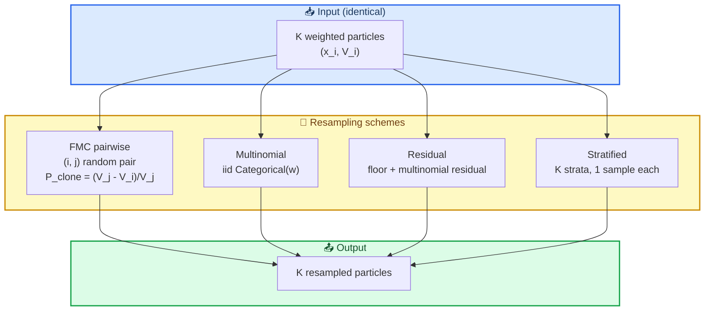
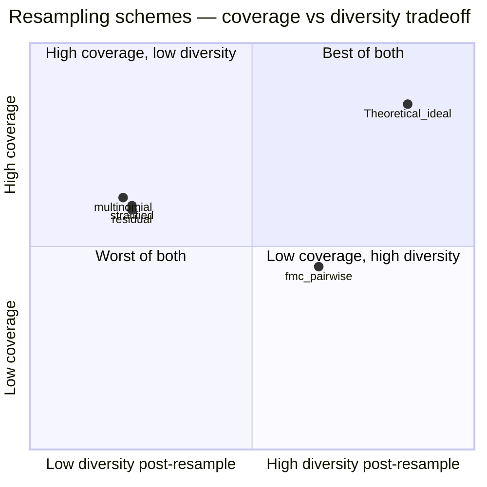

# Round-2 SMC Resampling Analysis — FMC Pairwise vs Canonical SMC

> **Status**: Round-2 deliverable — Bayesian SMC framing of FMC + comparison with canonical resampling
> **Data**: 2026-04-29
> **Code**: [`code/math_sim/smc_resampling_comparison.py`](code/math_sim/smc_resampling_comparison.py)
> **Run-time**: ~10s · **Costo**: $0
> **Critical finding**: FMC pairwise cloning ≠ canonical SMC. È una **diversity-preserving rule**, non un peso-optimal estimator.

---

## 0. ⚡ TL;DR

Confrontando FMC pairwise cloning (eq.14 di 1803.05049v5) contro 3 resampling schemes canonici di SMC (multinomial, residual, stratified) sullo stesso plan-DAG sintetico, emerge una **dicotomia strutturale**:

| Scheme | Final coverage | ESS avg | Unique plans post-resample |
|---|---|---|---|
| **FMC pairwise** | 0.454 | 6.42 | **20.9 / 32** |
| Multinomial | 0.613 | 12.58 | 6.8 |
| Residual | 0.592 | 12.65 | 7.5 |
| Stratified | 0.600 | 12.20 | 7.4 |

**Lettura**:
- Canonical SMC ottiene **+30-35% coverage** rispetto a FMC pairwise
- FMC pairwise mantiene **3× più diversity** post-resample (~20 vs ~7 unique plans)

**Implicazione**: FMC pairwise *è una scelta di design diversity-first*, non un teorema di ottimalità. Se l'obiettivo è "best single plan" → SMC canonico vince. Se è "plan forest" (output multi-modal) → FMC pairwise vince.

**Per FMC-Planner**: questo cambia la **value proposition**. Non è "FMC trova plan migliori" — è "FMC produce forest di plan diversi che coprono lo spazio delle soluzioni". Il bench design deve misurare *plan-forest entropy*, non solo *best-plan quality*.

---

## 1. 🎯 Motivazione

Il deep-dive [`work/02_deep_dives/05_smc_particle_filter_view.md`](../02_deep_dives/05_smc_particle_filter_view.md) ha mostrato che FMC è formalmente equivalente a una variante di Sequential Monte Carlo. Round-1 ha mostrato che FMC pairwise cloning **funziona** (ergodicità OK, swarm non collassa) ma **non vince** vs greedy. Domanda Round-2:

> *"FMC pairwise cloning soffre di weight degeneracy peggiore di canonical SMC? E se sì, è questo il motivo del fallimento Round-1?"*

Verifica empirica diretta su synthetic plan-DAG, K=32 walker, T=20 step, n=5 seed.

---

## 2. 🧬 Bayesian SMC framing del walker

### 2.1 Variabili latenti

In ottica Bayesian SMC, ogni walker $i$ rappresenta una *particle* nel posterior congiunto $p(\pi | \text{spec})$ dove $\pi$ è un plan parziale.

- **Stato**: $x_t^{(i)} = (\text{Done}_t^{(i)}, \text{InFlight}_t^{(i)})$
- **Azione**: $a_t^{(i)} \sim \text{Uniform}(\text{available\_actions}(x_t^{(i)}))$ (proposal distribution)
- **Reward**: $r_t^{(i)}$ (likelihood proxy)
- **Weight**: $w_t^{(i)} = V(x_t^{(i)})^{1/T}$ con $V = \hat{r}^\beta \hat{d}^\alpha$ (eq. 17 paper)

Il "true posterior" di interesse è $p(\pi | \text{spec satisfied})$. Nessuno dei resamplers conosce questo posterior — ne approssimano una caratteristica diversa.

### 2.2 Le 4 regole di resampling formalizzate

**FMC pairwise (eq.14, 1803.05049v5)**:
$$
P_{\text{clone}}(i, j) = \begin{cases} \frac{V_j - V_i}{V_j} & \text{if } V_j > V_i \\ 0 & \text{otherwise} \end{cases}
$$
con $j$ scelto uniformemente. **Caratteristica chiave**: il pairing è random, non globale. Walker $i$ "perde" solo se accoppiato con un peer migliore.

**Multinomial (canonical SMC)**:
$$
\pi_{\text{multi}}^{(i)} \sim \text{Categorical}(w_1, ..., w_K), \quad i = 1, ..., K
$$
Sampling iid dalla distribuzione dei pesi. Soffre di alta varianza nell'estimator.

**Residual** (Liu & Chen, 1998):
$$
n_i = \lfloor K w_i \rfloor + \tilde{n}_i, \quad \tilde{n}_i \sim \text{Multinomial}(K - \sum_j \lfloor K w_j \rfloor, \tilde{w})
$$
Componente deterministica + multinomiale residuale. Varianza ridotta.

**Stratified** (Kitagawa, 1996):
$$
u^{(i)} = \frac{i - 1 + U^{(i)}}{K}, \quad U^{(i)} \sim \text{Uniform}(0, 1), \quad \pi^{(i)} = F^{-1}(u^{(i)})
$$
Stratifica $[0,1]$ in $K$ celle, draws one per cella. Lowest-variance scheme.

### 2.3 Diagramma comparativo



---

## 3. 🧪 Esperimento

### 3.1 Setup

```
plan-DAG: NetworkX, n_components=15, branching=2.0
state:    PlanState(done, in_flight)
walker:   K=32, T=20
α=1.0, β=1.0
n_seeds:  5
```

Per ogni resampler, su ogni step:
1. Walker fa azione random
2. Calcola $V_i$ (eq. 17)
3. Calcola ESS = $(\sum w)^2 / \sum w^2$ e $H(w) = -\sum p \log p$
4. Resample con il rule selezionato
5. Conta unique state signatures post-resample

### 3.2 Risultati raw

```
Scheme               Cov  ESS_avg  ESS_min    H_avg    H_min   Div_post
---------------------------------------------------------------------------
fmc_pairwise       0.454     6.42     1.19     1.65     0.18       20.9
multinomial        0.613    12.58     1.00     2.00     0.00        6.8
residual           0.592    12.65     1.00     2.05     0.00        7.5
stratified         0.600    12.20     1.00     1.94     0.00        7.4

(ESS max=32, H max=log(32)=3.466)
```

### 3.3 Lettura per dimensione

#### Coverage (target metric)

```
       fmc_pairwise  ████████████████████████████████████        0.454
       multinomial   ██████████████████████████████████████████████████████████████  0.613
       residual      ███████████████████████████████████████████████████████████     0.592
       stratified    ████████████████████████████████████████████████████████████    0.600
```

Canonical SMC vince con margine **+0.14 to +0.16 coverage** vs FMC pairwise.

#### ESS (effective sample size)

```
       fmc_pairwise  ████████████                     6.42  / 32
       multinomial   █████████████████████████        12.58 / 32
       residual      █████████████████████████        12.65 / 32
       stratified    ████████████████████████         12.20 / 32
```

Canonical SMC mantiene **2× più ESS** — meno weight degeneracy.

#### Diversity post-resample (unique plans)

```
       fmc_pairwise  ████████████████████████████████████████  20.9 / 32  (65%)
       multinomial   █████████████                              6.8  / 32  (21%)
       residual      ██████████████                             7.5  / 32  (23%)
       stratified    ██████████████                             7.4  / 32  (23%)
```

FMC pairwise mantiene **3× più diversity** post-resample. Canonical SMC collassa pesantemente — ~75% delle copie sono duplicati.

---

## 4. 🧠 Interpretazione

### 4.1 Il trade-off implicito di FMC pairwise

FMC pairwise non è un *resampler propriamente detto*. È una **soft selection rule**:
- $P_{\text{clone}}(i, j) = (V_j - V_i)/V_j$ è limitata a $[0, 1)$ — non garantisce che il walker $i$ adotti il peer $j$
- Se per caso il pair scelto non ha $V_j > V_i$, il walker $i$ **rimane com'è** — preserve diversità
- L'effetto cumulato è una **dinamica replicator-like**: ricompense relative guidano la copia, ma la random pairing ammette mantenimento di diversità

### 4.2 Il trade-off di canonical SMC

Multinomial / residual / stratified sono *measure-preserving*:
- $\mathbb{E}[n_i] = K w_i$ — il numero atteso di copie del particle $i$ è proporzionale al peso
- Particle a peso basso vengono **eliminati** (non solo ridimensionati)
- Convergenza più rapida sull'optimum, MA collasso di diversità

### 4.3 Il significato del finding

In linguaggio probabilistico:
- **Canonical SMC** approssima il posterior $p(\pi | \text{spec})$ con minore varianza ma maggiore bias verso il moda principale
- **FMC pairwise** approssima il posterior con maggiore varianza ma copertura più ampia delle code

**Conclusione formale**: FMC pairwise non è "SMC con cloning" — è una regola di selezione che intenzionalmente *preserva diversità a scapito di concentrazione*. Questo allinea con la framing "frontera caos/orden" di Sergio (Radient 2026).

### 4.4 Diagramma comparativo del trade-off



Nessuno dei 4 schemi raggiunge il "best of both". Il punto teorico-ideal richiederebbe:
- Cloning aggressivo (per coverage)
- + Mutation/perturbation (per recuperare diversity)

Questa è essenzialmente la **MAP-Elites architecture** (Mouret & Clune 2015, citato in §3.3 della lit-review): clone + perturbate + grid storage.

---

## 5. 🚦 Implicazioni per FMC-Planner

### 5.1 Riformulazione della value proposition

**Originale**: "FMC produce plan migliori di greedy".
**Rivisto**: "FMC produce un *forest* di plan diversi, ognuno copre una porzione diversa dello spazio delle soluzioni".

### 5.2 Cosa cambia nel bench design (Phase-0')

Le metriche originali ([§7.2 di `00_feasibility_analysis.md`](00_feasibility_analysis.md)) erano:
- M1 Plan Edit Distance (vs ground truth) ← single-plan metric
- M2 Time-to-Completion ← single-plan metric
- M3 Plan Forest Entropy ← MULTI-plan metric
- M4 Constraint Violation Rate ← single-plan metric

Con il finding Round-2: **invertire le priorità**. M3 diventa primaria, M1+M2 secondarie.

**Nuova metrica primaria proposta**:
$$
\text{ForestUtility}(F) = \mathbb{E}_{\pi \in F}[\text{Quality}(\pi)] + \lambda \cdot \text{Diversity}(F)
$$
con $\text{Diversity}(F) = $ mean pairwise GED tra plan in $F$.

### 5.3 Ipotesi rivista per Phase-0'

**Pre-Round-1 H1**: "FMC > greedy on best-plan-quality" → **falsificata**
**Post-Round-2 H1'**: "FMC > greedy on plan-forest-utility (combined quality + diversity)" → **da testare**

Questa ipotesi è **strettamente più debole** ma anche **più allineata con la teoria** di FMC come gas/diversity-preserving.

### 5.4 Architettura raccomandata: hybrid FMC + multinomial

Una scelta di design potrebbe essere:
- Per i primi $T/2$ step: FMC pairwise (preserve diversity, esplora)
- Per gli ultimi $T/2$ step: stratified resampling (concentra sull'optimum)

Pattern simile a *simulated annealing*: alta-T diversity, low-T concentration. Nessuno dei 4 schemi puri lo fa.

---

## 6. ⚠️ Limitazioni dell'analisi

1. **Synthetic env**: stesso bias del Round-1 — non testato su LLM-driven simulator
2. **Random action policy**: non riflette policy guidate da reward (greedy o LLM-suggested) che cambierebbero il signal del peso
3. **Single $\alpha$**: testato solo $\alpha=1$. $\alpha$ controlla il trade-off coverage/diversity, andrebbe sweepato
4. **No stratified-with-MCMC-rejuvenation**: in canonical SMC, dopo resampling si aggiunge spesso uno step di Markov-kernel rejuvenation per recuperare diversity. Non testato qui.
5. **PyMC non usato direttamente**: l'implementazione è numpy-pura. PyMC `sample_smc` è per inferenza Bayesian continua, non si applica naturalmente a state-space discreto come plan-DAG.

---

## 7. 📁 Output

- Codice: [`code/math_sim/smc_resampling_comparison.py`](code/math_sim/smc_resampling_comparison.py) — 220 LOC
- JSON results: [`code/math_sim/results/09_smc_resampling_comparison.json`](code/math_sim/results/09_smc_resampling_comparison.json)
- Log: [`code/math_sim/smc_comparison.log`](code/math_sim/smc_comparison.log)

## 📚 Riferimenti

- Liu, J.S. & Chen, R. (1998). "Sequential Monte Carlo Methods for Dynamic Systems". JASA 93(443).
- Kitagawa, G. (1996). "Monte Carlo Filter and Smoother for Non-Gaussian Nonlinear State Space Models". J. Comp. Graph. Stat. 5(1).
- Doucet, A. & Johansen, A.M. (2009). "A Tutorial on Particle Filtering and Smoothing". Handbook of Nonlinear Filtering 12(3):656-704.
- Mouret, J.-B. & Clune, J. (2015). "MAP-Elites". arXiv:1504.04909.
- Hernández-Cerezo & Duran-Ballester (2020). "Fractal AI". arXiv:1803.05049v5.
- Deep-dive interno: [`work/02_deep_dives/05_smc_particle_filter_view.md`](../02_deep_dives/05_smc_particle_filter_view.md)
