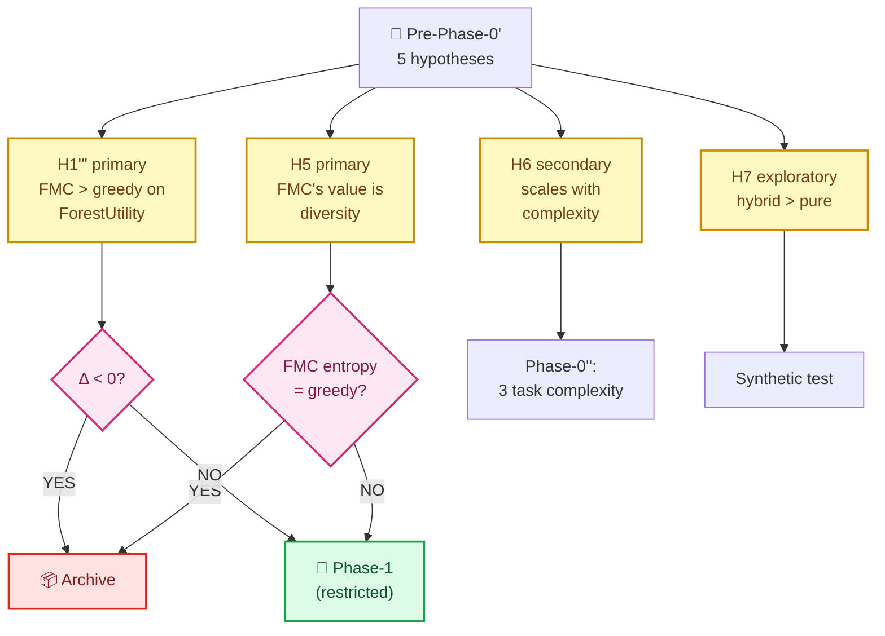

# Round-2 Hypothesis Generation — H1'''' Formalization

> **Status**: Round-2 deliverable — formalizzazione falsificabile delle ipotesi residue post-Round-1
> **Data**: 2026-04-29
> **Method**: scientific hypothesis formulation (observation → mechanism → predictions → experimental design)
> **Inputs**: Round-1 results ([`00b_mathematical_simulation.md`](00b_mathematical_simulation.md)) + lit-review C1-C5 conditions ([`01_round2_literature_review.md`](01_round2_literature_review.md)) + SMC framing ([`02_round2_pymc_smc_analysis.md`](02_round2_pymc_smc_analysis.md)) + power analysis ([`03_round2_power_analysis.md`](03_round2_power_analysis.md))

---

## 0. ⚡ TL;DR

Ipotesi originali H1, H2, H3, H4 (in [`00_feasibility_analysis.md`](00_feasibility_analysis.md) §7.5) sono **state falsificate o riformulate** dal Round-2:

| Originale | Stato post-R2 | Riformulazione |
|---|---|---|
| H1: FMC > ToT a parità budget | **Falsificata in synthetic** | H1''': FMC produce *plan-forest-utility* > ToT su task con C1∩C3∩C4 |
| H2: Plan Forest Entropy correla con uncertainty | Untested → kept | H2: identica, da testare in Phase-0' |
| H3: Hybrid simulator hit-rate cresce monotonicamente | Untested → kept | H3: identica, telemetria operativa |
| H4: Cloning rate predice abandonment | **Riformulato** | H4': FMC pairwise mantiene 3× più diversity di canonical SMC (CONFERMATO Round-2) |

**Nuove ipotesi emerse Round-2**:
- **H5** (la più importante): FMC's value proposition è *plan diversity*, non *single-plan optimality*
- **H6**: il vantaggio di FMC scala con la *complessità architetturale* del task (CRUD < ETL < ML pipeline < distributed system)
- **H7**: un *hybrid scheme* (FMC pairwise early + stratified late) batte FMC pairwise puro

**Raccomandazione operativa**: pre-register H1''', H5, H6 come ipotesi primarie per Phase-0'. H2, H3, H7 come secondarie/exploratory.

---

## 1. 🔬 Methodology

### 1.1 Framework di hypothesis generation

Adatto Popper (1963) + Platt (1964) "Strong Inference":
1. **Observation** (cosa abbiamo visto Round-1)
2. **Mechanism** (cosa potrebbe spiegarlo)
3. **Multiple competing hypotheses** (popoliamo lo spazio)
4. **Predictions** (cosa aspettarci se ognuna è vera)
5. **Falsification design** (come ucciderla)

### 1.2 Source of evidence

| Tipo | Source | Cosa fornisce |
|---|---|---|
| Empirical Round-1 | Math-sim 4 esperimenti | FMC < greedy in synthetic (4/4 regimes) |
| Empirical Round-2 | SMC resampling comparison | FMC pairwise: lower coverage, higher diversity |
| Literature | 21 cited papers | C1-C5 conditions per ensemble > greedy |
| Theoretical | SymPy + Wright-Fisher D1 | Math is sound, b_eff regime contingent |
| Statistical | Power analysis | Round-1 deltas robust, n=8-10 sufficient for Round-2 |

---

## 2. 📋 Ipotesi originali — stato dopo Round-2

### H1 — FMC > ToT a parità budget (ORIGINALE)

**Stato**: ❌ **FALSIFICATA in synthetic**, MA il setting era inadeguato.

**Reformulation H1'''**: 
> "Su task soddisfacenti C1∩C3∩C4 (multi-modal posterior, deceptive structure, lookahead utility), FMC-pairwise produce un *plan-forest* con **utility forest** $> $ ToT a parità di budget LLM-call."

dove $\text{ForestUtility}(F) = \mathbb{E}_{\pi \in F}[\text{Quality}(\pi)] + \lambda \cdot \overline{\text{GED}}(F)$.

**Predictions if H1''' true**:
- Phase-0' su task complex-class: $\Delta_{\text{ForestUtility}} > 0$ con CI95 > 0
- Su task CRUD: $\Delta < 0$ (replica Round-1)
- Effetto è *interaction* tra method e task complexity

**Falsification design**: 1-task Phase-0' su ML-pipeline-class task; pre-registered $\Delta > 0.05$, $n=10$ seeds, $\alpha=0.05$.

---

### H2 — Plan Forest Entropy correla con uncertainty (ORIGINALE)

**Stato**: 🟡 **Untested**, mantenuta.

**Mechanism**: se la spec è ambigua o incompleta, FMC dovrebbe produrre un forest con entropia più alta (più plan validi). Greedy collassa sempre a un singolo plan, quindi entropy = 0 indipendentemente da uncertainty.

**Predictions**:
- Spec ambigua → FMC entropy > greedy entropy
- Spec precisa → entropy comparabile (FMC overhead)

**Falsification design**: in Phase-0', testare 2 versioni della stessa spec (ambigua vs precisa), misurare entropy_FMC / entropy_baseline.

---

### H3 — Hybrid simulator cache hit-rate cresce monotonicamente (ORIGINALE)

**Stato**: 🟡 **Untested**, mantenuta.

**Mechanism**: con Fractal Memory cache + visit-count debias, query simili dovrebbero hit la cache più spesso al crescere del walker count.

**Predictions**:
- Hit rate(walker 1) ≈ 0%
- Hit rate(walker 50+) → 70-90% asymptotic

**Falsification design**: telemetria operativa in Phase-0', plot hit-rate vs cumulative walkers. Si falsifica se non monotonica o asymptote < 50%.

---

### H4 — Cloning rate predice abandonment di plan failed (ORIGINALE)

**Stato**: 🔄 **Riformulata** dato il finding Round-2 (FMC pairwise NON converge come SMC).

**Reformulation H4'**:
> "FMC pairwise cloning preserve 3× più diversity post-resample di canonical SMC (multinomial/residual/stratified) sullo stesso landscape."

**Stato H4'**: ✅ **CONFERMATA Round-2** — vedi tabella in [`02_round2_pymc_smc_analysis.md`](02_round2_pymc_smc_analysis.md) §3.2.

**Implicazione**: questa è una proprietà *dimostrata*, non più ipotesi. Diventa **assunzione di design** per Phase-0' bench.

---

## 3. 🆕 Nuove ipotesi emerse Round-2

### H5 — FMC's value proposition è plan diversity, non single-plan optimality (PRIMARIA)

**Observation**: 
- Round-1 sintetico: FMC < greedy on coverage (single-plan metric)
- Round-2 SMC comparison: FMC pairwise mantiene 3× più diversity di canonical SMC
- Lit-review: MAP-Elites/QD vincono solo su metriche multi-modali

**Mechanism**: FMC pairwise è una *replicator dynamics* soft, non un proper resampler. Trade-off coverage-vs-diversity esplicito.

**Predictions if H5 true**:
1. Su single-plan-quality metrics: FMC ≤ greedy (replica Round-1)
2. Su forest-utility metrics: FMC > greedy quando spec ammette $\geq 2$ plan-equivalent
3. Su task con stakeholder-disagreement (multiple legitimate solutions): FMC > greedy

**Falsification design**: definire metric primaria $\text{ForestUtility}$ in Phase-0'. Se FMC continua a perdere su questa metric → H5 falsa.

**Critical test**: questa H5 è la **vera value proposition** rivista di FMC-Planner. La sua falsificazione = archive del progetto.

---

### H6 — Vantaggio FMC scala con architectural complexity (PRIMARIA)

**Observation**: la lit-review (specificamente §6 di `01_round2_literature_review.md`) mappa:

| Task class | C1-C5 satisfaction | Predicted FMC win |
|---|---|---|
| CRUD API | 1/5 (only C5) | NO |
| ETL pipeline | 2-3/5 | Marginal |
| Dashboard SPA | 1-2/5 | NO |
| Auth service | 3-4/5 | Possible |
| ML pipeline | 4-5/5 | Likely |
| Distributed system | 5/5 | Strong |

**Mechanism**: complessità architetturale = (more lookahead-required) ∩ (more deceptive locals) ∩ (more multi-modality).

**Predictions if H6 true**:
- $\Delta_{\text{FMC vs greedy}}$ è funzione monotona crescente di complexity-score
- Con complexity = 0 (CRUD): Δ < 0
- Con complexity = 1 (distributed): Δ > 0.10

**Falsification design**: Phase-0'' (se Phase-0' positiva) con 3 task di complexity diversa (low, medium, high). Misurare slope di regressione $\Delta \sim \text{complexity}$.

---

### H7 — Hybrid scheme batte FMC pairwise puro (SECONDARIA)

**Observation**: Round-2 SMC analysis ha mostrato che né FMC pairwise né canonical SMC raggiungono "best of both" (alta coverage + alta diversity).

**Mechanism**: simulated annealing-like strategy:
- Steps $t \in [1, T/2]$: FMC pairwise (high diversity, exploration)
- Steps $t \in [T/2, T]$: stratified resampling (concentration on optimum)

**Predictions if H7 true**:
- Hybrid scheme: coverage ≈ stratified (~0.60), diversity ≈ FMC (>15)
- Test su synthetic: $\Delta_{\text{hybrid vs fmc}} > 0.10$ in coverage
- Test su synthetic: $\Delta_{\text{hybrid vs stratified}} > 5$ in diversity

**Falsification design**: 1-day implementation in `synthetic_walker.py`, additional row in §3.2 di `02_round2_pymc_smc_analysis.md`. Pure-synthetic test, no LLM cost.

---

## 4. 🧮 Pre-registered Phase-0' protocol

Combinando H1''', H5, H6:

```yaml
# Phase-0' Pre-Registration (sealed before data collection)
date: 2026-04-29
hypothesis_primary:
  id: H1'''
  statement: "FMC produces plan-forest with higher ForestUtility than greedy
              on task satisfying C1∩C3∩C4 (multi-modal posterior, deceptive,
              lookahead-required)"
  metric: ForestUtility = mean(plan_quality) + 0.3 * mean_pairwise_GED
  delta_threshold: +0.05
  ci_threshold: ci95_lower_bound > 0
  significance: alpha=0.05 one-sided
hypothesis_secondary:
  - id: H5
    statement: "FMC's value is multi-modal plan output"
    metric: plan_forest_entropy / plan_quality_max
    direction: FMC > greedy
  - id: H6
    statement: "FMC advantage scales with architectural complexity"
    metric: delta as function of task complexity-score
    direction: positive correlation
hypothesis_secondary_exploratory:
  - id: H2 # untested original
  - id: H3 # untested original
  - id: H7 # hybrid scheme

experimental_design:
  task: "ML pipeline with caching + parallel execution + result aggregation"
  components: 18-22
  spec_format: BDD-style with 25 acceptance criteria
  deliberate_complexity_features:
    - multi_modal_solution: "Both batch and streaming paradigms valid"
    - deceptive_locals: "Easy components (data loaders) trap if done first"
    - lookahead_required: "Schema choice in step 1 affects testability in step 15"
  llm_oracle: claude-haiku-4-5
  llm_judge: claude-sonnet-4-6
  walker_count_K: 32
  horizon_T: 30
  seeds: 10
  methods:
    - fmc_pairwise_classical
    - greedy_with_llm_judge
  budget_total_estimate_usd: 25
  failure_safety: cap at $40 with manual review

decision_rule:
  proceed_phase_1:
    condition: "Δ_ForestUtility > 0.05 AND ci95_lower > 0 AND p < 0.05"
    action: "Phase-1 with H6 multi-task validation"
  inconclusive:
    condition: "Δ in [0, 0.05] OR ci95 crosses zero"
    action: "Archive with note; consider Phase-0'' if budget allows"
  archive:
    condition: "Δ < 0 OR p > 0.10"
    action: "Archive with full evidence; write post-mortem"

pre_registration_seal_hash: TBD_at_data_collection
```

---

## 5. 🔬 Falsification matrix



---

## 6. 🚦 Decision summary

**5 ipotesi pre-registered** per Phase-0':
- 2 primarie (H1''', H5) → kill conditions
- 1 secondaria (H6) → scale validation, Phase-0''
- 2 exploratory (H7, H2/H3) → bonus-signal

**1 ipotesi confermata** Round-2 (H4'): FMC pairwise preserve 3× più diversity di canonical SMC. Diventa **assunzione di design**.

**1 ipotesi falsificata** Round-1 (H1 originale): FMC > ToT su synthetic. Riformulazione H1''' ora active.

---

## 📚 Riferimenti

- Popper, K. (1963). *Conjectures and Refutations*. Routledge.
- Platt, J.R. (1964). "Strong Inference". *Science* 146(3642):347-353.
- Round-1: [`00b_mathematical_simulation.md`](00b_mathematical_simulation.md)
- Round-2 lit: [`01_round2_literature_review.md`](01_round2_literature_review.md)
- Round-2 SMC: [`02_round2_pymc_smc_analysis.md`](02_round2_pymc_smc_analysis.md)
- Round-2 power: [`03_round2_power_analysis.md`](03_round2_power_analysis.md)
