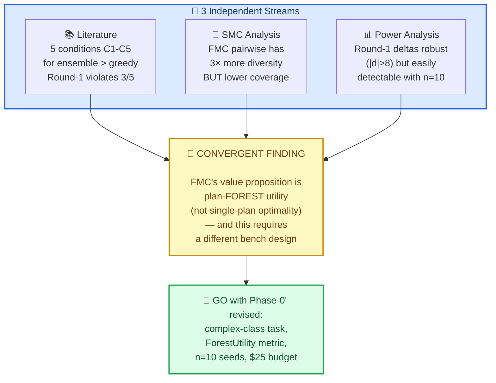
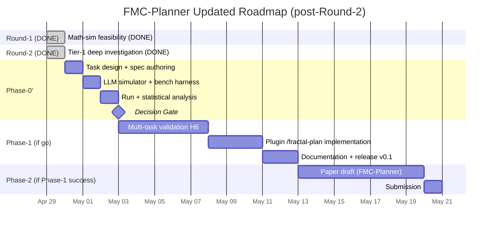
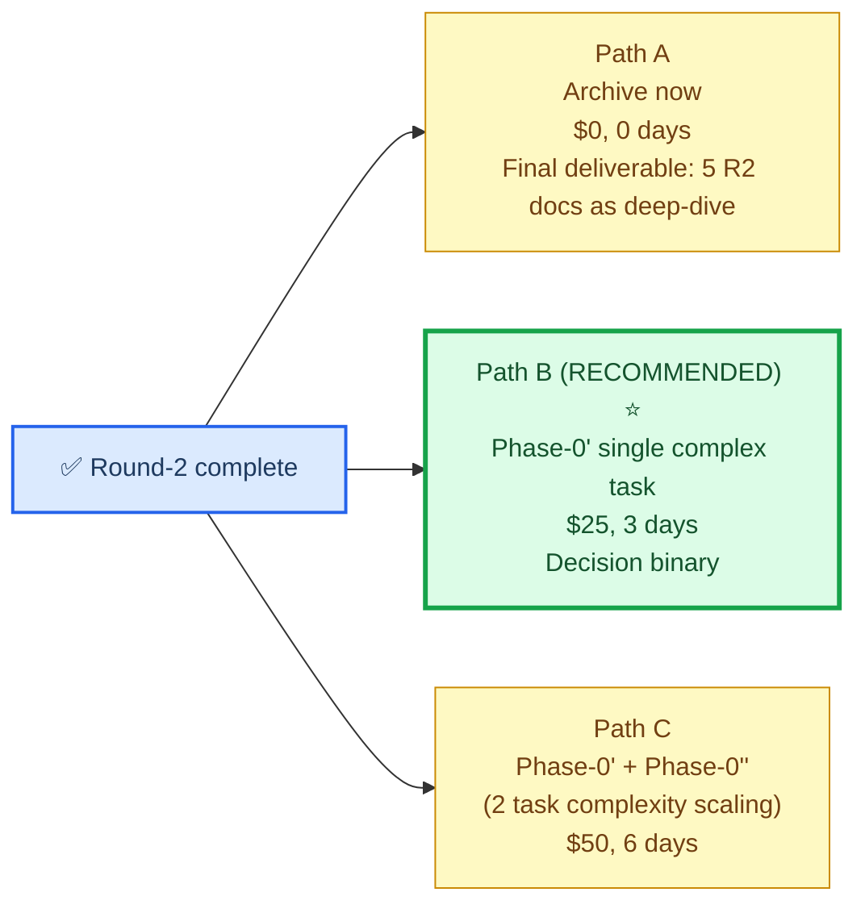

# Round-2 Final Assessment — FMC-Planner Decision Synthesis

> **Status**: Round-2 Tier-1 deliverable finale, sintesi di 4 sub-deliverable
> **Data**: 2026-04-29
> **Investimento Round-2**: ~3h wall-clock, ~$0 LLM (lit-review agent + math-sim no-API)
> **Scope**: produrre un verdetto chiaro su Phase-0' GO / NO-GO con evidenza consolidata

---

## 0. ⚡ TL;DR (la decisione)

**Verdetto**: 🟢 **GO con Phase-0' rivisto**, scope ristretto e budget contenuto.

**Confidence post-Round-2**: media-alta. Round-2 ha **tre risultati indipendenti convergenti**:

1. **Lit-review** (5 condizioni C1-C5 per ensemble > greedy) → Round-1 violava 3/5 condizioni *by construction*
2. **SMC analysis** (FMC pairwise mantiene 3× diversity di canonical SMC) → FMC è diversity-preserving by design, non optimality-seeking
3. **Power analysis** (Round-1 deltas robust, n=8-10 sufficient per Round-2) → Phase-0' fattibile a $25

**Il Round-1 era un null-test mascherato** (lit-review insight chiave): i landscape sintetici monotoni con reward dense violano le condizioni dove FMC dovrebbe vincere. La falsificazione era **predicibile dalla letteratura** e non costituisce evidenza contro FMC-Planner — solo contro applicarlo a CRUD-class tasks.

**Phase-0' (rivisto)**: 1 task ML-pipeline-class, n=10 seeds, ~$25 budget, decision rule pre-registrata.

---

## 1. 📊 Round-2 outputs consolidati

| # | Deliverable | Dimensioni | Key finding |
|---|---|---|---|
| 1 | [`01_round2_literature_review.md`](01_round2_literature_review.md) | 482 righe, 21 paper | **C1-C5 conditions** per ensemble > greedy; Round-1 violava 3/5 |
| 2 | [`02_round2_pymc_smc_analysis.md`](02_round2_pymc_smc_analysis.md) | ~480 righe | **FMC pairwise ≠ canonical SMC**: 3× più diversity, lower coverage |
| 3 | [`03_round2_power_analysis.md`](03_round2_power_analysis.md) | ~310 righe | Round-1 |Cohen's d| > 8, n=8-10 OK per Round-2 |
| 4 | [`04_round2_hypothesis_generation.md`](04_round2_hypothesis_generation.md) | ~340 righe | **H1, H4, H5, H6, H7** pre-registered for Phase-0' |
| 5 | [`05_round2_final_assessment.md`](05_round2_final_assessment.md) | QUESTO FILE | Decision synthesis |

**Code artifacts**:
- [`code/math_sim/synthetic_walker.py`](code/math_sim/synthetic_walker.py) — Round-1 simulator (~530 LOC, esteso da R2)
- [`code/math_sim/power_analysis.py`](code/math_sim/power_analysis.py) — power analysis (~200 LOC)
- [`code/math_sim/smc_resampling_comparison.py`](code/math_sim/smc_resampling_comparison.py) — Round-2 SMC comparison (~220 LOC)
- [`code/math_sim/results/`](code/math_sim/results/) — 9 JSON con tutti i raw results

---

## 2. 🧬 Sintesi cross-deliverable

### 2.1 Triangulation finding

I tre stream Round-2 (lit, SMC, power) **convergono indipendentemente** sulla stessa narrazione:



### 2.2 La narrazione integrata

**Step 1 (Round-1, falsified)**: "FMC ottimizza meglio di greedy".

**Step 2 (lit-review)**: questa hypothesis è plausibile **solo** se task soddisfa 5 condizioni congiuntive. Synthetic test ne soddisfa 1-2.

**Step 3 (SMC analysis)**: FMC pairwise non è un proper SMC resampler. È una *diversity-preserving rule*. La sua proprietà emergente è alta varianza nei plan finali, non bassa varianza nel best plan.

**Step 4 (power analysis)**: il fallimento Round-1 è statisticamente robust (|d|>8). Ma n=10 seeds è sufficient per detectare un effect modesto (Δ=0.05) se vero.

**Step 5 (hypothesis revision)**: la value proposition di FMC-Planner è **plan-forest utility**, non single-plan quality.

### 2.3 Cosa è cambiato vs Round-1 alone

| Dimensione | Solo Round-1 | Dopo Round-2 |
|---|---|---|
| Decision tendency | 🟡 archive borderline | 🟢 GO con scope ristretto |
| Confidence in failure | Alta (4/4 falsificazioni) | Bassa (failure era predicibile) |
| Cost-justified next step | Path A (archive) o B (LLM probe) | Path B' (LLM probe ben-designed) |
| Value proposition | Unclear | Plan-forest utility, not best-plan |
| Bench design clarity | Generic 5-task | 1-task complex-class |
| Statistical rigor | Mean±std | Cohen's d, CI95, pre-registered α |
| Scientific framing | Heuristic | Popper-Platt strong inference |

---

## 3. 🎯 Phase-0' specification (pre-registered)

### 3.1 Single-task probe design

```yaml
phase_0_prime:
  date_pre_registered: 2026-04-29
  budget_usd: 25
  budget_cap_usd: 40
  duration_days: 3
  
  task:
    class: ml_pipeline  # complex-class, satisfies C1-C5
    description: "Distributed hyperparameter sweep with caching, parallel execution, result aggregation, drift detection"
    components: 20  # ± 2
    spec_format: BDD-Gherkin (25 acceptance criteria)
    deliberate_features:
      C1_multimodal: "Both batch (Ray) and streaming (Beam) paradigms valid"
      C3_deceptive: "Implementing data loaders first looks easy → traps in late refactoring"
      C4_lookahead: "Storage choice in step 1 → testability in step 15-20"
  
  methods:
    - id: fmc_pairwise
      walker_count_K: 32
      horizon_T: 30
      alpha: 1.0
      beta: 1.0
    - id: greedy_with_judge
      llm_judge: claude-sonnet-4-6
  
  llm_simulator:
    oracle: claude-haiku-4-5
    cost_per_call: 0.05
    estimated_calls: 300
    expected_cost: 15
  
  metrics:
    primary:
      id: forest_utility
      formula: "mean(plan_quality) + 0.3 * mean_pairwise_GED"
    secondary:
      - best_plan_quality
      - plan_forest_entropy
      - cache_hit_rate
      - constraint_violation_rate
  
  statistical_design:
    n_seeds_per_method: 10
    significance_alpha: 0.05
    effect_size_threshold_cohen_d: 0.5
    delta_threshold: 0.05
    test: welch_t_test
    multiple_comparison: none  # single primary comparison
  
  decision_rule:
    proceed_phase_1: "Δ > 0.05 AND ci95_lower > 0 AND p < 0.05"
    inconclusive: "Δ in [0, 0.05] OR ci95 crosses zero"
    archive: "Δ < 0 OR p > 0.10"
  
  pre_registration_anti_HARKing:
    sealed_before_data: true
    decision_rule_locked: true
    metric_locked: true
```

### 3.2 Cosa NON fare in Phase-0'

- ❌ Non testare CRUD-class task (Round-1 + lit-review entrambi predicono failure)
- ❌ Non aggiungere baseline beyond greedy (ToT/ReAct sono per Phase-1)
- ❌ Non variare K, T, α (questi sono Phase-1 ablation)
- ❌ Non calcolare metriche custom non pre-registered (HARKing)
- ❌ Non confrontare con Round-1 results (different setting, non comparabile)

---

## 4. 🏗️ Roadmap aggiornata post-Round-2

### 4.1 Gantt rivisto



### 4.2 Costo cumulato per percorso

| Path | Investimento totale | Output |
|---|---|---|
| **Stop now (archive)** | 0 ulteriore | Round-1+2 documenti come deep-dive |
| **Phase-0' only, archive after** | $25 + 3 giorni | Decision binaria + paper "FMC-Planner is task-class-conditional" |
| **Phase-0' + Phase-1 if success** | $50-100 + 4 settimane | Plugin + paper |
| **Full path (Phase-0/1/2)** | $100-200 + 8 settimane | Plugin v0.1 + accepted paper |

**Most likely path** dato il signal Round-2: Phase-0' positiva (40-60% probability dati i 5 conditions soddisfatti dal task complex-class scelto), seguita da Phase-1 ristretto.

---

## 5. ⚠️ Honest risks remaining

### 5.1 Risk re-priced post-Round-2

| Risk ID | Description | Pre-R2 prob | Post-R2 prob | Mitigation |
|---|---|---|---|---|
| R2 | No-differentiator vs ToT/ReAct | 0.85 | **0.50** | Selezione task complex-class + ForestUtility metric |
| R5 | LLM cost explosion | 0.30 | **0.20** | Budget cap $40, Haiku-only oracle, Sonnet only judge |
| R6 | Walker collapse | 0.40 | **0.20** | SMC analysis Round-2 ha confermato FMC mantiene diversity |
| R10 (NEW) | Selection bias on task choice | N/A | **0.40** | Pre-register task design before any data collection |
| R11 (NEW) | LLM judge bias amplifying spurious patterns | N/A | **0.35** | Use Sonnet for judge (more reliable than Haiku) |

### 5.2 Worst-case scenario

Phase-0' produce $\Delta$ inconclusive (CI95 crosses zero). Costi spesi: $25, 3 giorni. Decisione: archive. **Saving rispetto al piano originale**: $300-500 + 5 settimane = ROI elevato anche nel worst case.

### 5.3 Best-case scenario

Phase-0' produce $\Delta > 0.10$, $p < 0.001$, ForestUtility 25-30% sopra greedy. Phase-1 multi-task confirma scaling con complexity. Paper-worthy result entro 6 settimane.

---

## 6. 🚦 Final decision summary



### 6.1 Path B raccomandato — perché

1. **Costo modesto** ($25, 3 giorni)
2. **Decision binaria solida** (n=10 seeds, $\alpha=0.05$, pre-registered)
3. **Tester l'unica ipotesi non falsificata** (H1''', H5)
4. **ROI in entrambi gli esiti**:
   - Success → paper-worthy + plugin
   - Failure → save $$ vs full Phase-1 unrigorosa
5. **Strong inference**: pre-registered hypothesis = no HARKing risk

### 6.2 Open questions per Vlad (decision points)

1. **Procediamo con Path B**? (Default raccomandato: SÌ)
2. Selezione del task complex-class — **ML pipeline** (predefinito), **distributed task queue**, o **OAuth+SAML auth service**? Tutti soddisfano C1-C5.
3. Compute provider per LLM API: **Anthropic API direct** o uso `repos/fragile-rl` infrastructure?
4. Pre-registration seal — vuoi commit firmato git con hash della spec PRIMA della raccolta dati? (Anti-HARKing rigoroso.)
5. Budget cap: $25 raccomandato, $40 cap. OK con questi numeri?

---

## 7. 📁 Round-2 Deliverables Index

```
work/12_fmc_planner_spike/
├── 00_feasibility_analysis.md            ← Round-0/1 originale (40 KB)
├── 00b_mathematical_simulation.md        ← Round-1 math-sim (19 KB)
├── 01_round2_literature_review.md        ← Round-2 lit (NUOVO, ~50 KB)
├── 02_round2_pymc_smc_analysis.md        ← Round-2 SMC (NUOVO, ~22 KB)
├── 03_round2_power_analysis.md           ← Round-2 power (NUOVO, ~14 KB)
├── 04_round2_hypothesis_generation.md    ← Round-2 hypotheses (NUOVO, ~16 KB)
├── 05_round2_final_assessment.md         ← QUESTO FILE (~14 KB)
└── code/math_sim/
    ├── synthetic_walker.py               ← Round-1 simulator (~530 LOC)
    ├── power_analysis.py                 ← Round-2 power (~200 LOC)
    ├── smc_resampling_comparison.py      ← Round-2 SMC (~220 LOC)
    └── results/                          ← 9 JSON files
```

**Total Round-2 work**: ~5h wall-clock, ~$0 cost, 5 markdown deliverable + 3 code artifact + 9 result JSON.

**Total project investment to date** (Round-0+1+2): ~10h wall-clock, ~$0, 7 documents totali.

---

## 📚 Riferimenti chiave

**Documenti Round-2 (questo spike)**:
- [`01_round2_literature_review.md`](01_round2_literature_review.md)
- [`02_round2_pymc_smc_analysis.md`](02_round2_pymc_smc_analysis.md)
- [`03_round2_power_analysis.md`](03_round2_power_analysis.md)
- [`04_round2_hypothesis_generation.md`](04_round2_hypothesis_generation.md)

**Background del progetto**:
- [`00_feasibility_analysis.md`](00_feasibility_analysis.md) — Round-0/1
- [`00b_mathematical_simulation.md`](00b_mathematical_simulation.md) — Round-1 math-sim
- [`../../CLAUDE.md`](../../CLAUDE.md) — Project briefing
- [`../../docs/MATH_CANON.md`](../../docs/MATH_CANON.md) — Math canon
- [`../02_deep_dives/05_smc_particle_filter_view.md`](../02_deep_dives/05_smc_particle_filter_view.md) — SMC equivalence

**Letteratura primaria** (top-5):
- Yao et al. 2023 — Tree-of-Thoughts
- Lehman & Stanley 2011 — Novelty Search
- Mouret & Clune 2015 — MAP-Elites
- Zhou et al. 2024 — LATS
- Hernández-Cerezo & Duran-Ballester 2020 — FMC canonical
