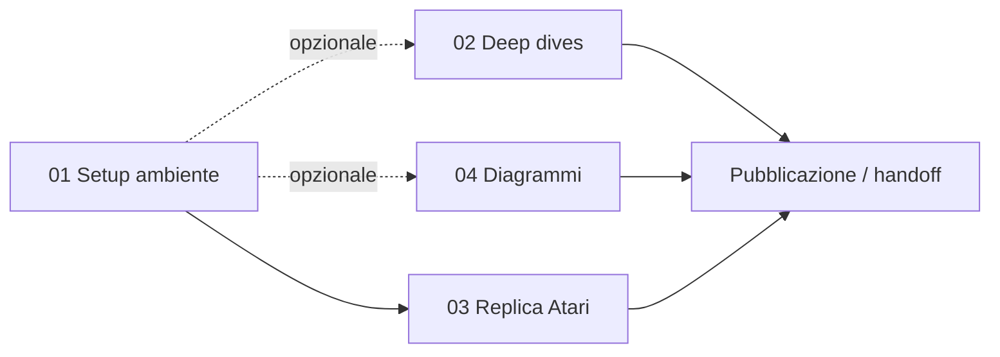

# `work/` — Implementazione operativa di Fractal AI

Questa cartella raccoglie i quattro filoni di lavoro derivati da [`ANALISIS.md`](../ANALISIS.md). Ogni sottocartella è autonoma, con un proprio piano e criteri di successo verificabili (rispettando i principi in [`CLAUDE.md`](../CLAUDE.md)).

## Indice dei filoni

| # | Cartella | Scopo | Stato |
|---|---|---|---|
| 01 | [`01_setup_environment/`](01_setup_environment/) | Installare l'ambiente `fragile` + verificare con un demo Atari | scaffolding pronto |
| 02 | [`02_deep_dives/`](02_deep_dives/) | Espansioni teoriche mirate (matematica del cloning, Active Inference, Standard Model of Cognition) | scaffolding + 1 deep-dive seed |
| 03 | [`03_atari_replication/`](03_atari_replication/) | Phase 1 della roadmap §11.4 — replica controllata su 3-5 Atari | piano sperimentale pronto |
| 04 | [`04_diagrams/`](04_diagrams/) | Diagrammi C4 / Mermaid per FMC e per `fragile-rl` | diagrammi completati |

## Ordine logico di esecuzione

- **01** è prerequisito di **03** (servono `fragile` + Atari ROM funzionanti)
- **02** e **04** sono indipendenti (puro lavoro di scrittura/diagrammi)
- **03** è il "ground truth" empirico: senza questo, l'analisi resta teorica

## Criteri di successo per filone

| Filone | Criterio verificabile |
|---|---|
| 01 | `python -c "import fragile; print(fragile.__version__)"` ritorna senza errori; un episodio Atari completo gira senza crash |
| 02 | Ogni deep-dive sta in 600-1200 righe, con riferimenti puntuali al codice (`file:linea`) e bibliografia citata |
| 03 | Tabella di benchmark con 3-5 giochi Atari, 5+ run per gioco, intervalli di confidenza, confronto numerico col paper |
| 04 | Diagrammi renderizzabili (Mermaid syntax valida) + leggibili (max 15 nodi per diagramma, label espliciti) |

## Convenzioni

- **Italiano** per la prosa, **inglese** per il codice e i commenti tecnici
- **Path relativi** dalla root del progetto (`/Users/vladvrinceanu/Desktop/PROGETTI ANTYGRAVITY/FractalAI/`)
- **Formato data**: ISO 8601 (`2026-04-26`)
- Citazioni del paper: `(Hernández-Cerezo & Duran-Ballester, 2020, §X.Y)`
- Citazioni del codice: link markdown a `repos/<nome>/<file>:<linea>`

## Quick links

- Paper: [`../1803.05049v5.pdf`](../1803.05049v5.pdf)
- Analisi profonda: [`../ANALISIS.md`](../ANALISIS.md)
- Behavioral guidelines: [`../CLAUDE.md`](../CLAUDE.md)
- Repos clonate: [`../repos/`](../repos/)
